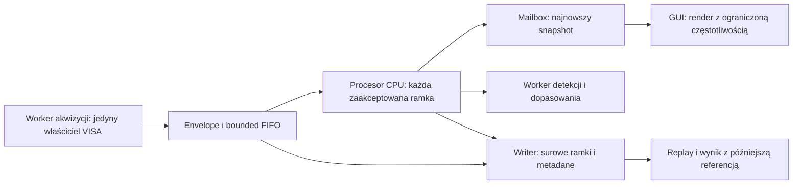

# Plan implementacji korekcji zmiennego tła widma w czasie rzeczywistym

Data: 2026-10-03. Projekt: MTJLAB, analizator Anritsu MS2830A.

Status: plan implementacji; opisane nowe funkcje, protokoły i cele wydajnościowe nie są jeszcze zaimplementowane ani zakwalifikowane na stanowisku.

**Rewizja 2026-10-04 po rzeczywistym pomiarze:** domyślny zaimplementowany tryb odejmuje stałą średnią REF. Nie jest to estymator bieżących amplitud ani przesunięć linii. Obserwowane duże reszty wymagają sprawdzenia dynamiki zakłóceń i sposobu uzyskiwania referencji; wydłużenie początkowego nagrania nie rozwiązuje tego samoistnie. Rozdział 37 aktualizuje priorytety na podstawie ponownego przeglądu źródeł pierwotnych. Status poszczególnych wdrożonych części opisuje `IMPLEMENTACJA_KOREKCJI_SZUMU_WIDMA.md`; niniejszy dokument pozostaje planem, nie świadectwem kwalifikacji.

**Aktualizacja wykonania 2026-10-04:** dostępny jest już tryb naprzemiennych
bloków REF/SIGNAL z potwierdzeniem stanu przez operatora, odświeżaniem średniej
REF, zapisem jednej sesji i późniejszą interpolacją wybranego bloku.
Rozdział 38 opisuje wdrożenie i analizę odnalezionych surowych nagrań.
Nie wykonano automatycznej zmiany pola/biasu ani kwalifikacji fizycznego REF.

## 1. Cel i decyzja architektoniczna

Celem jest ograniczenie zmiennych zakłóceń w widmach bez automatycznego wycinania częstotliwości, na których może pojawić się rezonans magnetyczny. Wynik ma zachowywać informację o amplitudzie, częstotliwości, szerokości i polu rezonansu oraz pozwalać ocenić niepewność tych wielkości.

Proponowany podstawowy tor:

1. Akwizycja nowych, kompletnych widm z metadanymi stanu toru i próbki.
2. Jednorazowa konwersja dBm do W na granicy procesora.
3. Charakterystyka tła z serii referencyjnej, początkowo około 60 s.
4. Przyczynowe oszacowanie aktualnego tła wyłącznie z dostępnych referencji.
5. Odejmowanie tła w mocy liniowej z zachowaniem znaku reszty.
6. Uśrednianie reszt w czasie, bez mieszania różnych stanów próbki.
7. Prezentacja wyniku, jego niepewności, wieku referencji i jakości estymacji.
8. Niezależny, trwały zapis surowych ramek i pochodzenia przetwarzania.
9. Opcjonalne późniejsze wyliczenie wyniku z referencji otaczających pomiar w czasie.

Pierwsza wersja ma używać CPU i NumPy, bez GPU, uczenia głębokiego i nowych ciężkich zależności. Podstawowe obliczenia na ramkę mają koszt O(F), gdzie F oznacza liczbę punktów widma. Model kilku zakłócających linii jest rozszerzeniem, a nie warunkiem uruchomienia podstawowego toru.

**Nie obiecujemy rozdzielenia nierozróżnialnych sygnałów.** Jeżeli sygnał magnetyczny i zakłócenie nakładają się, a referencja nie dostarcza niezależnej informacji, poprawnym wynikiem jest większa niepewność albo oznaczenie braku identyfikowalności. Nie wolno zastąpić tego fragmentu interpolacją i nazwać go odzyskanym sygnałem.

## 2. Zakres i etapy dostępności

| Wariant | Funkcja | Wymagania | Etap |
| --- | --- | --- | --- |
| Podgląd surowy | Aktualne widmo bez korekcji | Odczyt analizatora | Istniejący, zachować |
| Referencja statyczna | Średnia tła i charakterystyka jego zmienności | Seria w potwierdzonym stanie odniesienia | Pierwsze wdrożenie |
| Referencja odświeżana ręcznie | Nowy model po zebraniu kolejnego bloku tła | Operator oznacza stan odniesienia | Pierwsze wdrożenie |
| Referencja przeplatana | Powtarzane bloki REF/SIGNAL/REF | Zweryfikowane przełączanie stanów, runner, bezpieczeństwo | Drugi etap |
| Model zmiennych linii | Ograniczona adaptacja amplitudy i małych przesunięć | Informacja z referencji lub zweryfikowanych obszarów kontrolnych | Trzeci etap |
| Równoczesny kanał odniesienia | Estymacja szybkich zakłóceń | Dodatkowy tor sprzętowy i synchronizacja | Osobny projekt |

Automatyczne sterowanie polem, biasem lub wzbudzeniem nie jest domyślną częścią przycisku „Korekcja”. Wersja pierwsza pozostaje funkcją odbioru i przetwarzania. Automatyzacja stanu odniesienia musi wejść przez istniejące mechanizmy przepisów i bezpieczeństwa.

Nieustalone eksperymentalnie pozostają: metoda uzyskania referencji, czas stabilizacji próbki, dopuszczalny czas uśredniania sygnału, spodziewana szerokość rezonansu, szybkość dryfu oraz rzeczywista szybkość kompletnych sweepów. Plan określa sposób ich wyznaczenia zamiast zakładać konkretne wartości pola lub czasów przełączenia.

## 3. Stan obecny i konkretne miejsca integracji

Stan ustalony przez odczyt kodu w dniu sporządzenia planu. Numery linii nie są kontraktem; poniższe nazwy plików i symboli są punktami wejścia do implementacji.

| Plik / symbol | Stan obecny | Planowana zmiana |
| --- | --- | --- |
| `app/spectrum/processing.py`, `LinearPowerAverager` | Średnia w mW, wynik w dBm, licznik bez modelu niepewności | Zachować dotychczasową semantykę; nowy procesor ilościowy w W ze statystyką i pochodzeniem |
| `apply_reference_operation` | `difference_db` jest różnicą dBm; `subtract_power` logarytmuje dodatnią resztę, dla niedodatniej zwraca NaN | Dodać odrębną operację/model podpisanej różnicy w W; nie zmieniać znaczenia istniejących plików i operacji |
| `app/spectrum/analysis.py` | Filtr bilateralny, kandydaci stabilnych linii, interpolacyjne usuwanie linii | Nowy tor ilościowy nie może automatycznie korzystać z `emi_reject` ani `auto_clean` |
| `clean_spectrum_values` | Wywołuje operacje i progi projektowane w dB także dla innych jednostek | Dla W i W/Hz stworzyć jawną ścieżkę; nie przekazywać W do progów dB |
| `app/spectrum/display_model.py` | Wspólny model widoku i źródła analizy; `processed` powstaje z raw i reference | Dołączyć już obliczony wynik procesora; nie liczyć korekcji ponownie w GUI |
| `app/devices/anritsu_ms2830a/ui/analysis_worker.py` | Jedno zadanie i najnowsze oczekujące, pośrednie zadania mogą być zastępowane | Pozostawić do kosztownej analizy podglądu; nie używać jako jedynego konsumenta statystyki wszystkich ramek |
| `app/devices/anritsu_ms2830a/ui/page.py` | Live, średnie, referencja, analiza, ręczny zapis | Podłączyć controller procesora, status jakości i spójne snapshoty |
| `app/devices/anritsu_ms2830a/ui/spectrum_workbench.py` | Lokalny warsztat wykresu, markery, zakresy, zamrożenie widoku | Obsłużyć podpisane W, niepewność i jednostki bez zmiany shellu |
| `app/devices/anritsu_ms2830a/adapter.py` | `SpectrumTrace`, `ReferenceSpectrum`, ASCII/binary, cache osi | Dodać dowód świeżości, przedział czasowy i generację konfiguracji na granicy akwizycji |
| `acquire_fresh_trace` | Rozpoznaje zmianę zawartości, po timeout może zwrócić pierwszą ramkę; ma fallback do aktualnego trace | Nie uznawać tego za dowód nowego zakończonego sweepu ani niezależności |
| `app/ui/workers.py` | Własność sesji VISA w dedykowanych workerach | Zachować jednego właściciela sesji; procesor nie wysyła SCPI |
| `app/engine/runner.py` | `acquire_reference`, `acquire_spectrum`, kompletne sweepy i średnie | Użyć wspólnego procesora; zachowywać każdą ramkę w nowym trybie, nie tylko średnią |
| `app/engine/compiler.py` | Zamknięty zbiór operacji referencji, kwalifikacja protokołu, obowiązkowy raw | Rozszerzyć jawnie schemat i preflight; nie omijać kwalifikacji |
| `app/storage/reference_store.py` | Artefakt referencji v1: jeden checkpoint i metadane | Osobny wersjonowany artefakt modelu tła, odczyt starych referencji |
| `app/storage/hdf5_writer.py` | Transakcje, checkpointy; wynik przetworzony musi być skończony | Zapisywać skończone reszty ze znakiem i osobne maski jakości |
| `app/storage/hdf5_reader.py`, `manual_spectrum_writer.py`, `app/ui/results/spectrum_tab.py` | Zapis/odczyt surowego i przetworzonego widma | Obsłużyć profil, niepewność, wersje wyniku i odtwarzanie |
| `app/settings/models.py`, `app/resources/settings.template.yml` | Ustawienia akwizycji i kwalifikacji | Dodać walidowane ustawienia korekcji, czasu i ograniczeń zasobów |

Podczas przeglądu istniały lokalne zmiany `page.py` oraz nowe `spectrum_workbench.py` i `tests/test_anritsu_spectrum_workbench.py`. Implementację należy oprzeć na ich aktualnym stanie, bez nadpisywania cudzych zmian.

## 4. Kontrakt naukowy i jednostki

### 4.1. Moc, PSD i różnica w dB

Nowe modele obliczeniowe przechowują moc w SI:

```text
p_w = 10 ** ((p_dbm - 30) / 10)
p_dbm = 10 * log10(p_w) + 30       # tylko p_w > 0
ratio_db = 10 * log10(p_signal_w / p_reference_w)
residual_w = p_signal_w - p_background_w
```

Dotychczasowe obliczenia w mW pozostają poprawne w swoim kontrakcie. Granica starego i nowego API musi wykonywać jawne przeliczenie, bez interpretowania tablicy mW jako W. Test obowiązkowy: 0 dBm = 0.001 W.

Ślad analizatora opisuje moc zmierzoną przez tor o określonym RBW, a nie automatycznie PSD w W/Hz. Do PSD potrzebna jest kwalifikowana równoważna szerokość szumowa filtra ENBW i zgodny detektor. Nie utożsamiać ENBW z krokiem siatki ani automatycznie z RBW 3 dB.

Wynik całki po krzywej w W względem Hz ma wymiar W·Hz. Nie nazywać go mocą pasma. Moc pasma wymaga prawidłowej normalizacji odpowiedzi analizatora lub całkowania PSD w W/Hz. Dla podpisanej różnicy można raportować pole rezonansu w W·Hz jako oddzielną wielkość z taką jednostką. Przy nakładających się filtrach RBW prosta suma próbek w W podwójnie liczy część pasma.

### 4.2. Warunki odejmowania tła

Model bazowy zakłada `P_observed = P_signal + P_background + estimation_error`. Jest odpowiedni dla addytywnych, nieskorelowanych składowych po właściwym uśrednieniu mocy. Nie gwarantuje usunięcia koherentnej interferencji: dla sygnałów napięciowych występuje również człon wzajemny zależny od fazy. Z samych widm mocy nie można ogólnie odtworzyć tej fazy.

Zmiana stanu referencyjnego nie może niejawnie zmieniać wzmocnienia, impedancji, temperatury, obciążenia ani drogi zakłóceń. Zgodność ustawień analizatora jest konieczna, ale niewystarczająca; należy osobno kwalifikować stan próbki i toru.

Nie zakładać, że sygnał magnetyczny zawsze jest dodatnim pikiem. Dopuszczać dodatnie i ujemne struktury różnicowe; kierunek i model fizyczny należą do konfiguracji analizy eksperymentu.

### 4.3. Zasady nienaruszalne

- Brak notchy, zerowania, interpolacyjnego wypełniania i progowego kasowania danych w torze ilościowym.
- Duża wariancja częstotliwości nie jest dowodem braku sygnału.
- Brak uczenia tła z całego widma próbki jako trybu domyślnego.
- Brak średniej w dBm w estymacji mocy.
- Brak zastępowania ujemnej reszty dodatnim minimum przed analizą ilościową.
- Niepewność nie może maleć tylko dlatego, że wielokrotnie odczytano tę samą ramkę.
- Zmiana pola, biasu, temperatury, wzbudzenia albo konfiguracji pomiarowej kończy segment uśredniania.
- Żadna korekcja nie nadpisuje raw; wynik pozostaje odtwarzalny.
- Wyświetlanie i dopasowanie muszą wskazywać ten sam identyfikator wyniku i jednostkę.

## 5. Nowe modele i podział modułów

Nowe, niezależne od urządzenia modele umieścić w `app/domain/spectrum_correction.py`. Nie przenosić całej istniejącej integracji Anritsu przy okazji tej funkcji. Nowy kod domenowy nie importuje UI, VISA ani adaptera.

| Model | Najważniejsze pola i reguły |
| --- | --- |
| `SpectrumAcquisitionContext` | ID urządzenia/firmware, `configuration_generation`, `grid_id`, faktyczne RBW/VBW/detektor/tłumienie/preamp, rodzaj średniej analizatora, źródło dowodu kompletności |
| `SpectrumFrameEnvelope` | `frame_id`, `segment_id`, rola SIGNAL/REFERENCE/TRANSITION/UNKNOWN, czasy początku/końca akwizycji i odbioru, znany ID sweepu, fingerprint konfiguracji, status kompletności |
| `LinearSpectrumFrame` | Jednowymiarowe ciągłe `float64` w W, wspólna niemutowalna oś Hz, envelope; brak NaN/inf |
| `BackgroundProfile` | ID/wersja, zakres danych treningowych, średnia W, wariancja W², informacja o korelacjach, czas stabilności, mapa jakości, opcjonalne szablony zakłóceń |
| `ReferenceEstimate` | ID i wagi użytych bloków referencyjnych, estymowane tło W, wariancja estymacji W², wiek, horyzont predykcji, status jakości |
| `CorrectionConfig` | Metoda, typ uśredniania, czas/limit okna, TTL referencji, polityka braków, limity zasobów; parametry fizyczne po parsowaniu w SI |
| `CorrectedSpectrumFrame` | Reszta W ze znakiem, niepewność standardowa W gdy dostępna, maski ważności i jakości, source IDs, wersja algorytmu/modelu, status PROVISIONAL/FINAL |
| `SpectrumWindowSummary` | Początek/koniec i efektywny czas, liczba nowych sweepów, wagi, liczba efektywnych obserwacji jeśli oszacowana, zakres ramek źródłowych |

W `frozen dataclass` tablica NumPy nie staje się automatycznie niemutowalna. Wymagane są jawna własność bufora, brak zapisujących aliasów i kontrola cyklu życia. Przed emisją między wątkami przekazywać kopię snapshotu albo własność dedykowanego bufora. Nie emitować widoku do pamięci roboczej nadpisywanej przez następną ramkę.

Brak niepewności reprezentować jako `None` na poziomie całego wektora albo przez osobną maskę `uncertainty_valid`. Nie przechowywać NaN jako ukrytego stanu. Zero w nieważnym polu nie oznacza zerowej niepewności; reader i UI muszą respektować maskę.

Proponowane nowe moduły:

```text
app/domain/spectrum_correction.py           # modele i kontrakty jednostek
app/spectrum/streaming_statistics.py        # Welford, średnie, okna, wagi
app/spectrum/background_profile.py          # budowa i walidacja profilu
app/spectrum/reference_estimator.py         # hold, interpolacja, jakość/TTL
app/spectrum/realtime_processor.py          # deterministyczny procesor bez Qt
app/spectrum/interference_model.py          # opcjonalny model kilku linii
app/spectrum/correction_quality.py          # diagnostyka, propagacja niepewności
app/devices/anritsu_ms2830a/ui/correction_controller.py
app/devices/anritsu_ms2830a/ui/correction_card.py
app/storage/background_profile_store.py     # wersjonowany artefakt profilu
```

Nazwy są propozycją. Przy implementacji scalać małe, ściśle powiązane elementy, jeżeli podział tworzyłby moduły będące samymi przekierowaniami.

## 6. Akwizycja: kompletność, świeżość i zgodność

### 6.1. Nowy sweep to więcej niż inny timestamp

Odczyt bieżącego trace może zwrócić starą lub aktualizowaną ramkę. Różnica wartości między dwoma odczytami nie jest wystarczającym dowodem kompletności, a identyczne wartości nie dowodzą powtórzenia sweepu.

Kolejność wyboru protokołu:

1. Użyć istniejącej zakwalifikowanej ścieżki pojedynczego sweepu ze sprawdzeniem zakończenia jako wersji poprawnościowej.
2. Sprawdzić w dokumentacji konkretnego firmware, czy tryb ciągły udostępnia stabilny trace, licznik sweepów lub synchronizację zakończenia.
3. Dopiero po kwalifikacji dopuścić szybszą ścieżkę ilościową.
4. Przy braku dowodu świeżości dopuścić podgląd, ale nie zwiększać licznika niezależnych pomiarów i nie deklarować pełnej jakości statystycznej.

Nie wymyślać nowych komend SCPI na podstawie podobnego modelu przyrządu. Dokumentację i testy hardware dodać do materiałów kwalifikacyjnych.

### 6.2. Przedział czasu widma

Przechowywać `sweep_started_at_utc`, `sweep_completed_at_utc`, `received_at_utc` i monotoniczne czasy lokalne, jeżeli rzeczywiście są znane. Brakujące czasy oznaczyć jako nieznane, nie wyliczać pozornej precyzji z chwili odbioru.

W analizatorze przemiatającym różne częstotliwości mogą być mierzone w różnych chwilach. Przy dryfie szybszym niż sweep pojedynczy czas środkowy nie rozwiązuje problemu. Model czasu punktów wolno zastosować wyłącznie po kwalifikacji kolejności i czasu przemiatania; inaczej oznaczyć ograniczenie lub zwęzić zakres pomiaru decyzją operatora.

### 6.3. Fingerprint konfiguracji

Fingerprint zawiera co najmniej: oś/siatkę, trace mode, detektor, RBW i stan auto, VBW i tryb, tłumienie i auto, preamp, reference level, sweep mode/time, rodzaj i liczbę średnich sprzętowych, identyfikację instrumentu/firmware i skalowanie toru.

Samo porównanie liczby punktów jest niewystarczające. Auto-RBW lub auto-attenuation oznacza konieczność znajomości rzeczywistych ustawień. Zmiana na panelu przyrządu musi unieważnić cache i profil; jeśli nie da się wykryć jej niezawodnie, tryb ilościowy wymaga kwalifikowanej kontroli konfiguracji i okresowych odczytów. Interwał weryfikacji i jego ograniczenia należy zapisać.

Hash osi i metadanych obliczać przy zmianie konfiguracji, a nie dla każdej ramki. Każda ramka sprawdza generację i długość, a konfiguracja jest potwierdzana na granicach segmentów i zgodnie z polityką readback.

### 6.4. Binary i fallback

Zachować ASCII jako sprawdzoną ścieżkę oraz binary jako optymalizację po potwierdzeniu zgodności. Binary `float32` opisuje format transportu; po odbiorze liczyć w `float64`. Dodać pełną walidację skończoności, sentineli, osi i generacji także do szybkiej ścieżki.

Fallback nie może po błędzie po cichu zmienić „nowego kompletnego sweepu” na „dowolny bieżący trace”. Ma zwrócić jawny status i dowód jakości albo błąd. Procesor nie traktuje takiej ramki jako kolejnej niezależnej obserwacji.

## 7. Charakterystyka tła: sesja około 60 sekund

### 7.1. Procedura operatora

1. Ustalić stan referencyjny i jego uzasadnienie: np. rezonans poza analizowanym pasmem. Nie zakładać, że „bez wzbudzenia” oznacza „bez sygnału magnetycznego”.
2. Sprawdzić ustawienia rzeczywiste i zgodność toru z pomiarem próbki.
3. Rozpocząć zapis surowych ramek i blok statystyczny referencji.
4. Zbierać kompletne sweepy przez żądany czas. Zakończyć po ostatnim kompletnym sweepie, raportując rzeczywisty czas.
5. Wyświetlać postęp, liczbę sweepów, przerwy, pokrycie czasowe i powody odrzucenia.
6. Zbudować profil oraz raport jakości. Nie wymuszać statusu READY tylko dlatego, że upłynęło 60 s.

Minimum liczby ramek, np. 30 nowych sweepów jako początkowa bramka produktu, jest parametrem do walidacji, a nie gwarancją niezależności lub dokładności. Jeśli analizator jest wolny, wyświetlić potrzebę dłuższej kalibracji. Minuta danych nie pozwala wiarygodnie oszacować wielominutowego dryfu.

### 7.2. Statystyka strumieniowa O(F)

Dla każdej częstotliwości prowadzić Welforda w W:

```text
n <- n + 1
delta <- x - mean
mean <- mean + delta / n
M2 <- M2 + delta * (x - mean)
sample_variance <- M2 / (n - 1)       # gdy n >= 2
```

Stan zajmuje dwa wektory `float64` oraz bufory robocze. Wariancja ma jednostkę W². Wariancja pojedynczej obserwacji i wariancja średniej referencji są różnymi polami.

Przy korelacji czasowej nie stosować automatycznie `variance / n`. Oszacować wariancję średniej na podstawie bloków dłuższych od istotnego czasu korelacji. Jeśli danych jest za mało, oznaczyć niepewność jako niezakwalifikowaną. Sama liczba efektywnych próbek jest diagnostyką, nie zastępuje analizy dryfu.

### 7.3. Rozrzut, impulsy i stabilność

- Średnia arytmetyczna mocy pozostaje podstawowym estymatorem wartości oczekiwanej.
- Mediana i MAD służą jako dodatkowa diagnostyka impulsów i zmienności; nie zastępują średniej mocy bez oceny obciążenia.
- Nie mnożyć automatycznie MAD przez 1.4826 i nie interpretować wyniku jako sigma dla nieuśrednionej mocy o rozkładzie wykładniczym.
- Nie usuwać wysokich wartości tylko dlatego, że wyglądają jak outlier: mogą być rzeczywistą częścią rozkładu zakłócenia.
- Zbierać średnie blokowe, np. w blokach około 0.5–1 s, z jawnym czasem i liczbą sweepów. To startowe parametry diagnostyki do dostrojenia.
- Analizę Allana/autokorelacji prowadzić po zakończeniu kalibracji lub w zadaniu o niższym priorytecie; nie na pełnej historii przy każdej ramce.
- Używać pełnej rozdzielczości dla końcowych statystyk. Zredukowana mapa czas–częstotliwość jest wyłącznie podglądem.
- Dla nierównych odstępów nie stosować bez zmian wzorów zakładających równomierne próbkowanie. Grupować poprawne bloki i jawnie oznaczać przerwy.

Oprócz średniej i wariancji zapisać amplitudy, środki i szerokości zidentyfikowanych linii referencyjnych. Są to kandydaci zakłóceń, a nie maska do kasowania danych próbki.

### 7.4. Wynik kalibracji

Profil ma raportować: zgodność konfiguracji, stan referencyjny, pokrycie czasu, liczbę nowych sweepów, brakujące dane, zakres zmienności, zalecany maksymalny wiek referencji i zakres, w którym ocena jest poparta danymi. Jeżeli sygnał może być obecny w referencji, profil nie uzyskuje jakości „tło bez sygnału”.

## 8. Procesor czasu rzeczywistego

### 8.1. Kontrakt API

```python
processor.configure(config, acquisition_context)
processor.set_background_profile(profile)
processor.begin_segment(segment_context)
processor.ingest(frame_envelope, powers_dbm)   # wszystkie przyjęte ramki
snapshot = processor.snapshot()               # tylko gdy potrzebny odbiorcy
processor.end_segment(reason)
```

Procesor jest deterministyczny i niezależny od Qt. Czas i identyfikatory przychodzą jako dane wejściowe, a nie z niejawnych wywołań zegara w matematyce. Dzięki temu replay używa tego samego kodu co Live.

### 8.2. Kolejność na ramkę

1. Walidacja envelope, kompletności, kolejności, generacji i segmentu.
2. Archiwizacja raw zgodnie z polityką zapisu; stan trwałości widoczny oddzielnie.
3. Konwersja do W, jeden raz, w buforze procesora.
4. Jeśli REFERENCE: aktualizacja statystyki referencji, bez dodawania do sygnału.
5. Jeśli TRANSITION/UNKNOWN: zapis i diagnostyka, bez aktualizacji średniej sygnału/tła.
6. Jeśli SIGNAL: pobranie estymaty tła dla danej chwili i sprawdzenie ważności.
7. Obliczenie podpisanej reszty oraz jakości. Brak ważnego tła oznacza raw i status braku korekcji, nie podstawienie zerowego tła.
8. Aktualizacja średniej czasowej reszt i metadanych udziału referencji.
9. Publikacja immutable snapshotu na żądanie/render tick.
10. Kosztowna detekcja/dopasowanie pików tylko na wydzielonym workerze.

Każdą ramkę odejmować z referencją właściwą dla jej czasu, a następnie uśredniać reszty. Przy zmiennym tle nie wolno odjąć jedynie ostatniej referencji od średniej wszystkich wcześniejszych ramek.

### 8.3. Tryby uśredniania

**Stały blok naukowy:** średnia z N nowych sweepów albo z określonego przedziału czasu w niezmiennym stanie próbki. To podstawowy wynik ilościowy. Zapisuje liczbę sweepów, okres, wagi i informację o korelacji.

**Przesuwne okno:** pierścień K ramek reszt i suma; dodanie nowej oraz usunięcie najstarszej ma koszt O(F), pamięć O(KF). Dopuszczalne dla małych okien, ale z limitem RAM i resetem przy zmianie segmentu. Sumę kontrolnie odtwarzać z pierścienia rzadko, np. co 1024 aktualizacje, aby ograniczać narastanie błędu numerycznego; koszt uwzględnić w p99.

**EMA podglądu:** stan O(F), koszt O(F):

```text
alpha_t = 1 - exp(-delta_t_s / tau_s)
ema_t = ema_previous + alpha_t * (residual_t - ema_previous)
```

Do stabilnego obliczenia małego alpha użyć odpowiednika `-expm1(-dt/tau)`. Pierwsza poprawna próbka inicjuje średnią; nie zaczynać od sztucznego zera. Przy długiej przerwie albo zmianie segmentu wykonać reset, nie ukrywać go jako zwykłej aktualizacji.

EMA jest filtrem czasowym: po skoku osiąga około 95% nowej wartości po 3 tau. Podawać tau, wiek okna i opóźnienie odpowiedzi. Nie przedstawiać EMA jako chwilowej amplitudy dynamicznego sygnału. Dla nierównych odstępów jawnie określić, że jest to czasowe wygładzanie reprezentatywnych obserwacji, a nie automatycznie optymalna średnia statystyczna.

Dla niezależnych próbek o jednakowej wariancji i stałym alpha graniczne `N_eff = (2 - alpha) / alpha`. Dla nieregularnych wag śledzić sumę kwadratów wag. Ten wzór nie obejmuje korelacji między sweepami ani wspólnego błędu referencji.

Nie stosować automatycznie mniejszego wygładzania tylko wtedy, gdy amplituda wzrośnie: taka nieliniowa reguła może systematycznie zmieniać amplitudy i rozkład szumu. Ewentualne adaptacyjne tau wymaga osobnej kwalifikacji.

## 9. Referencja przyczynowa i wynik z opóźnieniem

### 9.1. Referencja dostępna teraz

Pierwsza wersja używa ostatniego zaakceptowanego bloku referencji bez ekstrapolacji jego trendu. Każdy wynik zawiera wiek tego bloku i zakres czasowy kalibracji. Po przekroczeniu zweryfikowanej ważności pokazać STALE; nie przedstawiać starej referencji jako aktualnej.

Model wzrostu niepewności z wiekiem, np. `u_bg²(dt) = u_ref² + q * dt`, wolno włączyć tylko po identyfikacji i sprawdzeniu modelu dryfu. `q` ma jednostkę W²/s; nie jest arbitralnym suwakiem „siły filtra”. Przy braku takiego modelu podawać nieznany błąd dryfu i ograniczać ważność referencji.

### 9.2. Referencje przed i po pomiarze

Dla dwóch zaakceptowanych bloków o reprezentatywnych czasach `t0 < t < t1`:

```text
w = (t - t0) / (t1 - t0)
b_hat(t) = (1 - w) * b0 + w * b1
residual_final(t) = p_signal(t) - b_hat(t)
```

To interpolacja wolnego tła, a nie odtworzenie jego nieprzewidywalnych szybkich fluktuacji. Bloki powinny być krótkie względem czasu istotnego dryfu, z poprawnie wyznaczonym czasem reprezentatywnym.

Wynik finalny wymaga przyszłej referencji, więc nie ma zerowego opóźnienia. UI pokazuje natychmiastowy wynik PROVISIONAL i później osobny FINAL. Zakończenie pomiaru bez końcowej referencji pozostawia wynik prowizoryczny; nie fabrykować końcowego bloku.

Nie nadpisywać zapisanego checkpointu raw ani historycznego wyniku prowizorycznego. Dopisać nową wersję przetwarzania z powiązaniem do tych samych ramek. Oczekujące dane doczytywać z HDF5; nie przechowywać całej sesji w RAM.

### 9.3. Niepewność i współdzielona referencja

Dla niezależnych bloków referencyjnych:

```text
u_bg² = (1 - w)² * u0² + w² * u1² + u_drift_model²
u_residual² = u_signal² + u_bg²
```

Gdy składowe są skorelowane, uwzględnić człony kowariancji lub wyznaczyć niepewność całego estymatora blokowo. Nie zakładać ich zerowości bez uzasadnienia.

Najważniejsza reguła: jeśli N pomiarów odejmuje tę samą referencję, jej błąd nie uśrednia się N razy:

```text
Var(mean(signal) - reference) = Var(mean(signal)) + Var(reference)
```

Dla wielu bloków `r_j` oraz wag próbek `a_i` gromadzić efektywne współczynniki `c_j = sum_i(a_i * w_ij)`. Wkład niezależnych referencji wynosi `sum_j(c_j² * Var(r_j))`. Pozwala to zachować poprawność bez gęstej macierzy kowariancji wszystkich ramek. Liczbę bloków w aktywnym oknie ograniczyć przez podział na segmenty i czas okna.

Niepewność ilościową początkowo wyznaczać dla zamkniętych bloków. Dla EMA podawać pasmo estymacji tylko po implementacji prawidłowych wag, korelacji i wspólnego błędu referencji; do tego czasu oznaczać widoczną zmienność jako rozrzut podglądu, nie 95% przedział ufności.

## 10. Opcjonalny model fluktuujących linii zakłócających

Ten etap włączyć po zatwierdzeniu podstawowego odejmowania. Jest użyteczny, jeśli kształt zakłóceń jest powtarzalny, a zmieniają się głównie amplitudy i małe przesunięcia.

### 10.1. Model

```text
b(f,t) = b0(f) + sum_k[a_k(t) * T_k(f)]
```

Szablony `T_k` pochodzą wyłącznie z referencji. Model może zawierać kilka lokalnych linii i sprawdzone wspólne zmiany toru. Nie dodawać elastycznej funkcji bazowej obejmującej dowolny kształt sygnału magnetycznego.

Dla małego przesunięcia `delta_f` można rozszerzyć bazę przez pochodną szablonu: `T(f - delta_f) ≈ T(f) - delta_f * T'(f)`. Ważność przybliżenia ograniczyć do zakresu sprawdzonego na danych, np. początkowo ułamka szerokości linii, a nie ustalonej liczby GHz. Po przekroczeniu zakresu przerwać adaptację i zażądać nowej referencji.

Współczynniki muszą mieć jawne jednostki wynikające z normalizacji szablonów. Bazy skalować przed faktoryzacją, aby amplituda i pochodna nie tworzyły źle uwarunkowanego problemu.

### 10.2. Skąd brać współczynniki

Kolejność preferencji:

1. Aktualny blok referencyjny bez sygnału próbki.
2. Niezależny, zsynchronizowany pomiar zakłócenia — po osobnej kwalifikacji.
3. Wyłącznie zatwierdzone obszary kontrolne widma próbki, niewrażliwe na sygnał w całym zakresie eksperymentu.

Maska ochronna rezonansu obejmuje również jego ogony, możliwe przesunięcia i margines RBW. Maska nie może powstawać wyłącznie z detektora, który może nie zauważyć słabego sygnału. Przy nieznanym położeniu sygnału nie dopasowywać modelu tła na całym widmie SIGNAL.

Jeżeli po wyłączeniu obszarów ochronnych nie pozostaje dość informacji do estymacji amplitudy danej linii, oznaczyć ją jako nierozdzielalną. Regularizacja nie dostarcza brakujących danych i nie uzasadnia deklaracji odzyskanego sygnału.

### 10.3. Obliczenia i ograniczenia

- Domyślnie mała baza, początkowo maksymalnie 8 składowych; zwiększać po pomiarze kosztu i identyfikowalności.
- Przy stałej masce i wagach przygotować QR/SVD ważonej macierzy w kalibracji, bez jawnego odwracania macierzy.
- Na aktualizację: projekcja O(Mr), rozwiązanie O(r²), rekonstrukcja O(Fr), gdzie M jest liczbą punktów kontrolnych, r liczbą składowych.
- Przy zmianie maski albo wag przeliczyć faktoryzację poza ścieżką renderowania; nie używać nieaktualnego operatora.
- Opcjonalny Kalman działa na kilku współczynnikach, nie na pełnej macierzy F×F. Parametry procesu muszą pochodzić z kalibracji.
- Nie stosować swobodnego nieliniowego dopasowania każdej linii przy każdej ramce.
- Ograniczenia amplitud/przesunięć sprawdzać jako walidację. Naiwne przycięcie współczynników może obciążać wynik; odrzucone dopasowanie ma jawny status.
- Robuste ważenie, np. Huber, dopuszczać tylko dla danych referencyjnych/kontrolnych i po testach obciążenia. Limit iteracji, np. 2, jest ograniczeniem kosztu, nie dowodem zbieżności.
- Rejestrować uwarunkowanie, błąd na niewykorzystanych obszarach kontrolnych, niepewność parametrów i przypadki odrzucenia modelu.

Model adaptacyjny nie może mieć celu „spłaszczyć widmo za wszelką cenę”. Jego celem jest przewidzieć niezależnie obserwowaną składową zakłócenia.

## 11. Wątki, kolejki i priorytety

### 11.1. Przepływ danych



Rysunek pokazuje zależności logiczne. Nie oznacza, że aplikacja może równolegle używać tego samego uchwytu HDF5 z różnych wątków. Writer ma jednego właściciela; przetwarzanie offline korzysta z kontrolowanego odczytu po commit albo z osobnego, świadomie zaprojektowanego mechanizmu odczytu.

### 11.2. Trzy różne polityki odbioru

| Odbiorca | Polityka | Czy wolno pomijać ramki? |
| --- | --- | --- |
| Statystyka naukowa i aktualizacja tła | Ograniczona FIFO, zachowanie kolejności | Nie po cichu; przerwy muszą zmieniać liczniki i jakość |
| Archiwum raw | Ograniczona FIFO, checkpointy | Nie w deklarowanym trybie rejestracji ilościowej |
| GUI oraz kosztowna analiza podglądu | Jeden najnowszy snapshot i najwyżej jedno oczekujące zadanie | Tak, z zachowaniem identyfikatora źródła |

Nie używać nieograniczonej kolejki sygnałów Qt jako magazynu ramek. Sygnał może jedynie budzić konsumenta bounded FIFO/mailbox. W workerze przetwarzać ograniczoną partię i wracać do obsługi zdarzeń; nie uruchamiać nieskończonej pętli, która blokuje queued Stop.

Jeżeli akwizycja jest szybsza niż procesor lub dysk:

1. Najpierw ograniczyć render i odroczyć detekcję/dopasowanie.
2. Wstrzymać żądanie następnego sweepu na granicy akwizycji, jeśli protokół to pozwala.
3. Przy akwizycji ciągłej utratę sweepów między odczytami raportować jako przerwę; nie twierdzić, że aplikacja rejestruje wszystkie sweepy przyrządu.
4. Po osiągnięciu limitu kolejki zatrzymać rejestrację zgodnie z polityką runnera. Nie przechodzić automatycznie w utratny zapis.
5. Podgląd bez archiwizacji może działać z opuszczaniem ramek, lecz jest oznaczony jako podgląd i jego statystyka odnosi się tylko do faktycznie przyjętych danych.

Początkowe limity: FIFO procesora 8 ramek, FIFO writera ograniczona zarówno liczbą, jak i bajtami, mailbox GUI 1 snapshot. Ostateczne wartości wynikają z benchmarku i maksymalnego dopuszczalnego opóźnienia. Duża kolejka nie jest rozwiązaniem problemu wydajności.

### 11.3. Kolejność i generacje

Każdy wynik zawiera `frame_id`, `segment_id`, `configuration_generation`, `processing_generation` i `profile_id`. Po zmianie konfiguracji wynik starej generacji nie trafia do aktualnego wykresu ani do bieżącej średniej. Zapis historyczny pozostaje poprawnie przypisany do starego segmentu.

Zamrożenie wykresu zamraża cały snapshot z markerami i analizą; nie zatrzymuje statystyki i zapisu. Wznowienie pobiera najnowszy kompletny snapshot. Nie łączyć nowych amplitud ze starą osią lub starym pasmem niepewności.

### 11.4. Anulowanie i bezpieczeństwo

Sygnał stop sprawdzać między ramkami i między ograniczonymi zadaniami diagnostycznymi. Procesor nie posiada sesji VISA i nie włącza wyjść. Długie zadania offline mają token anulowania. Zamknięcie strony nie może wykonywać nieograniczonego `wait()` w GUI.

Sprzętowy Emergency Stop zachowuje istniejącą ścieżkę i priorytet, niezależnie od backlogu filtracji. Dla workflow sterującego wyjściami błąd archiwizacji lub protokołu musi uruchamiać istniejące zatwierdzone zakończenie i potwierdzenie stanu bezpiecznego.

## 12. Optymalizacja CPU i pamięci

### 12.1. Co optymalizować od początku

- Ciągłe tablice `float64`, operacje wektorowe i bufory robocze o stałym rozmiarze.
- Używać `out=` tam, gdzie nie tworzy to aliasów między raw, modelem i wynikiem.
- Konwertować tuple/listę z adaptera do NumPy raz na ramkę; nie wykonywać cyklu tuple → array → tuple w każdym etapie.
- Oś częstotliwości przechowywać raz na `grid_id`, współdzielić jako niemutowalną.
- Nie generować stringów, etykiet, hashy i struktur JSON dla każdego binu.
- Nie liczyć percentyli całej historii przy każdym odświeżeniu.
- Nie budować tablic `F × window` na gorącej ścieżce.
- Nie wykonywać FFT/IFFT na wektorze mocy, aby odtworzyć nieistniejącą fazę sygnału.
- Nie stosować SVD/PCA całej macierzy czasu i częstotliwości na każdą ramkę.
- Nie tworzyć obiektów wykresu i legendy ponownie; aktualizować dane istniejących elementów.
- Dopasowanie rezonansów i aktualizacja mapy czas–częstotliwość mają własne, niższe częstotliwości.
- Nie wykonywać odczytów ustawień SCPI z procesora w celu „sprawdzenia modelu”.

Rozważyć zmianę granicy adaptera na bufor NumPy dopiero, jeżeli profilowanie wykaże istotny koszt budowania tuple. Wymaga to migracji wszystkich rzeczywistych konsumentów i walidacji własności pamięci; nie jest warunkiem pierwszej wersji. Nie tworzyć tymczasowych fasad w shellu UI.

### 12.2. Koszt algorytmów

| Operacja | Czas na aktualizację | Dodatkowa pamięć | Częstotliwość |
| --- | --- | --- | --- |
| dBm → W, walidacja | O(F) | Kilka wektorów O(F) | Każda przyjęta ramka |
| Welford | O(F) | O(F) | Każda ramka odpowiedniej roli |
| Odejmowanie tła + EMA | O(F) | O(F) | Każda ramka SIGNAL |
| Okno K ramek | O(F), okresowo O(KF) | O(KF) | Każda SIGNAL |
| Interpolacja referencji | O(F) | O(F) | Przy obliczeniu wyniku |
| Model r składowych | O(Mr + r² + Fr) | O(Fr + Mr) | REF lub limit aktualizacji modelu |
| QR/SVD modelu | Zależny od M i r | O(Mr) | Zmiana profilu/maski, poza Live hot path |
| Podgląd wykresu | O(F) lub O(F) selekcji + O(P) rysowania | O(P) | Maksymalnie ustalony render rate |
| Dopasowanie pików | Zależny od liczby ROI i modelu | O(ROI) | Np. 1–2 Hz lub na żądanie |

P oznacza liczbę punktów renderowanych, niezależną od rozdzielczości analizy. Downsampling zachowujący ekstrema obejmuje dodatnie i ujemne piki. Nie wolno używać pomniejszonej krzywej do amplitud, szerokości, całek lub archiwizacji.

Pasmo niepewności redukować konserwatywnie: minimum dolnej i maksimum górnej granicy w koszyku, na zgodnej osi. Nie downsamplować każdej granicy niezależnie w sposób powodujący przecięcie wstęg.

### 12.3. Budżet pamięci dla 10 001 punktów

Poniższe wartości są obliczeniami rozmiaru samych tablic, bez narzutów Pythona, Qt, HDF5 i rendererów.

| Bufor | Przybliżony rozmiar |
| --- | --- |
| Jeden wektor `float64` | 80 kB |
| 12 wektorów roboczych/statystycznych | 0.96 MB |
| Pierścień 32 ramek | 2.56 MB |
| 8 szablonów modelu | 0.64 MB |
| Historia 60 s przy 10 ramkach/s, jeden kanał | 48 MB |
| Historia 60 s przy 20 ramkach/s, jeden kanał | 96 MB |

Pełna minuta nie musi pozostawać w RAM. Raw zapisujemy strumieniowo; średnia/wariancja zajmują O(F), a kosztowna diagnostyka czyta bloki z pliku. Bufor mapy podglądu ma stały limit wierszy i szerokości. Nie wykonywać `np.stack` całej historii przy każdym odświeżeniu.

Dla 20 ramek/s i 10 001 punktów zapis samych amplitud `float64` wynosi około 1.6 MB/s, czyli 5.76 GB/h przed kompresją. Cztery pełne wektory na ramkę to około 6.4 MB/s i 23 GB/h. Z tego powodu per-bin tło/niepewność można zapisywać w checkpointach modeli i odtwarzać według wersji, a pełne wyniki przy zamknięciu bloku. Każda taka optymalizacja wymaga dokładnego, deterministycznego replay.

Nie zakładać dobrego współczynnika kompresji dla szumu. Przed rozpoczęciem rejestracji oszacować wymagane miejsce na podstawie nieskompresowanego wariantu oraz narzutów obecnego formatu.

### 12.4. Cele wydajnościowe do pomiaru

Profil referencyjny: komputer laboratoryjny, F = 10 001, generowane wejście 20 ramek/s, bez opóźnienia VISA w benchmarku samego procesora. Liczby są celami inżynierskimi, nie pomiarami obecnego programu.

| Metryka | Cel początkowy |
| --- | --- |
| Podstawowy procesor: konwersja, tło, reszta, statystyka | p95 ≤ 5 ms, p99 ≤ 10 ms na ramkę |
| Procesor z małym modelem linii | p95 ≤ 10 ms, p99 ≤ 20 ms |
| Od odebrania kompletnej ramki do jej dostępności dla GUI | p95 ≤ 50 ms przy wejściu 20 Hz |
| Aktualizacja danych wykresu po stronie aplikacji | p95 ≤ 16 ms przy renderowaniu maks. 20 Hz |
| Reakcja GUI na kliknięcie Stop przy obciążeniu | p95 ≤ 100 ms; to nie czas fizycznego wyłączenia sprzętu |
| Pamięć części korekcyjnej | Stały limit, początkowo ≤ 64 MB bez pełnej historii i bez bazowego GUI |
| Kolejka przy obciążeniu nominalnym | Bez narastającego backlogu przez 30 min |
| Diagnostyka kosztowna | Domyślnie ≤ 2 Hz, bez blokowania procesora |

Jeżeli rzeczywiste wejście jest szybsze, wymagać dodatkowo, by p99 procesora stanowiło najwyżej 20% okresu ramki albo ograniczyć dopuszczalną szybkość. Nie ekstrapolować wyniku benchmarku CPU do szybkości całego instrumentu.

Oddzielnie mierzyć: sweep, transfer, kolejkę, processing, oczekiwanie na render, paint i commit HDF5. Całkowite opóźnienie zawiera również czas sweepu, uśredniania i ewentualnego oczekiwania na przyszłą referencję. Szybkie obliczenia nie usuwają tych opóźnień fizycznych.

Raport benchmarku zawiera CPU, RAM, wersje bibliotek, liczbę wątków BLAS, rozmiar danych, warmup, p50/p95/p99/max, RSS, długości kolejek i liczbę utraconych ramek. Nie mnożyć wątków BLAS dla małych macierzy bez pomiaru; unikać konkurencji kilku pul wątków.

## 13. Stan jakości i zachowanie przy problemach

Stan procesora, jakość danych i stan bezpieczeństwa urządzeń są oddzielnymi osiami. READY nie oznacza hardware SAFE, a błąd modelu nie oznacza automatycznie awarii przyrządu.

| Zdarzenie | Reakcja procesora i prezentacji |
| --- | --- |
| Brak profilu | RAW_ONLY; aktywne raw, instrukcja zebrania referencji |
| Trwa kalibracja | CALIBRATING; postęp, bez pozornej korekcji |
| Za mało danych / nieznana korelacja | INSUFFICIENT_DATA; brak deklaracji zweryfikowanego CI |
| Profil zgodny i ważny | READY; wynik i jawna metoda |
| Referencja za stara | STALE; ostatni wynik oznaczony historycznie, aktualny raw dostępny |
| Brak końcowej referencji | PROVISIONAL; możliwość późniejszego przeliczenia |
| Zmienione RBW, tor, oś, firmware lub konfiguracja | INCOMPATIBLE; reset segmentu, brak korekcji |
| Podejrzenie przeciążenia wejścia/przesterowania | INVALID_ACQUISITION; nie próbować naprawiać programowo |
| Ramka niekompletna albo powtórzona według dowodu protokołu | Wykluczenie ze statystyki, zapis zdarzenia/liczników |
| Nierozdzielalne nakładanie sygnału i zakłócenia | AMBIGUOUS w odpowiednim obszarze; bez wygładzania zastępczego |
| Parametry modelu poza zakresem kalibracji | MODEL_OUT_OF_RANGE; brak nowej adaptacji, żądanie referencji |
| Zbyt duży backlog | OVERLOAD; ograniczenie podglądu, kontrolowana przerwa lub stop rejestracji |
| Błąd zapisu | RECORDING_FAULT; przerwanie rejestracji, approved shutdown gdy workflow steruje wyjściami |
| Przerwana komunikacja | Przerwa danych; żadnego sztucznego dopisywania ostatniej wartości |

Maski jakości mogą być wektorowe, ale ich znaczenie musi być jednoznaczne. Nie wolno interpretować punktu oznaczonego AMBIGUOUS jako zera ani automatycznie wykluczać go z całki bez zmiany definicji raportowanej wielkości.

## 14. UI Fluent i doświadczenie operatora

Całość jako karta funkcjonalna wewnątrz istniejącej strony Anritsu i istniejącego Fluent-native layoutu. Nie tworzyć nowego legacy shellu, QTabWidget ukrytego w Fluent ani fasady starej nawigacji. Przy implementacji interakcji zastosować projektowy skill `apple-design`, a kolory i spacing pobierać z `app/ui/design_system`.

### 14.1. Podstawowe sterowanie

- Przełącznik trybu: „Wyłączona”, „Referencja i średnia”, później „Model zakłóceń”.
- Przycisk „Zarejestruj tło”, pole czasu z jednostką, domyślnie propozycja 60 s.
- Pole opisu stanu referencyjnego i widoczna informacja, czy jest ręcznie oznaczony czy potwierdzony przez workflow.
- Średnia: blok pomiarowy, przesuwne okno albo EMA podglądu; jasne rozróżnienie celu.
- Status: wiek referencji, liczba nowych sweepów, okres uśredniania, jakość i opóźnienie.
- Akcje „Zapisz profil”, „Wczytaj profil”, „Nowy segment”, „Pokaż surowe”.
- Osobny status zapisu: podgląd / rejestracja / zapisane do ramki ID / awaria.

Dla profilu za starego lub niezgodnego kontrolki wyjaśniają przyczynę; nie zastępować jej wyłącznie kolorem. Wiek referencji aktualizować niezależnie od przychodzenia nowych danych.

### 14.2. Prezentacja krzywych

- Surowe dBm i tło dBm można nałożyć na wspólną oś logarytmicznej mocy.
- Podpisaną resztę prezentować w W z automatycznym prefiksem, np. pW, na osi liniowej wokół zera.
- Nie nakładać krzywych W i dBm na tę samą opisaną oś; użyć istniejącego wyboru widoku lub czytelnych osobnych paneli.
- Opcjonalne dodatnie dBm po korekcji jest wtórnym widokiem z lukami dla wartości niedodatnich, bez wpływu na dane naukowe.
- Wstęga: wyraźnie nazwać „rozrzut” albo „niepewność estymacji”; nie mieszać tych pojęć.
- Obszary o słabej identyfikowalności oznaczać delikatnym tłem, bez zasłaniania sygnału.
- Przełączenie PROVISIONAL/FINAL pokazuje różnicę w pochodzeniu i czasie, nie animuje pozornie ciągłej zmiany pomiaru.
- Wynik markerów, FWHM i całek musi odpowiadać pełnym danym wybranego snapshotu.

Istniejące filtry wizualne mogą pozostać jawnie oznaczonymi operacjami podglądu, ale nie mogą być niejawnie łączone z nową korekcją ilościową. Nie kierować nowych danych W do istniejącej funkcji, która używa progów i stałych wyrażonych w dB.

### 14.3. Stany i testy renderowania

Obowiązkowe: brak danych, zbieranie referencji, gotowy profil, niezgodność, stara referencja, brak CI, przetwarzanie opóźnione, rozłączenie, freeze/unfreeze, błąd zapisu, tryb disabled podczas przejść sprzętowych.

Testować normalne okno 1440×900 i wąskie 1024×768, skalowanie 100% i 150%, jasny/ciemny motyw, klawiaturę i długie etykiety jednostek. Po `show()` i przetworzeniu zdarzeń sprawdzać widoczność, parenting, niezerową geometrię wykresu i dostępność Stop. Dołączyć screenshoty z danych syntetycznych z informacją, że są syntetyczne.

Kontrolki Fluent/Pro wybierać według faktycznie zainstalowanej biblioteki i licencji. Nie zakładać obecności Pro i nie tworzyć jego prowizorycznej imitacji.

## 15. Trwały zapis, HDF5 i odtwarzalność

### 15.1. Minimalny zapis naukowy

W nowym trybie przechowywać wszystkie przyjęte raw frames, ich rolę, czasy, grid/configuration/segment IDs, dowód kompletności i stan toru. Dzisiejszy zapis tylko uśrednionego widma nie wystarcza do ponownego wyliczenia niepewności i dynamicznego tła.

Zapisywać także: profil tła, zakres referencji źródłowych, średnie i wariancje, model korelacji lub informację o jego braku, parametry przetwarzania z jednostkami, wersję algorytmu, wersję aplikacji, konfigurację wejściową i przyczyny invalidation. Model posiada immutable ID i hash treści.

Wynik musi dać się odtworzyć bez pliku profilu dostępnego tylko na komputerze operatora. Eksportowany profil można powiązać identyfikatorem, ale w pliku pomiaru trzeba zachować wymagany snapshot modelu.

### 15.2. Rozszerzenie schematu bez zmiany znaczenia pól

Nie zmieniać znaczenia `powers_dbm`, `processed_values`, `reference_index` ani publicznych nazw thaTEC/PyThat. W szczególności nie zapisywać W w `powers_dbm` i nie upychać dwóch referencji w jeden indeks.

Proponowane prywatne rozszerzenie, do zatwierdzenia w implementacji writer/reader:

```text
/spectrum_processing_v1/
    profiles/<profile_id>/...
    reference_blocks/<block_id>/...
    segments/<segment_id>/...
    frames/<frame_id>/...                # raw + envelope lub jawne linki
    results/<result_id>/...              # signed W, maski, niepewność
    model_checkpoints/<checkpoint_id>/...
```

To projekt nowej przestrzeni nazw, nie stwierdzenie istniejącego schematu. Surowe widma pozostają dostępne w kompatybilnej reprezentacji publicznej, a prywatne rozszerzenie zachowuje dodatkową proweniencję. Przed wyborem układu zbadać koszt obecnego checkpointu per frame. Jeśli potrzebny jest blokowy append dla przepustowości, wymaga on jawnego indeksu commit i osobnych testów recovery; nie omija istniejących transakcji.

`CorrectedSpectrumFrame` przechowuje skończoną resztę ze znakiem i osobne maski. Niedostępny wynik jest nieobecnym wynikiem lub jawnie nieważnym rekordem, nie NaN przepchniętym przez walidator. Nie rozluźniać globalnego wymogu skończonych danych.

Nowy artefakt profilu ma własny schema ID. Referencja v1 może zostać wczytana jako statyczna średnia bez historii i bez kwalifikowanej niepewności. Nie dopisywać jej fikcyjnej wariancji zerowej ani statusu gotowości modelu dynamicznego.

### 15.3. Transakcje i awarie

- Najpierw walidować cały rekord i zależności, potem mutować plik.
- Użyć istniejącego wzorca pending → flush → commit/link → reprezentacja publiczna → oznaczenie zakończenia.
- Nie publikować wyniku odwołującego się do niezatwierdzonego profilu lub ramki raw.
- Pozwalać na poprawny raw bez jeszcze gotowej korekcji; taki stan jest normalny dla wyników opóźnionych.
- Wynik FINAL jest dopisanym rekordem, nie modyfikacją przeszłego wyniku PROVISIONAL.
- Model adaptacyjny checkpointować lub zapisywać jego współczynniki i decyzje tak, aby replay był jednoznaczny.
- Flush ważnych zdarzeń błędu/stop/invalidation zgodnie z istniejącym kontraktem audytu.
- Przy awarii odtwarzać do ostatniej wspólnej, kompletnej granicy commit; odrzucać niepełne zależności.
- Po wznowieniu nie przywracać automatycznie ważności starej referencji. Rewalidacja tożsamości, ustawień, czasu, stanu próbki i hardware jest obowiązkowa.

### 15.4. Wydajność zapisu

Jeden writer, stałe dtype, współdzielona oś, ograniczone kolejki. Chunking i bezstratną kompresję dobrać benchmarkiem na realistycznym szumie. Rozmiar batcha nie może zmieniać niejawnie deklarowanej trwałości: UI raportuje ostatni zatwierdzony frame ID, a plan pomiaru określa maksymalny czas danych oczekujących na commit.

CSV pozostaje indeksem/eksportem pochodnym. Eksport ilościowy zawiera jawne jednostki, statusy, signed W, niepewność i identyfikatory. Nie zapisywać tylko „wyczyszczonego wykresu”.

Zmiana publicznego kontraktu wymaga równoległej aktualizacji manifestu, writera, readerów, validatora i kwalifikacji PyThat. Nie aktualizować golden hash, aby jedynie uciszyć test.

## 16. Ustawienia i API przepisów

Ustawienia w istniejącym `AnritsuSettings`, walidacja Pydantic i `parse_quantity`. Czasy, częstotliwości i moce w YAML mają jawne jednostki. Liczniki i limity liczby elementów pozostają liczbami całkowitymi; enumy są zamknięte.

Przykład proponowanego, jeszcze nieobsługiwanego bloku ustawień:

```yaml
anritsu:
  spectrum_correction:
    enabled: false
    method: reference_subtraction
    calibration_duration: "60 s"
    calibration_min_sweeps: 30
    temporal_average:
      mode: ema_preview
      time_constant: "1 s"
    reference_policy:
      mode: manual_refresh
      maximum_age: null          # brak kwalifikowanego TTL, a nie nieskończoność
    protected_frequency_ranges: []
    adaptive_model:
      enabled: false
      max_components: 8
    render_interval: "50 ms"
    diagnostics_interval: "1 s"
    processing_queue_frames: 8
    working_memory_limit_mib: 64
    archive_raw_frames: true
```

Wartości 1 s i 50 ms są ustawieniami startowymi podglądu, nie parametrami eksperymentu zatwierdzonymi naukowo. Brak TTL uniemożliwia oznaczenie długotrwałej korekcji jako zweryfikowanej; podgląd może ją pokazać wyłącznie z odpowiednim statusem.

Walidować m.in.: dodatnie czasy, zakresy rosnące i mieszczące się na osi, pamięć wymaganą przez okno, metodę obsługi referencji, zgodność jednostek, brak adaptacji bez zatwierdzonych danych kontrolnych i brak sprzecznych trybów akwizycji.

W przepisach rozszerzyć istniejące `acquire_reference`/`acquire_spectrum` i parametry w `app/recipes/parameter_registry.py`, zamiast tworzyć drugi silnik wykonawczy. Jeśli nowy model wymaga osobnego kroku kalibracji, dodać go jawnie do schematu, buildera, kompilatora, estymacji czasu, runnera i audit events.

Zasady kompilatora:

- Wymagać zakwalifikowanej metody kompletnego sweepu.
- Znać źródło profilu i segment referencyjny przed użyciem korekcji.
- Wymagać raw dla trybu ilościowego.
- Uwzględniać w estymacji czasu kalibrację, przejścia, stabilizację, akwizycję i referencję końcową.
- Nie oznaczać wyniku FINAL przed istnieniem obu referencji.
- Nie stosować ustawienia GUI „ostatnia referencja” do przepisu bez jawnego, zapisanego powiązania.
- Zachować kompatybilność dotychczasowych przepisów i znaczenie dotychczasowych operacji.

## 17. Automatyczne przeplatanie stanów i bezpieczeństwo instrumentów

Etap sprzętowy zaczyna się dopiero po określeniu, jak powstaje referencja dla danej próbki. Sam plan nie zakłada, że pole 0 T, odwrócenie pola albo wyłączenie RF daje identyczne tło.

Maszyna workflow:

```text
PREFLIGHT
→ przejście do stanu REF zgodnie z zatwierdzonymi akcjami
→ potwierdzenie readback i stabilizacji
→ blok REFERENCE
→ przejście do stanu SIGNAL
→ potwierdzenie readback i stabilizacji
→ blok SIGNAL
→ następny REF lub zakończenie z końcowym REF
→ zatwierdzone shutdown/finally i potwierdzenie stanu
```

Widma z ramp i stabilizacji mają rolę TRANSITION i nie uczą modelu. Kryterium stabilizacji powinno obejmować fizyczny readback tam, gdzie dostępny, oraz ograniczony deadline, nie tylko arbitralne `sleep`.

Wykorzystać istniejące limity lab/DUT, readiness, kwalifikację firmware, blokady, configure → arm → enable, rampy, compliance, watchdog i cancellation. Procesor nie może korygować wartości zadanych ani sterować polem w odpowiedzi na znaleziony pik.

Przy timeout po mutacji nie ponawiać ślepo polecenia. Uruchomić zatwierdzone wyłączenia, odczytać potwierdzenie i raportować UNKNOWN/FAULT, jeśli bezpieczeństwa nie potwierdzono. Zatrzymanie „filtra” i zatrzymanie eksperymentu są różnymi akcjami; UI musi zachować jednoznaczny dostęp do obu.

Testy sprzętowej referencji muszą sprawdzić także zmianę impedancji/prądu próbki i tła po przełączeniu. Nawet bezbłędna sekwencja poleceń nie dowodzi równoważności naukowej stanów.

## 18. Analiza rezonansów i detekcja sygnału

Parametry ilościowe wyznaczać na pełnej osi z podpisanych danych liniowych albo przez wspólne dopasowanie modelu sygnału i tła z jawnie ograniczonym tłem. Lorentzian/Gaussian to hipotezy do wyboru według fizyki eksperymentu, nie uniwersalne kształty wszystkich rezonansów.

FWHM liczyć względem lokalnego modelu bazowego i połowy amplitudy w jednostkach liniowych; nie traktować arbitralnej połowy wartości dB jako połowy mocy. Dla dodatniego piku i poprawnego tła relacja połowy mocy do około −3.01 dB obowiązuje wyłącznie przy właściwej definicji poziomu odniesienia.

Nie zamieniać progowania istotności w filtr danych: sygnał poniżej progu pozostaje na wykresie i w pliku. Detekcja dostaje flagę i niepewność. Szukanie pików w 10 001 punktach wymaga kontroli wielokrotnych porównań; prosty próg „3 sigma dla każdego binu” nie zapewnia niskiego prawdopodobieństwa fałszywego alarmu dla całego widma.

W pierwszej wersji wyznaczać próg na rozkładzie maksimum statystyki z bloków kontrolnych i symulacji, z uwzględnieniem korelacji sąsiednich binów i liczby przeszukiwanych szerokości. Nie stosować gaussowskiego CI do niskiej liczby nieuśrednionych próbek mocy bez walidacji.

Niepewność całki i parametrów dopasowania musi uwzględniać korelację częstotliwościową wynikającą z RBW oraz wspólny model tła. Nie sumować bezwarunkowo wariancji binów jako niezależnych. Wersja pierwsza może stosować blokowy bootstrap pełnych widm dla zamkniętych bloków, poza ścieżką Live.

## 19. Testy naukowe: czy sygnał rzeczywiście pozostaje zachowany

### 19.1. Generator i odtwarzanie danych

Stworzyć deterministyczny generator z zapisanym seedem, który tworzy moc w W, a na granicy wejściowej konwertuje do dBm. Uwzględnić rozkład mocy szumu i liczbę średnich sprzętowych, nie tylko gaussowski szum dodany do dBm.

Osobno generować koherentne sygnały w dziedzinie zespolonej i ich moc, aby pokazać ograniczenia odejmowania mocy. Takiego przypadku algorytm nie musi „naprawić”; musi nie deklarować nieuzasadnionej skuteczności.

Po zdobyciu serii rzeczywistego tła wykonać injection/recovery: dodawać znany niezależny sygnał w mocy przed przetwarzaniem, również dokładnie pod zakłóceniami. To test algorytmu dla modelu addytywnego, a nie dowód pełnej poprawności sprzętu lub odporności na koherentną interferencję.

### 19.2. Macierz scenariuszy

| Przypadek | Oczekiwany rezultat |
| --- | --- |
| Samo stacjonarne tło | Reszta średnio zgodna z zerem; brak dodatniego biasu od clippingu |
| Stały wąski rezonans bez zakłócenia | Zachowane amplituda, centrum, FWHM i pole w granicach niepewności |
| Rezonans dokładnie pod linią EMI | Odzyskanie tylko przy informacyjnej referencji; inaczej AMBIGUOUS |
| Fluktuująca amplituda EMI | Redukcja błędu zgodna z szybkością referencji, bez uczenia rezonansu |
| Dryf częstotliwości EMI | Poprawny model w zakresie kalibracji, jawne odrzucenie poza nim |
| Nowa linia nieobecna w kalibracji | Wykryta zmiana jakości; bez automatycznego kasowania |
| Sygnał stale obecny w kalibracji | Test wykazuje utratę identyfikowalności; profil wymaga odrzucenia/oznaczenia |
| Bardzo szeroki lub słaby rezonans | Brak wchłaniania przez elastyczny baseline/model tła |
| Ujemna struktura różnicowa | Zachowany znak i kształt |
| Impulsy, przeskoki telegraph, szum 1/f | Rzetelna diagnostyka niestacjonarności; brak udawanej niezależności |
| Skok amplitudy sygnału | Zmierzona odpowiedź czasowa zgodna z tau/oknem |
| Zmiana pola lub biasu | Reset segmentu, brak mieszania sygnałów |
| Skorelowane sweepy i średnia sprzętowa | Niepewność nie maleje jak dla niezależnych danych |
| Jedna referencja użyta wiele razy | Jej wkład do niepewności pozostaje |
| Nakładające się okna referencji | Kowariancja uwzględniona lub profil oznaczony jako niezakwalifikowany |
| REF zawiera przesunięty rezonans w tym samym paśmie | Wynik oznaczony jako różnica stanów, nie czysty sygnał |
| Duplikaty, out-of-order, przerwy | Poprawne liczniki i status, bez fikcyjnego N |
| Niekompletny sweep lub zmiana ustawień podczas transferu | Odrzucenie z ilościowego toru |
| Zatrzymanie bez referencji końcowej | Raw zachowany, wynik PROVISIONAL |
| Koherentna interferencja | Ujawnione ograniczenie modelu addytywnej mocy |

### 19.3. Miary odbioru

Mierzyć względny bias amplitudy, centrum, FWHM i pola, RMSE, pokrycie przedziałów niepewności, fałszywe detekcje, rozdzielczość czasową i opóźnienie. Pokazywać metryki przed i po korekcji dla tego samego raw.

Proponowane bramki początkowe dla scenariuszy kwalifikacyjnych o wysokim SNR, stacjonarnym sygnale i dostatecznej rozdzielczości, np. co najmniej 10 punktów na FWHM:

- Średni bias amplitudy i pola ≤ 1% w podstawowym torze referencyjnym.
- Średni bias FWHM ≤ 2%.
- Bias centrum ≤ 0.1 kroku siatki dla dobrze próbkowanego, identyfikowalnego modelu.
- Pokrycie nominalnego 95% przedziału sprawdzone na co najmniej 1000 niezależnych powtórzeń; raportować przedział dwumianowy pokrycia, nie wymagać dokładnie 95.0%.
- Docelowy odsetek fałszywej detekcji co najmniej jednego rezonansu w czystym widmie ≤ 1% dla zadeklarowanego zakresu wyszukiwania, z przedziałem ufności i osobnym zbiorem walidacyjnym.
- Zmniejszenie RMSE na zbiorze z odtwarzalnym dryfem względem starej statycznej referencji, bez pogorszenia parametrów sygnału ponad przyjęty budżet.

To proponowane progi produktu, nie uniwersalne prawa. Dla niskiego SNR, rezonansów poniżej RBW i pełnego nakładania nie narzucać fikcyjnej dokładności 1%; raportować nieidentyfikowalność lub szerszy przedział. Parametry modelu dobierać na innym zbiorze niż końcowe wyniki kwalifikacji.

Testy porównawcze obejmują: raw, dotychczasową referencję statyczną, uśrednianie bez korekcji, nową korekcję oraz istniejące filtry wizualne jako punkt odniesienia ich możliwego obciążenia. Nie oceniać jakości wyłącznie przez mniejszą wariancję po filtracji.

## 20. Testy programistyczne, integracyjne i awaryjne

Proponowane nowe pliki testów; nazwy nie oznaczają, że już istnieją:

```text
tests/test_spectrum_streaming_statistics.py
tests/test_spectrum_background_profile.py
tests/test_spectrum_reference_estimator.py
tests/test_spectrum_realtime_processor.py
tests/test_spectrum_interference_model.py
tests/test_spectrum_correction_uncertainty.py
tests/test_spectrum_correction_controller.py
tests/test_spectrum_correction_store.py
tests/test_spectrum_correction_replay.py
tests/test_spectrum_correction_rendering.py
tests/test_spectrum_correction_scientific_validation.py
```

### 20.1. Jednostki i matematyka

Sprawdzić W/mW/dBm, ekstremalne poprawne skale, odrzucenie NaN/inf, kształt tablic, zgodność siatki i wymiarów. Porównać strumień z niezależnym obliczeniem batch. Weryfikować Welforda, EMA z nierównymi czasami, reset po przerwie, wagi interpolacji, wspólną referencję i kowariancję znanych syntetycznych przypadków.

Testować przepełnienie konwersji zamiast liczyć na późniejsze filtrowanie inf. Mała ujemna wariancja wynikająca wyłącznie z zaokrąglenia może być przycięta do zera według jawnej tolerancji; ujemnej reszty mocy nie przycinać.

### 20.2. Współbieżność

Wolny procesor, wolny writer, wolny renderer, zmiana konfiguracji z zadaniem w locie, stary wynik po nowej kalibracji, zamknięcie okna w trakcie QR, stop przy pełnej kolejce, freeze/unfreeze. Test wyścigu bufora: odbiorca starego snapshotu widzi niezmienne dane po wielu kolejnych ramkach.

### 20.3. Storage i replay

Round-trip raw/profil/wynik/maski/jednostki; referencja v1 bez wariancji; nieznana wersja profilu; crash na każdym kroku pending/commit; brak końcowej referencji; przerwana finalizacja; brakujący model; resume po zmianie ustawień; ograniczone miejsce na dysku; odtworzenie wyniku przy identycznej wersji algorytmu.

Zapewnić zgodność numeryczną replay w określonej tolerancji, a nie obiecywać bitowej identyczności między różnymi BLAS/CPU. Jeżeli zapisane współczynniki modelu są używane do rekonstrukcji, reader musi znać ich normalizację i wersję.

### 20.4. Obecne testy do rozszerzenia lub uruchomienia

- `tests/test_spectrum_processing.py`, `test_spectrum_analysis.py`, `test_spectrum_display_model.py`.
- `tests/test_spectrum_analysis_worker.py`, `test_spectrum_plot.py`, `test_spectrum_plot_and_floating_fixes.py`.
- `tests/test_anritsu_fast_acquisition.py`, `test_anritsu_hardware.py`.
- `tests/test_reference_store.py`, `test_manual_spectrum_writer.py`, `test_hdf5_writer.py`, `test_run_recovery.py`.
- `tests/test_thatec_reader.py`, `test_thatec_validator.py`, `test_thatec_schema_mapper.py`.
- `tests/test_simulated_run.py`, `test_recipe_compiler.py`, `test_recipe_builder.py`.
- `tests/test_settings_and_safety.py`, `test_settings_repository.py`.
- `tests/test_fluent_anritsu_moke_lakeshore_pages.py`, `test_anritsu_layout.py`, aktualny test workbench.

Przy zmianach sprzętowych dodatkowo fault injection po każdej mutacji, dokładna kolejność komend, limits, readback, timeout, compliance i kontynuacja pozostałych shutdownów po błędzie jednego z nich.

Wykonać `ruff check app tests`, odpowiednie cele `pytest`, a dla zmienionych plików pomiarowych walidację z `require_pythat=True`. Testy hardware i kwalifikacyjne pominięte z powodu braku środowiska oznaczać jako niewykonane, nie zaliczone.

## 21. Kolejność wdrożenia i warunki zakończenia etapów

Każdy etap jest samodzielnym przeglądalnym zakresem. Nie uruchamiać eksperymentalnego modelu w standardowym trybie, zanim nie przejdzie jego kwalifikacji.

| Etap | Zadania | Warunek odbioru |
| --- | --- | --- |
| E0: dane i ograniczenia | Zebrać realne raw tła/próbki, ustalić stan REF, czasy sweepów i zakres sygnału; profilowanie obecnego Live | Zapisany zestaw wejściowy i raport braków, bez zgadywania parametrów sprzętu |
| E1: kontrakty akwizycji | Envelope, generacje, dowód kompletności, segmenty, jawny fallback | Testy świeżości, przerw, konfiguracji; kwalifikowana ścieżka do pomiaru ilościowego |
| E2: rdzeń matematyczny | W, Welford, signed subtraction, blok/EMA, profile statyczne, shared-reference uncertainty | Batch/stream zgodne, zachowany znak, brak biasu od clippingu, replay rdzenia |
| E3: zapis i artefakty | Raw frames, profile, nowe wyniki, maski, transakcje, reader | Crash/recovery i PyThat round-trip, żadnych nadpisanych danych |
| E4: integracja Live | FIFO, worker, mailbox, GUI, jednostki, statusy, freeze | Brak blokowania UI, poprawna geometria po show, inspectable screenshoty, benchmark nominalny |
| E5: ręczne odświeżanie | Aktualizacja profilu i historii referencji, TTL, wynik finalny z dwóch REF | Poprawna przyczynowość i wersjonowanie, stara referencja nie przechodzi jako świeża |
| E6: przepisy i przeplatanie | Compiler/runner, role bloków, przejścia, stabilizacja i finally | Symulacja oraz kwalifikacja sprzętu, pełne testy safety i storage |
| E7: model linii | Baza, małe przesunięcia, obszary ochronne, diagnostyka identyfikowalności | Injection/recovery, brak wycinania rezonansu, jawne odrzucenie poza zakresem |
| E8: kwalifikacja całości | Realne dane, statystyka pokrycia, 30 min obciążenia i dłuższy soak | Spełnione bramki naukowe, wydajnościowe i kompatybilności; raport ograniczeń |

Rekomendowane pierwsze wydanie produkcyjne obejmuje E0–E5 i E8 dla tego zakresu. E6 oraz E7 mogą wejść później niezależnie po spełnieniu swoich warunków. Sama gotowa karta GUI nie kończy etapu, jeśli brakuje zapisu lub sprawdzenia poprawności wyniku.

Kolejność optymalizacji: dowód poprawności → profilowanie → wektoryzacja i ograniczenie kopii → rendering → zapis → ewentualna zmiana transportu. GPU/Numba/Cython rozważyć dopiero, jeśli pomiar wskazuje rzeczywisty nierozwiązany bottleneck, z osobnym kosztem utrzymania i wdrożenia.

## 22. Plan benchmarków i eksperymentów kwalifikacyjnych

1. Zarejestrować co najmniej krótką serię około 60 s oraz dłuższą, np. 10–30 min, w stałym stanie referencyjnym. Dłuższa seria służy do dryfu i TTL; czasy są propozycją kampanii pomiarowej.
2. Ustalić rzeczywistą liczbę nowych sweepów, rozrzut czasu odczytu, brakujące ramki i koszt protokołu.
3. Porównać błędy dla różnych długości bloków referencji i odstępów REF/SIGNAL przy tym samym łącznym czasie eksperymentu. Uwzględnić utratę czasu na przełączenia; nie porównywać metod przy różnym budżecie czasu bez zaznaczenia.
4. Na tych samych danych sprawdzić stacjonarny model, interpolację i model linii, z niezależnym zbiorem walidacyjnym.
5. Przeprowadzić injection/recovery dla amplitud, szerokości i pozycji obejmujących spodziewany eksperyment, w tym pod najsilniejszym EMI.
6. Uruchomić replay 1×, 5× i 10× szybkości nagrania; to test oprogramowania, a nie deklaracja możliwości analizatora.
7. Uruchomić pełny pipeline dla F = 1001, 10 001 i większego syntetycznego F = 100 001 jako test skalowania. Ostatnia wartość nie zakłada obsługi przez sprzęt.
8. Testować przeciążenie 2× względem nominalnego wejścia: system zachowuje ograniczoną pamięć, reaguje na Stop i stosuje jawne backpressure/stop zamiast rosnącego opóźnienia.
9. Wykonać 30 min nominalnego obciążenia i dłuższy soak, np. 2 h, z pomiarem RSS, wątków, deskryptorów, kolejek i rozmiaru pliku.
10. Zatwierdzić wartości domyślne tau, czasu kalibracji, TTL i szybkości renderowania dopiero na podstawie raportu. Raport powinien wskazywać, dla jakich warunków korekcja jest skuteczna i kiedy musi zostać oznaczona jako niepewna.

## 23. Ryzyka i decyzje pozostające do zamknięcia

| Ryzyko / niewiadoma | Jak je rozstrzygnąć | Zachowanie do czasu rozstrzygnięcia |
| --- | --- | --- |
| Brak stanu bez sygnału | Eksperyment z polem/wzbudzeniem i kontrolą toru | Profil diagnostyczny, bez deklaracji czystego tła |
| Fluktuacje szybsze od sweepu/cyklu REF | Mapa czasowa i pomiar czasów | Większa niepewność; rozważyć sprzęt referencyjny |
| Zmiana tła ze stanem pola/biasu | Kontrolne pomiary przy kilku stanach | Nie uogólniać jednej referencji na wszystkie stany |
| Brak udokumentowanej synchronizacji continuous | Dokumentacja firmware i test hardware | Ilościowo używać qualified single sweep |
| Przesterowanie / nieliniowość toru | Readback, test dynamiki i kwalifikacja | INVALID, bez naprawiania filtrem |
| Nowa linia EMI podczas próbki | Diagnostyka residual i następna REF | Nie klasyfikować automatycznie jako szum do usunięcia |
| Słaby rezonans w obszarze kontrolnym | Injection/recovery i niezależne uzasadnienie maski | Adaptacja z SIGNAL wyłączona |
| Za dużo danych dla obecnego HDF5 | Benchmark liczby checkpointów i I/O | Mniejsza szybkość lub zatwierdzony blokowy zapis |
| Nieznana korelacja / ENBW | Kwalifikacja statystyczna i dokumentacja | Brak PSD/CI o nieuzasadnionej dokładności |
| Oczekiwanie natychmiastowej interpolacji dwóch REF | Jawny podział PROVISIONAL/FINAL | Natychmiast tylko model przyczynowy |

## 24. Literatura i zakres jej zastosowania

Poniższe źródła uzasadniają zasady pomiarowe. Szczegółowa architektura, nazwy modeli, progi produktu i budżety wydajności są propozycją dla MTJLAB, a nie gotowym algorytmem przepisanym z jednej publikacji.

1. [Rohde & Schwarz, „Improved Dynamic Range with Noise Correction”, 1EF76](https://scdn.rohde-schwarz.com/ur/pws/dl_downloads/dl_application/application_notes/1ef76/1EF76_0E.pdf). Uzasadnia odejmowanie mocy, potrzebę uśredniania i niestabilność reprezentacji logarytmicznej blisko skompensowanego tła. Opisana korekcja szumu własnego analizatora nie gwarantuje usunięcia zewnętrznych linii EMI.
2. [Agilent, „PSA Performance Spectrum Analyzer Series”, nota 5980-3079, sekcja Noise Subtraction Techniques](https://hpwiki.mcguirescientificservices.com/_media/application_notes%3A5980-3079en.pdf). Kopia dokumentu producenta: odejmowanie w mocy liniowej, zgodność warunków akwizycji i zachowanie ujemnych reszt przed integracją zamiast obcinania ich do zera.
3. [Schieder i Kramer, 2001, „Optimization of radio astronomical observations using Allan variance measurements”](https://arxiv.org/abs/astro-ph/0105071). Podstawa do doboru czasu integracji i rytmu referencji wobec dryfu; wnioski należy przenieść do rzeczywistego protokołu stanowiska, z uwzględnieniem czasu przełączeń.
4. [„Use of Nuclear Spin Noise Spectroscopy to Monitor Slow Magnetization Buildup at Millikelvin Temperatures”, 2016](https://pmc.ncbi.nlm.nih.gov/articles/PMC5053266/). Przykład użycia widma odniesienia po przesunięciu rezonansu polem. Nie dowodzi, że ten sam sposób daje czystą referencję dla każdego układu MTJ.
5. [Buchanan i in., 2018, „Background correction in rapid scan EPR spectroscopy”](https://pmc.ncbi.nlm.nih.gov/articles/PMC6047921/). Pokazuje zależność tła od pola i znaczenie fizycznie dobranej procedury rozdzielania sygnału oraz tła. Szczególna metoda z cross-loop resonator nie jest proponowana jako gotowa procedura dla Anritsu/MTJ.
6. [Widrow i in., 1975, „Adaptive Noise Cancelling: Principles and Applications”](https://www-isl.stanford.edu/~widrow/papers/j1975adaptivenoise.pdf). Uzasadnia znaczenie niezależnego kanału skorelowanego z zakłóceniem i wolnego od pożądanego sygnału. Klasycznego cancellation sygnałów czasowych nie należy utożsamiać z odejmowaniem dwóch niesynchronicznych widm mocy.

## 25. Końcowa lista odbioru funkcji

- [ ] Otrzymujemy nowe, kompletne ramki albo jawnie raportujemy ograniczenie protokołu.
- [ ] Raw, ustawienia i stan eksperymentu są zapisane, a replay odtwarza wynik.
- [ ] Obliczenia ilościowe działają w W, bez średniej dBm i bez wycinania częstotliwości.
- [ ] Ujemne reszty są zachowane, a W/W·Hz/W/Hz/dB/dBm mają odrębne znaczenie.
- [ ] Referencja nie uczy się niejawnie z sygnału próbki.
- [ ] Niepewność uwzględnia korelacje, wiek tła i wspólne referencje albo jawnie informuje o braku kwalifikacji.
- [ ] PROVISIONAL i FINAL mają osobną proweniencję i nie nadpisują historii.
- [ ] Nowy stan próbki lub konfiguracji resetuje właściwe akumulatory.
- [ ] Kolejki i pamięć są ograniczone; nie ma ukrytej utraty ramek archiwalnych.
- [ ] GUI pozostaje Fluent-native, reaguje na Stop i przechodzi testy renderowania.
- [ ] Dotychczasowe przepisy, pliki i workflow pozostają czytelne i funkcjonalne.
- [ ] Testy injection/recovery potwierdzają zachowanie parametrów rezonansu w zadeklarowanym zakresie.
- [ ] Zmierzone benchmarki spełniają cele albo dokumentują ograniczoną obsługiwaną szybkość.
- [ ] Automatyczne przełączanie stanów, jeśli wdrożone, ma osobną kwalifikację bezpieczeństwa i równoważności tła.
- [ ] Raport wydania rozdziela testy na symulacji, odtwarzaniu danych i rzeczywistym sprzęcie.

## 26. Pierwsze nagranie laboratoryjne — procedura operatora

Procedura pilotażowa dla wdrożonej zakładki `Background correction`. Celem
jest uzyskanie surowych serii do kwalifikacji, nie nadanie referencji statusu
sygnału-free ani wyznaczenie zatwierdzonego TTL. Czasy poniżej są czasami
zbierania danych, nie parametrami filtra zatwierdzonymi naukowo.

1. Uruchomić aktualny kod z głównego katalogu projektu:

   ```powershell
   python -m app.main --settings .config/settings.yml
   ```

   Nie dodawać `--simulate` do nagrania laboratoryjnego. Połączyć Anritsu i
   otworzyć `Spectrum analyser` → `Background correction`. Jeśli zakładki
   nie ma, działa poprzednia instancja aplikacji. Jeśli `Record background…`
   jest nieaktywny, zanotować komunikat; nie zmieniać flag kwalifikacji protokołu
   w celu odblokowania. Aktualny lokalny profil deklaruje istniejący protokół
   `standard_scpi_opc`, ale nie zastępuje to kwalifikacji urządzenia.

2. Zachować obecny tor: ta sama próbka, kable, obciążenie wejścia, zakres
   częstotliwości, liczba punktów, RBW/VBW, tłumienie, preamp i detektor.
   Nie odłączać wejścia jako zamiennika referencji. Nie stosować wycinania
   pików ani wygładzania w osi częstotliwości. Zanotować trace mode i średnią
   sprzętową, jeśli są aktywne; nie traktować takich sweepów automatycznie
   jako niezależnych. Na etapie pilotażu nie zmieniać detektora na podstawie
   niezweryfikowanego założenia.

3. Wybrać `Temporal average` → `Measurement block`, pozostawić
   `Preview time constant` → `1 s` (nie steruje średnią bloku). Pole opisu
   powinno zawierać stan próbki i znane wartości pola, biasu oraz wzbudzenia.
   Jeśli nie wiadomo, czy stan wyklucza sygnał magnetyczny, wpisać wprost
   `stan kontrolny; nieobecność sygnału niepotwierdzona`. Nie zgadywać.

4. Wykonać nagrania w nowym folderze `measurements/noise_qualification/`.
   Użyć nowych nazw, jeśli pliki już istnieją. Aplikacja tworzy pliki wyłącznie
   jako nowe i nie nadpisuje wcześniejszego pomiaru.

   | Kolejność | Stan | Akcja | Czas | Plik |
   |---|---|---|---|---|
   | 1 | Stały stan kontrolny | `Reference duration`: `60 s`, `Record background…` | Automatycznie do końca | `ref_before.h5` |
   | 2 | Stan pomiarowy, jeśli jest znany; inaczej ten sam stan kontrolny | `Record corrected spectra…`, po około 120 s `Stop acquisition` | 120 s | `signal_or_control.h5` |
   | 3 | Powrót do dokładnie tego samego stanu kontrolnego co 1 | `Reference duration`: `60 s`, `Record background…` | Automatycznie do końca | `ref_after.h5` |
   | 4 — dodatkowo | Niezmienny stan kontrolny | `Reference duration`: `600 s`, `Record background…` | 10 min | `ref_long.h5` |

   Przed uruchomieniem każdego bloku poczekać na ustalenie stanu próbki.
   Zmiany pola/biasu/wzbudzenia wykonywać istniejącą procedurą stanowiska;
   nie podano tu nowych setpointów ani zezwolenia na wyjścia sprzętu.
   Przy nieznanym stanie bez sygnału pozostawić ten sam stan w blokach 1–3
   i jasno opisać blok 2 jako CONTROL. Takie dane pomagają zbadać szum, ale
   nie dowodzą odzyskania sygnału magnetycznego.

5. Referencja kończy się dopiero po zadanym czasie oraz zebraniu minimum
   sweepów — domyślnie 30. Wolna akwizycja może więc trwać dłużej niż 60 s.
   W SIGNAL zadany `Reference duration` nie zatrzymuje pomiaru; potrzebny jest
   `Stop acquisition`. Po Stop poczekać na `Archive closed` i licznik
   `Committed … raw spectra`. Nie zamykać aplikacji, dopóki zapis nie zakończy
   się. Ręcznie zatrzymany SIGNAL może mieć status `aborted`; sam taki status
   nie oznacza utraty zatwierdzonych ramek.

6. Przekazać ścieżki do oryginalnych plików `.h5`, opis kolejnych stanów,
   oczekiwane pasmo sygnału oraz komunikaty błędów, jeśli wystąpiły. Preferować
   pełne archiwa akwizycji; `Export background profile…`, zrzut wykresu lub
   pojedyncze CSV nie zastępują historii surowych sweepów. Nie trzeba jeszcze
   uruchamiać `Finalize between two references…` — najpierw zweryfikować raw
   oraz zgodność ustawień. Ujemnych wyników korekcji nie zerować.

## 27. Raport stabilności po zakończeniu REF

Po komunikacie `Archive closed` można uruchomić w katalogu projektu:

```powershell
python -m tools.diagnose_spectrum_reference measurements/noise_qualification/ref_long.h5 --output measurements/noise_qualification/ref_long_diagnostics.json --block-duration "1 s"
```

Podstawić rzeczywistą ścieżkę archiwum. Plik wyjściowy musi być nowy.
Narzędzie przyjmuje tylko zakończony surowy REF z pojedynczym profilem;
nie wystarczy plik z `Export background profile…`. Dla szczególnych sond
można dopisać np. `--bins 100 250 600` (indeksy od zera, nie wartości Hz).

W raporcie sprawdzić `cadence_valid`, `issues`, `block_counts` oraz
`discarded_tail_sweeps` przed oceną `allan_variance_w2` i `autocorrelation`.
Braki bloków, nierówna kadencja albo mniej niż 16 ukończonych bloków
wstrzymują obie analizy. Jeśli sweep trwa dłużej niż 1 s, dobrać większą
długość bloku, np. `--block-duration "5 s"`, oraz nagrać odpowiednio dłużej.
Nie interpolować luk tylko po to, aby otrzymać krzywą Allana.

Raport pozostaje diagnostyką. Wymaga interpretacji razem z ustawieniami,
stanem próbki i eksperymentem kontrolnym. Nie ustawia automatycznie TTL,
czasu uśredniania, kwalifikacji niezależności ani statusu braku sygnału.

## 28. Korekcja na głównym wykresie

W `Current spectrum` wybierz `View → Raw − background [signed W]`.
Widok pokazuje ten sam opublikowany wynik co dolny wykres zakładki
`Background correction`, łącznie z ujemnymi wartościami, statusem,
czasem, ramką i ścieżką archiwum korekcji. Nie wykonuje nowego odejmowania
od dowolnego aktualnego trace analizatora. Zwykły odczyt Raw/Live nie
przekształca się przez tę zmianę widoku w ilościowy pomiar z korekcją.

Jeśli wynik jeszcze nie istnieje, widok pokazuje komunikat oraz przyciski
`Record background…`, `Record corrected spectra…` i `Stop recording`.
Nagranie tła można rozpocząć z głównego widoku; jeśli brakuje opisu stanu,
przycisk kieruje do jego wprowadzenia w `Background correction`.
Po nagraniu lub załadowaniu profilu kliknij `Record corrected spectra…`
i wybierz nowy plik archiwum. W tym trybie główny przycisk Live także
uruchamia ten proces i podczas nagrywania staje się `Stop recording`.
Jeśli zwykły Live już działa, najpierw zatrzymaj go, aby zwolnić analizator.
Możesz pozostać w `Current spectrum` podczas nagrywania.
Pojawiają się wtedy kolejne kompletne wyniki z istniejącego procesora.
Nowe nagranie albo import profilu bez wyniku usuwa stary podgląd, aby nie
wyglądał jak wynik aktualnego pomiaru. Zamrożenie wyświetlanego wyniku
w workspace jest respektowane również przez widok główny.

Przełącz `View → Raw / reference`, żeby wrócić do starego widoku i jego
operacji referencyjnych. Nowe tło nie zastępuje starej referencji i nie
jest dopisywane do operacji odejmowania dB. W widoku signed W stare
filtry i ręczny zapis legacy Raw są schowane; wynik z raw/provenance
pozostaje w archiwum nagrywania. `Export` na nowym wykresie zapisuje
CSV z kolumnami `trace`, `frequency_Hz`, `signed_power_w`.

## 29. Pomiar całego przepływu bez VISA

Krótki pomiar worker/HDF5/publikacja/wykres (wyjściowe JSON, HDF5 i PNG muszą
być nowe; zapisuje każde surowe widmo i jego signed W):

```powershell
python -m tools.benchmark_spectrum_pipeline --points 10001 --frames 200 --warmup 20 --rate "20 Hz" --output artifacts/spectrum-pipeline-benchmark/new-run.json
```

Producent czeka na potwierdzenie zapisu, tak jak aplikacja. Sprawdzić osobno
`achieved_rate_hz` i `schedule_lateness`: brak przepełnienia FIFO przy takim
backpressure nie dowodzi dotrzymania nominalnego 20 Hz. Raport oddziela
submission Stop od zamknięcia HDF5, zbiera aktualny working set na Windows
oraz peak, także po końcowej walidacji PyThat. Wykres jest rzeczywiście shown
i aktualizowany; processEvents obejmuje obsługę zdarzeń i paint, nie mierzy
opóźnienia fizycznego ekranu. Ślad pozostaje syntetyczny i nie kwalifikuje
instrumentu, niezależności sweepów ani utrzymania sygnału laboratoryjnego.
Krótki pomiar nie zastępuje kampanii 30 min i 2 h.

## 30. Przygotowanie lokalnego modelu zakłóceń z GUI

W zakładce `Background correction` wybierz
`Prepare model from recorded REF…`. Analiza działa także bez połączenia
z analizatorem, gdy nagrywanie i import/eksport profilu są zakończone.
Wskaż zakończone surowe archiwum REF; eksport samego profilu nie zawiera
historii potrzebnej do treningu. Wskaż nowy plik `.h5` oraz identyfikator
modelu. Istniejący plik wyjściowy nie zostanie nadpisany.

Wprowadź zakresy częstotliwości z jednostkami w formacie
`start .. stop; start .. stop`, np. `1.26 MHz .. 1.74 MHz`.
Przecinek dziesiętny jest obsługiwany; zakresy rozdziela średnik.
Podane liczby są wyłącznie przykładem składni, nie zaleceniem pasma dla
laboratorium. Zakresy muszą odpowiadać rzeczywistej siatce częstotliwości.

- `Local interference regions`: pasma, w których model może opisywać
  zmienne zakłócenia.
- `Control fitting regions`: pasma wykorzystywane do estymacji współczynników.
  Kwalifikacja ich braku sygnału musi uwzględniać możliwy dryft rezonansu,
  ogony oraz wpływ RBW.
- `Protected signal regions`: pasma chronione przed użyciem do dopasowania,
  z marginesem wynikającym z oczekiwanego sygnału i RBW.
- `Control fitting scale`: dodatnia skala w jednostkach mocy, np. `1 pW`.
  Nie jest automatycznie kwalifikowaną niepewnością pomiarową.
- `Local components` i `Maximum training frames`: ograniczenie rzędu
  i liczby ramek użytych do treningu; źródłowa historia pozostaje zachowana.

`Train and save model` natychmiast pokazuje stan pracy. Odczyt REF,
obliczenia i zapis odbywają się na osobnym workerze. Pasek nie prezentuje
zmyślonego procentu postępu SVD. `Cancel training` albo zamknięcie okna
żąda współpracującego anulowania; rozpoczęty artefakt pozostaje ze statusem
`aborted`, a REF nie jest modyfikowany.

Domyślnie `Control regions independently qualified to exclude signal`
jest wyłączone. Model można przygotować bez tej kwalifikacji, lecz nie
można go użyć do korekcji Live. Włączenie wymaga zapisanego dowodu i oznacza
deklarację użytkownika, nie automatyczną weryfikację przez aplikację.
Wynik nadal wymaga oddzielnej walidacji held-out REF oraz testu zachowania
SIGNAL. Po takiej walidacji model można zaimportować przez
`Load model calibration…`; samo zakończenie treningu nie zmienia modelu
bieżącego pomiaru ani nie kwalifikuje sygnału laboratoryjnego.

## 31. Walidacja modelu na oddzielnym REF w GUI

W `Background correction` wybierz `Validate model on separate REF…`.
Wskaż zamknięty plik z modelem, zakończone surowe nagranie REF oraz nowy
raport `.json`. Identyfikator jest opcjonalny tylko wtedy, gdy plik zawiera
jeden model. Nagranie REF nie może być plikiem treningowym, mieć tego samego
profilu ani nakładać się czasowo na trening. Konfiguracja i siatka muszą
odpowiadać modelowi; niezakończone checkpointy są odrzucane.

Pole `Held-out frequency regions` pozostaw puste, aby użyć chronionych
binów zapisanych w modelu, albo podaj jawne zakresy z jednostkami,
np. `1.48 MHz .. 1.52 MHz`. Są to przykłady składni, nie zalecenia dla
konkretnego stanowiska. Biny walidacyjne muszą być wyłączone z dopasowania
współczynników. Pusta maska albo zakres obejmujący biny użyte do dopasowania
nie tworzy raportu.

Kliknij `Validate and save report`. Aplikacja natychmiast pokaże pracę
workera. Wynik podaje liczbę sweepów, zaakceptowanych i odrzuconych
dopasowań oraz RMS w W na zadeklarowanych binach: dla modelu i statycznej
referencji, na tych samych zaakceptowanych ramkach. Jeśli nie zaakceptowano
żadnego dopasowania, RMS jest niedostępny, nie równy zero. Raport zawiera
też przyczyny odrzucenia i hashe plików źródłowych. Anulowanie albo
zamknięcie okna nie publikuje niekompletnego raportu. Istniejący raport
nie jest nadpisywany; archiwa źródłowe pozostają bez zmian.

Mniejszy RMS jest diagnostyką predykcji tła na tych danych. Nie ustanawia
niezależności, kwalifikacji do Live, CI ani odzyskania nieznanego sygnału
magnetycznego. Aplikacja nie zmienia kwalifikacji modelu po walidacji.
Nadal potrzebny jest oddzielny test zachowania SIGNAL i ocena warunków
laboratoryjnych.

Równoważne CLI, z opcjonalnymi zakresami (można powtarzać `--region`):

```powershell
python -m tools.validate_spectrum_interference measurements/model.h5 measurements/heldout_ref.h5 --output measurements/model_validation.json --region "1.48 MHz" "1.52 MHz"
```

Bez `--region` CLI używa zapisanych chronionych binów, tak samo jak GUI.

## 32. Diagnostyka stabilności REF w aplikacji

Po zakończeniu nagrywania wybierz w `Background correction`
`Inspect recorded REF stability…`. Wskaż surowe zakończone archiwum REF
i nowy raport JSON. Eksport samego profilu nie zastępuje historii sweepów.
Aplikacja weryfikuje hash profilu odtworzonego z całej historii, również
z ostatniego częściowego bloku. Niezgodność profilu/raw, niezakończone
checkpointy, niekompletne sweepy albo zmiana osi są błędem, nie podstawą
do interpolacji lub automatycznej naprawy danych.

W `Time-block duration` podaj czas z jednostką, początkowo np. `1 s`.
`Diagnostic bin indices` przyjmuje do 16 unikalnych indeksów od zera,
rozdzielonych spacjami albo przecinkami. To indeksy, nie częstotliwości Hz
ani pasma usuwane z widma. Puste pole wybiera punkty rozłożone po siatce
oraz bin o największej średniej mocy REF. Wybór jawny służy m.in. do
zbadania interesujących linii zakłócających.

`Analyze and save report` uruchamia osobny worker. Wynik podaje całkowitą
liczbę sweepów, ukończonych bloków czasowych i sweepów w odrzuconym
częściowym ogonie, regularność efektywnej kadencji oraz problemy historii.
Wybierz bin częstotliwości i metrykę:

- `Allan variance`: tau w s, wariancja Allana w W² i liczba nakładających
  się par. Liczba par nie jest liczbą niezależnych obserwacji ani CI.
- `Autocorrelation`: opóźnienie w s i bezwymiarowa korelacja średnich
  bloków. Dla stałej mocy korelacja jest niezdefiniowana; tabela nie
  przedstawia zapisanych zer technicznych jako wyniku korelacji.

Braki bloków, nieregularna efektywna kadencja lub mniej niż 16 pełnych
bloków wstrzymują obie tabele. Raport i jawny komunikat pozostają
dostępne, bez fikcyjnych liczb. Dobór czasu bloku wymaga uwzględnienia
czasu sweepu; dla wolnego sweepu potrzebne są większe bloki i odpowiednio
dłuższe nagranie. Nie skracać bloku tylko po to, by wymusić pozytywny wynik.

Cancel i zamknięcie okna anulują obliczenia współpracująco. Źródło
pozostaje niezmienione, a istniejący raport nie jest nadpisywany.
Diagnostyka nie ustawia TTL, niezależności sweepów, signal-free status,
czasu uśredniania ani kwalifikacji niepewności. Jej ocena musi uwzględniać
rzeczywisty stan toru i próbki.

## 33. Powtarzane cykle pipeline i pomiar zasobów po zamknięciu

Uruchomienie w środowisku kwalifikacyjnym, bez VISA:

```powershell
python -m tools.benchmark_spectrum_cycles --output artifacts/spectrum-cycle-benchmark/new-cycles.json --cycles 20 --warmup-cycles 2 --points 10001 --frames 20 --warmup-frames 5 --rate "20 Hz"
```

Narzędzie używa istniejącego pełnego async pipeline w jednym procesie,
z osobnym nowym archiwum HDF5, raportem i zrzutem wykresu dla każdego
cyklu. Nie zmniejsza siatki ani nie usuwa ukończonych plików. Preflight
obejmuje budżet dysku całej serii i końcowej konwersji PyThat. Końcowy JSON
publikowany jest wyłącznie po ukończeniu wszystkich cykli; przerwana seria
zachowuje journal `.cycles.jsonl` i wszystkie dotychczasowe artefakty.

Warmup cykli jest ustalony przed pomiarem; wszystkie ich ramki i wyniki
pozostają zapisane. Po każdym cyklu Qt wykonuje deferred deletion i GC,
a następnie mierzony jest aktualny RSS, liczba wątków i uchwytów systemu
operacyjnego. Raport przedstawia zmianę first→last oraz opisowe nachylenie
względem numeru cyklu. Takie nachylenie nie jest testem istotności ani
automatycznym dowodem braku wycieków; wpływ mają też alokatory i cache.

Osobne rozkłady p50/p95/p99/max dotyczą programmatycznego submission Stop
i czasu zamknięcia archiwum wraz z walidacją zgodności. Stop następuje po
ostatniej ramce; nie jest to kwalifikacja reakcji na kliknięcie operatora
podczas akwizycji ani potwierdzenie fizycznego zatrzymania przyrządu.
Każdy raport cyklu zachowuje czasy commit/publication/paint, lateness,
obserwowany rozmiar FIFO i metadane platformy.

Krótka seria cykli służy wykrywaniu błędów lifecycle i mierzeniu rozkładu
kosztów zamknięcia. Nie zastępuje 30 minut ciągłego nominalnego obciążenia,
2 godzin soak ani kampanii laboratoryjnej. Nie otrzymuje automatycznie
statusu leak-free, GUI Stop response qualified albo laboratory qualified.

### 34. Przekazanie tablic do zapisu i granica publikacji

Unikać konwersji pełnego `values_w` do krotki Python w workerze. Writer
przyjmuje jednowymiarowe realne tablice, przejmuje własny snapshot, waliduje
go przed checkpointem i używa tych samych wartości w private/public HDF5.
Testować mutację tablicy wywołującego między obiema reprezentacjami,
zgodność signed W/PyThat oraz odrzucenie malformed danych bez mutacji pliku.
Nie usuwać flush ani walidacji trwałości w celu uzyskania dobrego benchmarku.

Rozdzielić moment dostępności zatwierdzonego wyniku dla GUI od rysowania.
Gotowy wynik może zostać opublikowany po commit; timer ≤20 Hz kontroluje
rysowanie najnowszej kompletnej ramki. Porównanie opóźnień musi mierzyć
osobno publication i display, zachować warmup i wszystkie próbki oraz
ocenić p95 ≤50 ms bez selekcji cykli. Obecne krótkie cykle po optymalizacji
zapisu nadal przekraczają tę bramkę w części przebiegów.

Stan implementacji: view jest teraz częścią potwierdzenia udanego commit,
REF/odrzucone ramki nie publikują korekty, a Freeze dotyczy wyłącznie
rysowania. Raporty rozróżniają publikację po commit i requested snapshot
z timera. Krótka kampania `full-grid-20-cycles-commit-publication.json`
spełniła 50 ms w 18/18 mierzonych cyklach, ale nie zastępuje bramek 30 min,
2 h i operator-click Stop. Szczegółowe wyniki oraz ograniczenia są zapisane
w `IMPLEMENTACJA_KOREKCJI_SZUMU_WIDMA.md`.

### 35. Stop: oddzielna bramka reakcji GUI pod obciążeniem

Benchmark Stop musi nacisnąć rzeczywisty przycisk podczas checkpointu,
nie dopiero po ostatniej zatwierdzonej ramce. Rejestrować timestamp post
z wątku workera, dispatch kliknięcia, czas handlera, pierwsze widoczne
feedback i terminalne zamknięcie. Do progu 100 ms używać reakcji GUI,
nie czasu zapisu/close ani czasu fizycznego wyłączenia sprzętu.
W zachowaniu produkcyjnym kontynuować zapis już zaakceptowanej ramki,
bez utraty raw i bez deklaracji SAFE na podstawie stanu przycisku.

Uruchomienie przygotowanej sesji syntetycznej, bez urządzeń:

```powershell
$env:QT_QPA_PLATFORM = 'offscreen'
python -m tools.benchmark_spectrum_stop_response --output artifacts/spectrum-stop-benchmark/new-report.json --cycles 20 --warmup-cycles 2 --points 10001 --frames-before-stop 15 --rate '20 Hz'
```

Ścieżki wynikowe muszą być nowe. Preflight obejmuje całe archiwa kampanii
oraz koszt konwersji PyThat; partial journal i raw zachować przy błędzie.
Testy: `tests/test_spectrum_stop_benchmark.py`. Zrzuty muszą pokazywać
stan Stop i stan po zamknięciu. Wywołanie QTest to dowód reakcji software
w danej karcie, nie kwalifikacja fizycznej myszy, monitora czy shutdown.

Aktualny raport `full-grid-20-cycles.json`: p95 feedback po Paint 7.218 ms,
300/300 ramek, 0 strat. Bramka syntetyczna PASS; kwalifikacja produkcyjnego
shella, laboratorium i ciągłych pomiarów pozostaje osobną pracą.

### 36. Pełny shell: Stop i ownership widgetów

Powtórzyć benchmark z `--host shell`, naciskając przycisk głównej strony
„Raw − background”. Katalog pomiarów, SQLite, audit i QSettings izolować
od danych operatora; cała hierarchia Fluent ma pozostać produkcyjna.
Potwierdzenie Stop musi być widoczne również przy istniejącej krzywej.

Stan: `full-shell-grid-20-cycles.json` spełnił syntetyczny próg p95 100 ms
(40.634 ms) przy 300/300 zapisanych ramkach. Nie kwalifikuje fizycznego
input/display ani shutdown sprzętu. Wykryto pozostawanie 1020 widgetów
Qt / 261 top-level na każdy cykl shellu mimo DeferredDelete i GC.
Naprawa ownership oraz przyciętej etykiety globalnego E-STOP pozostaje
konieczna przed zamknięciem kwalifikacji UI. Testy muszą sprawdzić liczbę
żywych obiektów po usunięciu hosta; samo stabilne FIFO lub handles nie
dowodzi zwolnienia GUI. Nie usuwać cudzych/globalnych okien dla uzyskania
dobrego wyniku benchmarku. Szczegóły i raporty są w dokumencie implementacji.

Wprowadzono ownership menu PlotItem/ViewBox/ColorBar, kontroler dashboardu
jako QObject oraz jawne zatrzymanie korekcji przy zamykaniu MainWindow.
Regresja obejmuje przerwanie skanowania, odrzucone zamknięcie podczas drain,
ponowną próbę, zniszczenie menu i anulowanie queued layout callbacks razem
z właścicielem. Po poprawkach: 10/10 tych regresji i 23/23 REF/SIGNAL/layout.
`full-shell-owned-grid-20-cycles.stop-cycles.jsonl` zawiera już pierwszy
cykl pełnej siatki: 15/15 raw, zero strat, zero pozostających widgetów.
Kampania 20 cykli trwa; nie wpisywać PASS na podstawie pierwszego cyklu.
Przycięta etykieta E-STOP oraz kwalifikacja 30 min / 2 h pozostają otwarte.

Aktualizacja: kampania `full-shell-owned-grid-20-cycles.json` zakończona
20/20, raw 300/300, 0 strat, 0 widgetów i top-level po każdym cleanup;
Stop p95 40.245 ms, syntetyczna bramka 100 ms PASS. RSS nadal rośnie
631021568 → 1547059200 B w mierzonych cyklach. Ownership QWidget nie
zamyka kwalifikacji pamięci; następny krok to diagnostyka pozostałych
obiektów, pamięci Python/NumPy oraz cache/alokatora bez resetu procesu.

E-STOP ma poprawioną szerokość pogrubionego napisu i układy dla mniejszych
szerokości, z zachowaniem opisów dostępności, sygnałów i pełnych statusów.
16/16 regresji oraz obejrzane pełne okna 1500×950 / 820×650, light/dark,
potwierdzają brak przycięcia tej etykiety. Szeroki zestaw ma 39 PASS / 1 FAIL
(stare oczekiwanie przed show); poprawiony przypadek zaliczony osobno 1/1.
Kwalifikacja całego planu, RSS, 30 min / 2 h i laboratorium nadal otwarta.
## 34. Ręczne rozpoczęcie nowego segmentu SIGNAL

Podczas rejestracji SIGNAL w `Background correction` przycisk
`New SIGNAL segment` rozpoczyna nowy akumulator bez zamykania bieżącego
archiwum i bez zmiany profilu tła. Operacja jest dostępna po otwarciu
sesji CPU; pozostaje wyłączona podczas kalibracji REF, rozpoczynania
sesji, oczekującego resetu oraz zatrzymywania.

Po kliknięciu aplikacja od razu pokazuje stan oczekiwania. Po potwierdzeniu
zapisu decyzji usuwa poprzedni wynik, także przy zamrożonym podglądzie.
Pierwsze widmo nowego segmentu rozpoczyna średnią od jednej klatki.
Kolejne raw mają nowy `segment_id`, a reset jest zapisany przed właściwym
checkpointem. Odtwarzanie zachowuje poprzednie segmenty i nie miesza ich
z nową średnią.

Przycisk nie steruje fizycznym stanem próbki i nie potwierdza jego
stabilizacji. Receptury ze sterowaniem stanem, oznaczaniem TRANSITION,
readbackiem stabilizacji i finally nadal wymagają wdrożenia etapu E6.

## 37. Rewizja metody dla rzeczywistych zakłóceń zmiennych w czasie

Data przeglądu: 2026-10-04. Ten rozdział zmienia priorytet kolejnych prac,
nie włącza automatycznie nowego filtra ani sterowania sprzętem.

### 37.1. Co wynika z kodu i otrzymanego wykresu

Na przekazanym wykresie `Raw − background — provisional` dominują wąskie,
dodatnie i ujemne struktury około 0.4–0.7 GHz, dochodzące do kilkudziesięciu
pW. Pozostała część przedstawionego pasma ma znacznie mniejsze reszty.
To obserwacja wykresu, nie identyfikacja fizycznego źródła zakłóceń ani
położenia sygnału magnetycznego. Możliwe są zmiany amplitudy, położenia
linii, odpowiedzi toru lub stanu próbki; sam zrzut ich nie rozdziela.

Odczyt implementacji potwierdza:

- `app/spectrum/reference_estimator.py::causal_reference` zwraca
  `profile.mean_w` bez dynamicznego oszacowania aktualnych linii.
- `Background correction` domyślnie wybiera `Mean reference subtraction`.
  Model zakłóceń działa dopiero po załadowaniu i wybraniu kalibracji.
- `ReferenceInterferenceModel` ma małą bazę wytrenowaną na REF i dopasowuje
  współczynniki z obszarów kontrolnych. W SIGNAL wymaga niezależnie
  potwierdzonego braku docelowego sygnału w tych obszarach. Samo istnienie
  tej funkcji nie kwalifikuje jej dla pokazanego pomiaru.
- `bracketed_reference` interpoluje dwa bloki REF podczas finalizacji.
  Nie odtwarza nieobserwowanych szybkich fluktuacji pomiędzy nimi.

Dla addytywnej, nieskorelowanej mocy model pomiaru ma postać:

```text
P_t(f) = S_t(f) + B_t(f) + epsilon_t(f)             [W]
R_t(f) = P_t(f) - mean_REF(f)
       = S_t(f) + [B_t(f) - mean_REF(f)] + epsilon_t(f)
```

Minuta REF zmniejsza błąd oszacowania średniej tła; nie dostarcza wartości
`B_t` podczas późniejszego SIGNAL. Nawet przy stabilnej statystyce
nie usuwa losowej realizacji szumu w pojedynczej ramce. Jeśli średnia
lub położenie linii zmieniają się pomiędzy REF i SIGNAL, pozostaje również
błąd systematyczny.

Sama fluktuacja amplitudy nie dowodzi niestacjonarności. Jeżeli rozkład,
średnia i korelacje są stabilne, uśrednianie liniowej mocy może nadal
poprawiać estymację; zysk zależy od liczby efektywnie niezależnych próbek.
Oddzielić tę sytuację od dryfu średniego poziomu i przemieszczania linii.
Niezależnego szumu termicznego w kanale pomiarowym nie można anulować
odejmowaniem jego niezależnej realizacji z innego kanału. Referencja
pozwala usuwać przewidywalną, wspólną składową lub estymować średnie tło;
wnosi również własny błąd. To rozróżnienie trzeba potwierdzić danymi.

Przykład analityczny, nie wynik diagnozy stanowiska: dla niezmiennej
amplitudy `A` i przesuniętej linii o kształcie `L`:

```text
B_t(f) - B_0(f) = A * [L(f - f0 - delta_f) - L(f - f0)]
              ≈ -A * delta_f * dL/df
```

Mały dryf może zatem pozostawić strukturę o przeciwnych znakach po obu
stronach linii. Zerowanie ujemnych reszt lub wygładzenie tego fragmentu
nie dowodzi odzyskania sygnału.

### 37.2. Przegląd literatury i granice przeniesienia wyników

Poniżej źródła pierwotne. Wyniki innych stanowisk nie są obietnicą takiego
samego tłumienia ani zachowania amplitudy w MTJLAB.

| Źródło | Wynik istotny dla decyzji | Warunek zastosowania tutaj |
| --- | --- | --- |
| [Widrow i in., 1975, Adaptive Noise Cancelling: Principles and Applications](https://www-isl.stanford.edu/~widrow/papers/j1975adaptivenoise.pdf), DOI 10.1109/PROC.1975.10036 | Referencja skorelowana z zakłóceniem pozwala adaptacyjnie śledzić jego zmiany. Obecność sygnału użytecznego w referencji prowadzi do jego tłumienia. | Rzeczywista dodatkowa informacja o aktualnym zakłóceniu; minutowy zapis z przeszłości nie jest takim kanałem. |
| [Sintes i Schutz, 1999, Removing non-stationary, non-harmonic external interference from gravitational wave interferometer data](https://arxiv.org/abs/gr-qc/9903013), DOI 10.1103/PhysRevD.60.062001 | Model ze stałą amplitudą nie wystarczył; potrzebna była amplituda zmienna w czasie. Zbyt krótkie okno dopasowania usuwa także sygnały w zajętych binach. | Nie przyspieszać adaptacji bez sprawdzenia zachowania sygnału; metoda z tej pracy korzysta z przebiegu czasowego i modelu wspólnego źródła linii. |
| [Kimpson i in., preprint 2024, Adaptive cancellation of mains power interference in continuous gravitational wave searches with a hidden Markov model](https://arxiv.org/abs/2412.01058) | Adaptacyjny RLS z kanałem monitorującym zakłócenie umożliwił wykrycie wstrzykniętego sygnału zasłoniętego linią. Autorzy raportują 20–40 dB tłumienia w badanych przypadkach. | Metoda używa szeregu czasowego i bieżącego kanału odniesienia, a nie samej wcześniejszej średniej widma. |
| [Mitchell i Robertson, 2005, Reference antenna techniques for canceling radio frequency interference due to moving sources](https://agupubs.onlinelibrary.wiley.com/doi/full/10.1029/2004RS003152), DOI 10.1029/2004RS003152 | Porównano adaptacyjne usuwanie RFI przed korelacją oraz z widm wzajemnych. Zmiany podczas integracji powodują dekorelację i dodatkowy szum. | Widma mocy z dwóch niezależnych, niesynchronizowanych sweepów nie zastępują zespolonego widma wzajemnego. |
| [Gonçalves i in., 2013, Spin torque ferromagnetic resonance with magnetic field modulation](https://arxiv.org/abs/1310.7996), DOI 10.1063/1.4826927 | Modulacja pola w ST-FMR pozwoliła ujawnić rezonanse MTJ przy silnym tle niemagnetycznym. Dla małej modulacji odpowiedź jest proporcjonalna do pochodnej względem pola. | Badano napięcie prostowane ST-FMR. Nie jest to bezpośrednia walidacja odszumiania emisji mikrofalowej mierzonej analizatorem. |
| [Riley i Howe, NIST SP 1065, 2008, Handbook of Frequency Stability Analysis](https://www.nist.gov/publications/handbook-frequency-stability-analysis) | Charakterystyka stabilności, korelacji i zależności od czasu uśredniania pomaga rozdzielić rodzaje zmienności. | Zastosowanie diagnostyki do szeregu mocy linii wymaga jawnych jednostek W/W² i uwzględnienia kadencji; nie jest kwalifikacją częstotliwości wzorca ani automatycznym doborem TTL. |

### 37.3. Zmieniona decyzja: bieżąca referencja przed mocniejszym filtrem

Rekomendacja inżynierska wynikająca z przeglądu: jako następny etap
kwalifikować bieżącą referencję oraz identyfikowalność zakłóceń.
Nie traktować statycznego odejmowania jako ukończonego rozwiązania
dla niestacjonarnych linii.

| Dostępna informacja | Preferowana metoda | Główne ograniczenie |
| --- | --- | --- |
| Możliwy stan bez docelowego sygnału, zachowujący tor zakłóceń; przełączenia i sweepy dostatecznie szybkie | Powtarzany REF/SIGNAL/REF lub symetryczne REF/SIGNAL/SIGNAL/REF, z kwalifikacją stabilizacji | Nie usuwa fluktuacji szybszych niż pomiary referencyjne; zmiana impedancji lub szumu próbki między stanami zanieczyszcza różnicę. |
| Bieżący, równoczesny, zsynchronizowany kanał zakłóceń wolny od sygnału próbki | Adaptacyjne usuwanie z przebiegów/IQ lub widm wzajemnych | Wymaga sprzętu, zgodnego pasma, synchronizacji, pomiaru korelacji i kontroli przecieku sygnału do referencji. |
| Tylko widma mocy, ale sprawdzone pasma kontrolne przewidują zmiany linii w paśmie sygnału | Ograniczony model kilku składowych tła, aktualizowany z tych pasm i REF | Niezależnie zmieniającej się linii, widocznej wyłącznie w chronionym paśmie, nie można oszacować z odległych pasm. |
| Brak powyższych informacji; sygnał i zakłócenie nakładają się | Zachować resztę i oznaczyć brak identyfikowalności; zmienić protokół pomiaru | Z jednego widma mocy nie istnieje ogólna metoda gwarantująca separację obu składników. |

Najbardziej uzasadniony następny krok przy obecnym torze software to
protokół przeplatany, jeśli stan REF jest fizycznie dostępny i poprawny.
Równoczesny kanał odniesienia ma największy potencjał dla szybkich zmian,
lecz nie wolno zakładać, że obecne urządzenia już go dostarczają.

Wariant modulacji pola i detekcji synchronicznej rozważać po określeniu
rodzaju eksperymentu. Różnica `P(H + delta_H) - P(H - delta_H)` mierzy
kontrast, w granicy małej modulacji pochodną; nie jest bezpośrednio
`P_signal(H)`. Jeżeli oba stany zawierają sygnał, nie oznaczać żadnego REF
wolną od sygnału. Dopasowanie musi używać odpowiedzi właściwego modelu
fizycznego, uwzględniać amplitudę modulacji i stałą czasową detekcji.

### 37.4. Pomiar diagnostyczny przed wyborem parametrów

1. Ustalić z operatorem rodzaj sygnału: emisja próbki albo pomiar przy
   wymuszeniu RF, oczekiwane pasmo i możliwe przemieszczenia rezonansu
   przy zmianie pola/biasu. Nie wyznaczać chronionego pasma wyłącznie z
   pików na aktualnym wykresie.
2. Zapisać faktyczne RBW, VBW, detektor, tłumienie, preamp, średnią
   wewnętrzną, siatkę oraz czasy kompletnych sweepów. W porównywanych
   blokach utrzymywać zgodność. Częstotliwość odświeżania GUI nie jest
   częstotliwością nowych pomiarów.
3. Jeżeli operator zna potwierdzony stan bez sygnału magnetycznego,
   zarejestrować w nim dwie kolejne serie po 60 s bez zmiany ustawień.
   Pierwsza jest REF treningowym, druga niezależnym fragmentem testowym
   w czasie. Kolejne sweepy nie stają się niezależne statystycznie przez
   sam podział pliku. Bez potwierdzonego stanu nazywać nagranie kontrolnym,
   nie sygnałowo czystą referencją.
4. W `Background correction` rejestrować kompletną serię raw do nowych
   plików, potwierdzić widoczny licznik i status zakończenia. Zachować
   oba archiwa, nie tylko eksport widocznej średniej. Uruchomić istniejące
   `Reference diagnostics` dla binów linii i tła; początkowy czas bloku
   dopasować do rzeczywistego sweepu.
5. Z raw obliczyć szeregi lokalnej mocy/kształtu, środka oraz szerokości
   linii. Dla obszarów o nierozdzielonej strukturze nie raportować
   fikcyjnego precyzyjnego środka. Przedstawiać moc punktu lub pole W·Hz;
   moc pasma wymaga kwalifikowanej normalizacji/PSD.
6. Porównać średnie bloków, ACF, diagnostykę Allana i mapę czas–częstotliwość.
   Mapa musi pokazywać wszystkie pomiary i przerwy. Sprawdzić osobno
   dryf środka, niezależne zmiany amplitud, skoki i zmiany szerokości.
   Minuta jest pomiarem wstępnym; nie kwalifikuje wielogodzinnej stabilności.
7. Ocenić przewidywanie przyszłego bloku: statyczna średnia z pierwszego
   fragmentu przeciw drugiemu, potem model dynamiczny z danymi dostępnymi
   przyczynowo. Rozdzielić fragmenty treningu, wyboru parametrów i końcowego
   testu w czasie; dobierać parametry bez używania końcowego testu.
8. Dopiero po potwierdzeniu poprawnego REF zaplanować powtarzane cykle
   REF/SIGNAL. Zmiany stanu wykonuje bezpieczny runner lub uprawniony
   operator; sam filtr nie wysyła komend pola ani biasu.

Zawężenie pasma do interesującego obszaru może poprawić rozdzielczość
i czas obserwacji, ale zmienia konfigurację i wymaga nowego zgodnego REF.
Interpolacja gęstszej siatki nie odtwarza rozdzielczości utraconej przez RBW.

### 37.5. Przeplatana referencja: algorytm i semantyka czasu

Automatyzację wdrożyć jako część E6: jawne stany, readback, potwierdzone
czasy stabilizacji, TRANSITION oraz istniejące limity i finally.
Samo oznaczenie ramki `REFERENCE` w UI nie potwierdza stanu fizycznego.

Wariant przyczynowy odejmuje najnowszy zakończony REF. Wiek referencji
i niepewność predykcji rosną do następnego REF; nie nazywać tego
interpolacją. Dla późniejszej finalizacji:

```text
alpha = (t_signal - t_ref_before) / (t_ref_after - t_ref_before)
B_hat(f) = (1 - alpha) * REF_before(f) + alpha * REF_after(f)
R(f) = SIGNAL(f) - B_hat(f)
```

Wagi muszą wynikać z czasu właściwej akwizycji; nie używać czasu
publikacji w GUI. Widmo przemiatanego analizatora nie jest zbiorem
równoczesnych próbek. Gdy nie ma dowodu czasu poszczególnych binów,
stosować potwierdzony przedział sweepu i jawnie uwzględnić tę niepewność.

Symetryczny układ REF/SIGNAL/SIGNAL/REF może anulować liniowy dryf
przez różnicę średnich obu stanów przy równo rozmieszczonych czasach.
Przy nierównych czasach używać poprawnych wag czasowych. Nie przypisywać
mu usuwania szybkich skoków między blokami. Średnia cykli kontrastu dotyczy
jednego stanu pomiarowego; uwzględniać korelację cykli i wspólne referencje.

Kadencję wybierać na podstawie błędu predykcji na niezależnym fragmencie
raw oraz czasu stabilizacji i akwizycji. Punkt startowy do badania może
stanowić odstęp REF dużo krótszy od obserwowanego czasu zmian, ale żadna
stała proporcja nie zastępuje walidacji. Gdy sweep trwa dłużej niż zmiany
zakłóceń, protokół nie daje dostatecznie aktualnego odniesienia.

Niepewność reszty obejmuje pomiar SIGNAL, oszacowanie REF i błąd modelu
zmian pomiędzy nimi. Wspólna referencja tworzy skorelowany błąd wielu
reszt; jej niepewność nie zanika przez uśrednianie kolejnych SIGNAL.
Uwzględniać kowariancje, jeżeli występują. Bez kwalifikacji modelu dryfu
pozostawić wynik provisional i nie publikować wyliczonego CI jako pewnego.

### 37.6. Ograniczony model dynamiczny w istniejącym procesorze

To proponowane rozszerzenie `ReferenceInterferenceModel`, nie funkcja
już zakwalifikowana dla laboratorium. Kalman/RLS określa sposób aktualizacji
parametrów; sam nie dostarcza informacji odróżniającej sygnał od szumu.

1. Wyłącznie z treningowego REF wyznaczyć bazę `Phi` i obwiednię zmian:
   niezależne amplitudy istotnych linii, małe przesunięcia środka,
   ewentualnie szerokości oraz powolne tło. PCA/SVD obliczać poza gorącą
   ścieżką; sprawdzić, czy mały rząd rzeczywiście opisuje zmienność.
2. Stosować model `B_hat = B0 + Phi @ c`. Kolumny `Phi` mają jednostkę W,
   współczynniki `c` są bezwymiarowe dzięki jawnie zapisanym skalom
   kalibracyjnym. Przesunięcie fizyczne odtwarzać w Hz. Liniowe szablony
   pochodnych są przybliżeniem małego dryfu; duży dryf wymaga nowej
   kalibracji lub osobnego zweryfikowanego modelu nieliniowego.
3. Zamrozić chronione pasma i bazę podczas SIGNAL. Aktualizować stan tylko
   z prawidłowego REF, równoczesnego kanału kontrolnego albo niezależnie
   sprawdzonych pasm bez sygnału. Nie aktualizować modelu ze wszystkich
   binów SIGNAL ani automatycznie traktować jego pików jako zakłóceń.
4. Dla stałych wag i maski kontrolnej preobliczyć skalowany QR. Ocenić
   rząd i uwarunkowanie ograniczonej do kontroli bazy. Jeśli zmiany
   amplitudy/przesunięcia w chronionym paśmie nie są obserwowalne poza
   nim, przerwać ilościową estymację tego składnika.
5. Na ramkę obliczyć pomiar współczynników z kontroli i ewentualnie
   aktualizować mały stan przyczynowym filtrem. Parametry dynamiki,
   szumu procesu i pomiaru wyznaczyć z oddzielnych REF; nie dopasowywać
   ich do gładkości wyniku SIGNAL. Czas kroku pochodzi z akwizycji,
   nie z nominalnego timera.
6. Sprawdzać innowacje, zgodność kontekstu, obwiednię parametrów,
   przybliżenie małego dryfu i nieujemność estymowanego tła. Skoki poza
   obwiednię oznaczać jako niezgodność modelu, nie kasować odpowiadających
   im raw. Każdy reset i decyzję zapisać przed właściwym checkpointem.
7. Odejmować w W z zachowaniem znaku. Średnią lub EWMA reszt dobierać do
   dopuszczalnej odpowiedzi czasowej sygnału. Wygładzanie prezentacji
   nie może zmieniać danych dopasowania ani sugerować wzrostu informacji.
8. Pokazać tryb `Mean reference`, `Interleaved reference` lub
   `Dynamic model`, wiek referencji i status modelu. Błąd modelu ma
   widoczny stan; ewentualny powrót do średniej REF jest jawną decyzją,
   a nie cichym uznaniem słabszej estymacji za bieżącą korekcję.

Koszt wariantu liniowego dla F punktów, M kontrolnych i r składowych:

```text
konwersja oraz reszta:       O(F)
projekcja z precomputed QR:  O(M*r + r²)
rekonstrukcja tła:           O(F*r)
opcjonalny mały Kalman:      O(r³)
pamięć stała:                O(F*r + M*r + r² + F)
```

Nie tworzyć kowariancji F×F, nie refitować pełnego nieliniowego widma
ani nie wykonywać SVD przy każdym sweepie. Używać ciągłych `float64`,
buforów roboczych workera oraz oddzielnych niemutowalnych snapshotów
publikacji. Stały QR jest ważny tylko dla zgodnych wag/maski; zmiana
wag wymaga nowego operatora, nie cichego wykorzystania starego.

Dla F=10001 i r=8 sama macierz bazy zajmuje 640064 B, a rekonstrukcja
obejmuje około 80008 iloczynów na ramkę. To rachunek rozmiaru i kosztu,
nie benchmark ani kwalifikacja 20 Hz całego pipeline. Przy r większym
od 8 rozszerzenie wymaga osobnego preflight i dowodu identyfikowalności.
Zapis raw i flush pozostają obowiązkowe; wykres może pokazywać najnowszą
zatwierdzoną ramkę w ograniczonej kadencji, procesor nie pomija źródeł.

### 37.7. Wariant z równoczesną referencją: potrzebny dowód sprzętowy

Przed projektem adaptacji w dziedzinie napięć/IQ sprawdzić zainstalowane
opcje analizatora, pasmo chwilowe, możliwość jednoczesnego pomiaru dwóch
torów oraz wspólną podstawę czasu. [Dokumentacja producenta MS2830A](https://www.anritsu.com/en-gb/test-measurement/products/ms2830a)
opisuje opcjonalne funkcje analizy sygnału i pasma analizy; nie dowodzi
obecności tych opcji ani dwóch synchronicznych kanałów w naszym egzemplarzu.
Zakres przemiatania 0–6 GHz nie oznacza równoczesnego IQ całego tego pasma.

Kanał referencyjny powinien obserwować tę samą zakłócającą składową,
z mierzalnym powiązaniem z wejściem pomiarowym i bez istotnego sygnału
próbki. Sam drugi analizator mocy ani arbitralna antena nie zapewniają
tego warunku. Kwalifikować synchronizację, opóźnienie, transfer,
zależność korelacji od czasu oraz przeciek sygnału do referencji.

NLMS, RLS lub adaptację częstotliwościową porównać na rzeczywistych
zsynchronizowanych nagraniach. Parametry dobrać na osobnym zbiorze,
ocenić poziom szumu wnoszonego przez tor referencyjny. Nie przenosić
algorytmu napięciowego bezpośrednio na tablice dBm. Dla koherentnych
składowych `|s+n|²` zawiera człon wzajemny; same widma mocy nie zachowują
fazy koniecznej do ogólnego usunięcia interferencji.

### 37.8. Bramka akceptacji i kolejność wdrożenia

Najpierw określić minimalny sygnał istotny eksperymentalnie oraz dopuszczalne
błędy amplitudy, częstotliwości, FWHM, pola i odpowiedzi czasowej. Progi
ustalić przed końcowym testem. Płaski wykres i największe tłumienie piku
nie są samodzielnym kryterium sukcesu.

Walidacja ma obejmować:

- drugie nagranie bez sygnału, z rzeczywistymi fluktuacjami linii;
- znany słaby sygnał w różnych położeniach, również na linii zakłócającej
  i na granicy chronionego pasma, oraz sygnał utrzymujący się przez cały
  SIGNAL, aby wykryć jego stopniowe wchłanianie przez adaptację;
- niezależny dryf kilku amplitud, środka i szerokości, skoki, braki
  referencji, zmianę konfiguracji i przekroczenie obwiedni modelu;
- false positives na nagraniach kontrolnych, odzysk parametrów sygnału,
  niepewność i korelację reszt; wielokrotne wyszukiwanie pików wymaga
  oddzielnego uwzględnienia liczby prób;
- identyczny wynik replay z raw i historią decyzji, niezmienione źródła,
  kompletność zapisu, widoczny stan niezgodności oraz zgodność jednostek;
- p95 czasu commit→publication wraz z całą ścieżką zapisu, brak strat,
  ograniczone FIFO i pamięć w długim przebiegu zgodnie z wcześniejszymi
  bramkami planu. Mały koszt macierzy nie kwalifikuje GUI ani HDF5.

Dodanie syntetycznej mocy do widm kontrolnych sprawdza wyłącznie model
addytywnej mocy. Koherentny tor wymaga wstrzyknięć napięciowych/IQ albo
kontrolowanego eksperymentu fizycznego. Wyłącznie test syntetyczny nie
potwierdza stanu REF ani zachowania sygnału magnetycznego w laboratorium.

Kolejność prac po tej rewizji:

1. Charakterystyka realnych raw i kwalifikacja fizycznego REF.
2. Zmierzenie, czy kadencja REF/SIGNAL może śledzić fluktuacje; jeżeli tak,
   domknięcie przeplatania E6 z bezpieczeństwem i pełnym pochodzeniem.
3. Ocena obserwowalności obecnego modelu kontrolnego na oddzielnych raw;
   dopiero potem mały model dynamiczny i test zachowania sygnału.
4. Gdy zmiany są szybsze od sweepów lub brak identyfikowalności w kontrolach,
   projekt równoczesnej referencji albo właściwej fizycznie modulacji.
5. Kwalifikacja laboratoryjna i całego pipeline przed deklaracją,
   że odszumianie zachowuje parametry docelowego sygnału.

## 38. Wdrożone przeplatanie i pomiar realnej kadencji (2026-10-04)

### 38.1. Zamknięty zakres programowy

- Jeden nowy plik HDF5 zawiera kolejne REF/SIGNAL/REF, wszystkie raw,
  ukończone profile, potwierdzenia operatora i historię decyzji.
- Save natychmiast pokazuje oczekiwanie na konkretny stan. Przed pierwszym
  potwierdzeniem nie ma komend analizatora ani otwartego pliku archiwum.
- Każdy blok rozpoczyna się po osobnym potwierdzeniu stabilnego stanu przez
  operatora. Między blokami nie są zlecane kolejne sweepy. Potwierdzenie
  nie jest readbackiem pola/biasu ani dowodem braku sygnału w REF.
- Przed kolejnym blokiem porównywana jest rzeczywista konfiguracja analizatora.
  Zmiana kończy sesję błędem przed następnym sweepem, z zachowaniem raw.
- Przyczynowa korekcja SIGNAL odejmuje ostatnią ukończoną średnią REF w W;
  uśrednianie SIGNAL rozpoczyna się od nowa w każdym bloku.
- Zakończenie bloku wynika z zapisanych czasów akwizycji i liczby
  zatwierdzonych sweepów. REF musi spełniać jednocześnie czas i minimum
  sweepów. Czas GUI i czas ręcznej zmiany stanu nie wyznaczają wag korekcji.
- Stop zachowuje zatwierdzony prefiks oraz oczekujący raw. Przerwane REF
  nie jest profilem tła. Ukończone REF z zamkniętej przerwanej sesji można
  wykorzystać po sprawdzeniu historii, hashy i dokładnej rekonstrukcji z raw.
- Dialog wybiera zapisany blok SIGNAL i jego konkretne REF przed/po.
  Brak REF po bloku blokuje interpolację. Osierocony profil bez decyzji
  ukończenia również nie jest referencją do finalizacji.
- Finalizacja zapisuje osobny wynik i zachowuje źródła bez zmian; wynik
  jest odtwarzalny. Brak laboratoryjnej kwalifikacji oznacza brak kwalifikowanego CI.

Szczegółowa instrukcja operatora, implementacja i dowody testów znajdują się
w [dokumencie wykonania](IMPLEMENTACJA_KOREKCJI_SZUMU_WIDMA.md).
Sterownik fizycznych przejść, readback i czasy stabilizacji z E6 pozostają
otwarte do określenia rzeczywistego stanu REF.

### 38.2. Co wykazały odnalezione raw

Źródła: `measurements/spectrum_reference_20261004T065740_561422Z.h5`
(30 REF, completed) i `measurements/spectrum_signal_20261004T070015_999220Z.h5`
(62 SIGNAL, aborted). Są zgodne według zapisanej konfiguracji i osi,
ale opis REF to `est`, a flagi braku sygnału, niezależności sweepów i
pełnej weryfikacji kontekstu pozostają false.

| Wielkość | REF | SIGNAL |
|---|---:|---:|
| Mediana odstępu ukończonych trace | 3,676 s | 3,766 s |
| Mediana przedziału start–ukończenie akwizycji | 3,491 s | 3,493 s |
| Średnia binu 0,6245715931 GHz | 9407,96 pW | 9363,08 pW |
| Odchylenie standardowe tego binu | 166,24 pW | 205,06 pW |
| Opisowa korelacja sąsiednich trace tego binu | −0,173 | −0,083 |

Przy tej kadencji REF z dwóch sweepów zajmuje około 7 s nawet dla żądania
`1 s`, przed doliczeniem ręcznej zmiany stanu i readbacków. W fingerprint
występuje `sweep_time_s=0.039`, `average_count=50`, detector `NORM`,
RBW 3 MHz, VBW 30 kHz. Sam odczyt czasu sweepu nie opisuje kadencji
całego pozyskiwania nowego trace; przyczyna różnicy nie została potwierdzona.
Nie zmieniono automatycznie ustawień analizatora.

Te krótkie nagrania pokazują znaczne fluktuacje mocy. Nie pozwalają
potwierdzić niezależności, stacjonarności, czasu ważności REF ani tego,
która część SIGNAL jest magnetyczna. Oszacowania lokalnego argmax na siatce
nie potwierdzają rzeczywistego dryfu częstotliwości przy RBW większym od
kroku siatki. Zmiany średniej widoczne na części linii także wymagają
oddzielenia od zmian stanu próbki.

Wniosek implementacyjny: przeplatanie służy aktualizacji powolnego tła.
Nie ma podstaw, aby obiecywać usunięcie szybkich, niezależnych fluktuacji
w SIGNAL. Zmniejszenie REF do dwóch sweepów może zwiększyć jego błąd
estymacji; nie stanowi zalecenia do pomiaru ilościowego. Kwalifikować
łącznie liczbę REF, czas SIGNAL i uśrednianie, bez wybierania parametrów
według samego wygładzenia wykresu.

Raport, wykres i skrypt odtworzenia:
`artifacts/spectrum-interleaved-lab-diagnostic/recordings-20261004.json`,
`recordings-20261004.png`, `analyze_recordings.py`. REF odtworzono ze wszystkich
raw i porównano pełny content hash. SHA-256 obu plików źródłowych przed
i po analizie są identyczne. Jest to diagnoza, nie test skuteczności filtra.

### 38.3. Następne bramki fizyczne

1. Określić REF, który usuwa docelowy sygnał przy zachowaniu toru RF;
   potwierdzić go niezależnie, a nie samym opisem operatora.
2. Zarejestrować powtarzane cykle oraz oddzielne nagranie kontrolne.
   Sprawdzić, czy odświeżanie zmniejsza błąd predykcji wolnego dryfu
   względem statycznego REF przy takim samym budżecie czasu.
3. Sprawdzić na znanym sygnale amplitudę, szerokość, środek, pole i
   odpowiedź czasową. Nie uznać tłumienia interferencji za dowód zachowania sygnału.
4. Dla szybszych lub nieobserwowalnych zmian ustalić dostępność
   równoczesnej referencji/IQ albo właściwej fizycznie modulacji.
   Sam Kalman bez niezależnej informacji nie rozwiązuje identyfikowalności.
5. Domknąć niezależne bramki wydajnościowe i laboratoryjne z wcześniejszych
   rozdziałów. Testy nowej obsługi cykli nie zamykają całego pierwotnego planu.

## 39. Opcjonalne usuwanie bardzo wąskich pików w podglądzie Live

Po obserwacji zmiennych, wąskich dodatnich i ujemnych pików w wyniku
Signal − reference dodano osobny filtr morfologiczny inspirowany spektralnym
Hampel. Próg szerokości, skala odstępstwa i chronione pasmo są jawne.
Filtr nie wymaga stacjonarności czasowej i nie rozszerza modelu uczonego na REF.

Wdrożenie obejmuje NumPy, jednostki Hz, worker CPU, wybór źródła Processed,
Fluent Parameters, markery zastąpień, testy zachowania szerokich cech
i diagnostykę zapisanych RAW bez komunikacji z urządzeniem. Jest to
opcja podglądu, nie zamknięcie bramek pomiarowych poprzednich rozdziałów.
Chroniony obszar zachowuje całe dotykające go cechy; bez takiej wiedzy
wąski sygnał użyteczny może zostać zmieniony razem z zakłóceniami.

Szczegółowy algorytm, koszt, instrukcja i źródła literaturowe:
[FILTR_WASKICH_PIKOW_LIVE.md](FILTR_WASKICH_PIKOW_LIVE.md).
Kwalifikacja na niezależnym SIGNAL pozostaje wymagana.
