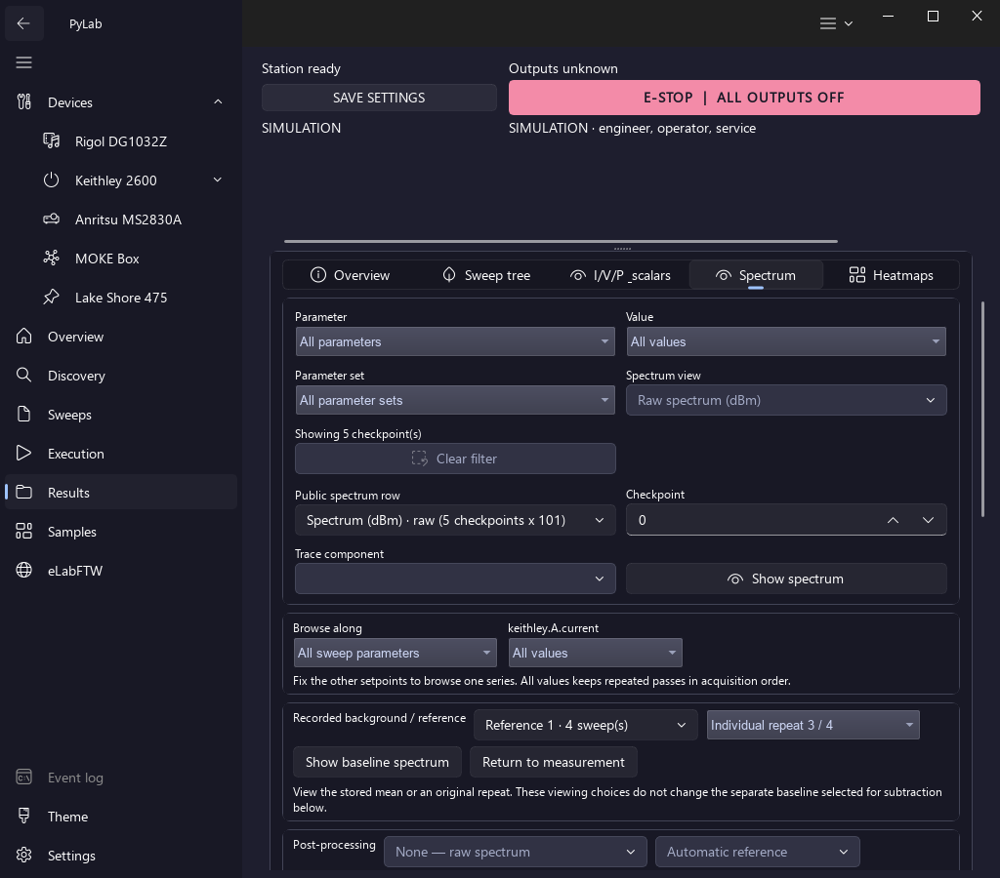
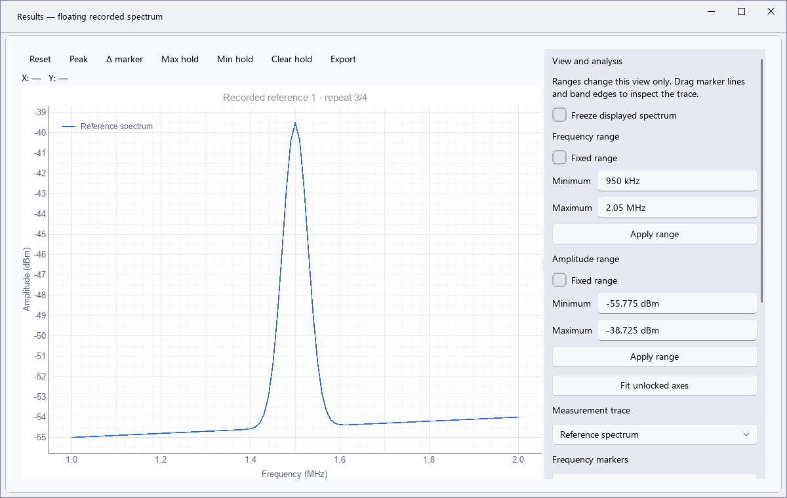
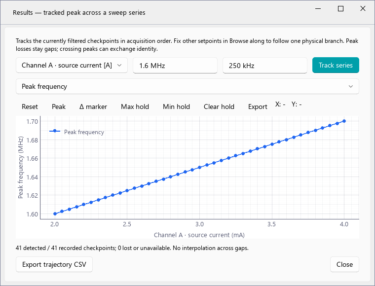
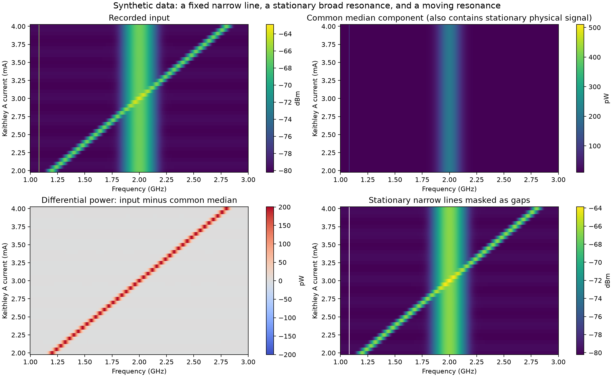
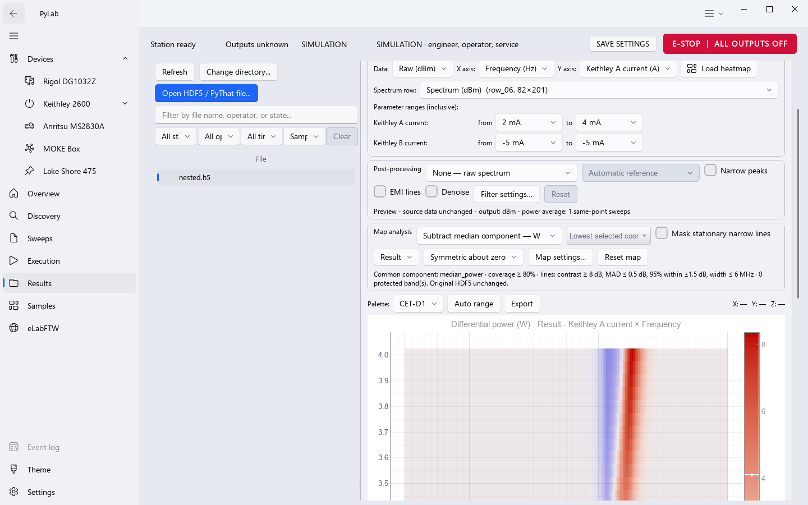
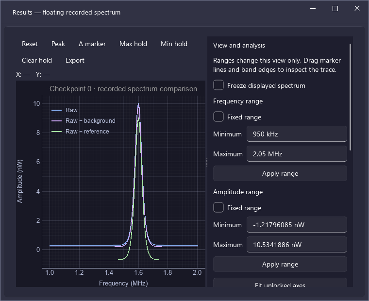

# Results: analiza zapisanych widm, trajektorii pików i map — 2026-10-08

Rozbudowano Results tak, żeby można było analizować pomiar po zakończeniu sweepa: porównywać RAW z różnicami względem zapisanego tła i referencji, ustawiać zakresy, używać markerów i pasm, śledzić piki po parametrach sweepa oraz analizować składową wspólną map. Analiza korzysta z archiwum wybranego pomiaru. Pliki źródłowe HDF5 pozostają bez zmian.

Pionowe linie na przesłanym zrzucie są kandydatami na sygnały niezależne od badanego parametru. Sam wygląd mapy nie dowodzi, że są zakłóceniami: rzeczywisty rezonans również może nie zmieniać częstotliwości w wybranym zakresie prądu. Dlatego nowe filtry są domyślnie wyłączone, mają jawne parametry i widoki porównawcze. Nie dopasowano progów do konkretnego pliku użytkownika — w tym zadaniu dostępny był zrzut ekranu, bez tego archiwum.

## Praca z widmem w Results

W zakładce Spectrum dodano kartę **Compare / view**:

- **Analysis** — widmo zgodne z ustawieniami istniejącego panelu Post-processing: odejmowanie odpowiedniego tła/referencji, operacje względne, filtry i ich konfiguracja.
- **Raw**, **Raw − BG**, **Raw − Ref** — niezależnie włączane krzywe, które można wyświetlać jednocześnie. Krzywe porównawcze korzystają z nieprzefiltrowanego RAW i oddzielnych, zapisanych baz odniesienia; filtry powyżej dotyczą Analysis.
- **Background spectrum**, **Reference spectrum** — samo zapisane tło/referencja, również jako nakładka na pomiar lub różnicę. Wyłączenie Analysis pozwala oglądać same bazy.
- Osobny wybór background/reference z tego archiwum. Zachowano kontrolę przeznaczenia bazy, siatki częstotliwości i zgodności konfiguracji; brak jednoznacznej bazy powoduje czytelny błąd.
- **Auto units**, **W — linear power**, **dBm — log power**. Wspólna oś krzywych mocy ma wspólne jednostki. W trybie Auto mieszane RAW w dBm i różnice w W są prezentowane w W.
- **Axes / markers / band…** — zakresy stałe, przeciągane markery częstotliwości i różnice między markerami, wybór krzywej pomiarowej, zakres pasma, informacje o próbkach i szerokości.
- **Peak table / tracking…** — wspólny detektor i konfiguracja pików z przeglądarki Anritsu; piki mierzone na jawnie wybranej krzywej.
- **Floating window** — większe, niezależne okno z tymi samymi krzywymi i inspektorem. Freeze utrzymuje wybrane widmo podczas dalszego przeglądania checkpointów; po wyłączeniu wraca aktualny checkpoint.
- **Max/Min hold** — dla odwiedzanych checkpointów o zgodnej siatce i jednostkach. Eksport zapisuje listę checkpointów użytych w hold; zmiana jednostek usuwa niezgodną historię.

Panel można zresetować bez zmieniania archiwum. Kontrolki zawijają się na węższych ekranach. Narzędzia wykorzystują komponenty istniejącej przeglądarki Anritsu i układ Fluent wewnątrz strony Results.

Odejmowanie mocy pozostaje fizycznie poprawne:

\[
P\,[W]=10^{(L\,[dBm]-30)/10},\qquad \Delta P=P_{RAW}-P_{baseline}.
\]

Ujemne różnice są zachowane w W. Konwersja do dBm pokazuje wyłącznie dodatnie reszty; wartości niedodatnie pozostają lukami z informacją dla operatora. Nie stosuje się wartości bezwzględnej ani sztucznego dodatniego progu. Stosunku/kontrastu w dB nie nakłada się na wspólną oś z mocą w W.

Zapisane background i reference można również obejrzeć osobno, zastosować lokalne filtry i zmienić jednostki. Odejmowanie bazy wymaga checkpointu pomiarowego. Uśrednianie czasowe wymaga pojedynczych sweepów tego samego punktu; sąsiednie punkty o innym prądzie lub napięciu nie zastępują historii czasowej.

### Średnia i pojedyncze powtórzenia tła/referencji

Dodano jawną kartę **Recorded background / reference**. Operator wybiera kolekcję z tego pomiaru, następnie **Stored mean** lub **Individual repeat K / N** i **Show baseline spectrum**. Wyświetlane są oryginalne dane oraz czas wybranego powtórzenia. **Return to measurement** przywraca checkpoint i jego wcześniejsze ustawienia korekcji. Można oglądać referencję także wtedy, kiedy przerwany pomiar nie zdążył zapisać żadnego checkpointu sygnału.

W **Post-processing** wybór kolekcji i powtórzenia określa bazę używaną do odejmowania lub innych operacji odniesienia. Dotyczy widma i mapy. W **Compare / view** istnieją oddzielne wybory dla background i reference; dana para kolekcja/powtórzenie jest wspólna dla krzywej tej bazy i jej krzywej RAW − baza. Wybór bazy do samego oglądania nie zmienia bazy korekcji checkpointu.

Domyślnie odejmowana jest zapisana średnia. Dla N zebranych powtórzeń oznacza ona

\[
\bar P(f)=\frac{1}{N}\sum_{k=1}^{N}10^{(L_k(f)-30)/10},\qquad
L_{mean}(f)=10\log_{10}\bar P(f)+30.
\]

Nie jest to średnia arytmetyczna wartości dBm. Po wyborze pojedynczego powtórzenia odejmowana jest jego oryginalna moc, bez uśredniania pozostałych powtórzeń. W signed W wynik zachowuje znak. Śledzenie pików na nowej krzywej **Reference spectrum** korzysta z tego samego wybranego powtórzenia, zamiast omijać wybór przez starszy widok referencji przypiętej do checkpointu.

Format zapisu nie został zmieniony: średnia pochodzi z `/references/<index>`, a powtórzenia z istniejących `/recipe_raw_sweeps_v1/<ordinal>`, wskazanych przez `source_recipe_sweep_indices`. Czytnik sprawdza zatwierdzenie rekordu, SHA-256 oryginalnego źródła, Hz/dBm, siatkę, numer powtórzenia i tożsamość bloku akwizycji. Brak lub uszkodzenie wybranego źródła powoduje błąd; nie jest zastępowane średnią. Starszy/importowany plik zawierający wyłącznie średnią udostępnia tylko tę średnią.

Odczyt jest leniwy i odbywa się w zadaniu roboczym. Wybór jednego powtórzenia odczytuje je oraz pierwsze źródło jego kolekcji do kontroli tożsamości, bez materializowania pozostałych widm. Lista powtórzeń jest wirtualizowana również dla długiej akwizycji tła. Cache rozróżnia kolekcję, średnią i numer powtórzenia.

Eksport zachowuje `selected_sweep` (numer lokalny od zera; UI pokazuje od 1), `source_sweep_indices` (globalne identyfikatory w archiwum), liczbę źródeł w kolekcji, purpose, czas i fingerprint. Przy samodzielnym oglądaniu bazy manifest osobno zapisuje faktyczne filtry bez korekcji oraz zachowane ustawienia korekcji checkpointu.

Podczas przeglądu renderowania naprawiono też błędne osadzenie ukrytego panelu inspektora: był niezarządzanym rodzeństwem wykresu i pojawiał się nad formularzem Results po pokazaniu powłoki. Teraz pozostaje ukrytym dzieckiem wykresu do chwili jawnego osadzenia w oknie narzędzi/floating.

## Śledzenie pików po sweepie

Po wybraniu piku w tabeli **Track across sweep…** otwiera niezależną trajektorię. Każde okno zachowuje własny plik, serię checkpointów, źródłową krzywą, filtry i ustawienia detektora. Można śledzić kilka pików w osobnych oknach.

Najpierw należy wybrać serię w **Browse along** i ustalić pozostałe parametry, np. Keithley A jako oś przy jednym prądzie Keithley B. Następnie w oknie trajektorii wybiera się oś, częstotliwość początkową i połowę szerokości bramki częstotliwości. Algorytm przechodzi po checkpointach w kolejności akwizycji i wybiera najbliższy wykryty pik w bramce względem poprzedniej wykrytej częstotliwości.

Dostępne wykresy: częstotliwość, amplituda, FWHM i Q. Brak piku lub danych daje lukę i jawny stan w eksporcie. Detektor analizuje oddzielnie ciągłe fragmenty skończonych próbek, żeby nie mierzyć szerokości przez brakujące biny. Nie interpoluje utraconych pików.

Brama ogranicza przeskoki między liniami, lecz przecięcie dwóch rezonansów może zamienić ich tożsamość. Zbyt wąska bramka może też uciąć skrzydła rezonansu i ograniczyć pomiar szerokości. Detekcja i dopasowanie modeli są narzędziami analizy, bez gwarancji fizycznej identyfikacji modu. Znaczenie prominence/width i problem brakujących próbek opisuje [dokumentacja SciPy find_peaks](https://docs.scipy.org/doc/scipy/reference/generated/scipy.signal.find_peaks.html).

## Analiza map

W Heatmaps dodano **Map analysis** po istniejącym panelu Post-processing. Pipeline jest jawny:

1. Dokładny przekrój zapisanych checkpointów i wybranych parametrów, bez niejawnego uśredniania powtórzeń lub różnych wartości drugiej osi sweepa.
2. Opcjonalne przetwarzanie każdego pełnego widma, zgodne z panelem Spectrum.
3. Opcjonalna operacja składowej wspólnej dla wybranego przekroju.
4. Opcjonalne maskowanie stałych wąskich linii, rozpoznawanych na odpowiadającej mu zapisanej macierzy RAW w dBm.
5. Zakres kolorów i paleta, które zmieniają prezentację.

Włączenie Post-processing zachowuje macierz RAW tego samego przekroju jako źródło klasyfikacji linii, z tą samą orientacją, siatką i mapowaniem checkpointów. Dzięki temu maskowanie działa też na mapie RAW − background/reference w signed W. Dla historycznej, osobno zapisanej macierzy processed bez takiego RAW należy wybrać w UI wiersz Raw i odpowiednią operację Post-processing. Aplikacja nie klasyfikuje reszt jako absolutnej mocy RAW.

| Operacja | Obliczenie dla częstotliwości f | Jednostka wyniku | Interpretacja |
| --- | --- | --- | --- |
| Off | Bez operacji mapowej | Jednostka wejścia | Punkt wyjścia do porównania |
| Subtract median component | \(P_i(f)-\operatorname{median}_j P_j(f)\) | W, ze znakiem | Odchylenie od składowej typowej dla przekroju |
| Subtract lower-quantile component | \(P_i(f)-Q_q(P_j(f))\), domyślnie q=0,20 | W, ze znakiem | Odchylenie od empirycznej niższej bazy |
| Subtract selected coordinate | \(P_i(f)-P_{i_0}(f)\) | W, ze znakiem | Różnica względem konkretnego zapisanego punktu |
| Contrast vs median | \(L_i(f)-\operatorname{median}_j L_j(f)\) | dB | Kontrast względny; nie jest odejmowaniem addytywnej mocy |

Mediana jest odporna na pojedyncze nietypowe obserwacje, lecz może usunąć rezonans zajmujący większość wartości badanego parametru dla danej częstotliwości. Niższy kwantyl może pomagać przy rzadko obecnym sygnale, ale jest empiryczną bazą i nie jest nieobciążonym estymatorem średniej mocy szumu. [NIST opisuje odporność mediany oraz znaczenie wartości odstających](https://www.nist.gov/publications/possible-advantages-robust-evaluation-comparisons).

Widoki **Result**, **Input before map filters**, **Common component** pozwalają zobaczyć wynik, wejście i odejmowaną bazę. Input omija filtry mapowe, również wtedy, kiedy konfiguracja filtrów nie może zostać zastosowana; pozostaje wejściem po ewentualnym Post-processing. Filtry wspólnej składowej i linii wymagają częstotliwości na jednej osi. Dla map dwóch parametrów przy jednej częstotliwości dostępne są nadal zakresy kolorów.

Statystyki składowej wspólnej i maski wymagają co najmniej trzech czytelnych wartości parametru. Domyślne pokrycie kolumny to 80% **całego wybranego przekroju**, wliczając brakujące punkty. Biny bez wymaganej bazy pozostają lukami, a istniejące luki nie są wypełniane zerami.

### Mask stationary narrow lines

Klasyfikator sprawdza łącznie:

- medianę RAW w dBm i kontrast względem lokalnej mediany częstotliwości: domyślnie co najmniej 8 dB;
- bezpośrednią MAD amplitudy względem mediany po parametrze: najwyżej 0,5 dB;
- co najmniej 95% dostępnych amplitud w odległości ±1,5 dB od mediany — sama MAD nie wystarcza, gdy linia reaguje na parametr tylko w części sweepa;
- pełną szerokość wykrytej wyniesionej grupy binów: najwyżej 6 MHz, z sąsiedztwem częstotliwości 60 MHz;
- pokrycie danych i pasma chronione przed maskowaniem.

MAD jest tutaj \(\operatorname{median}|L_i-\operatorname{median}L|\) w dB. Nie nazywamy jej odchyleniem standardowym ani poziomem ufności. Normalizacja do skali sigma zależy od modelu rozkładu; [NIST podaje definicję i osobną normalizację dla rozkładu normalnego](https://itl.nist.gov/div898/software/dataplot/refman2/auxillar/mad.htm).

Szerokości używają rzeczywistych częstotliwości i krawędzi binów. Algorytm obsługuje także nierównomierne siatki. Pasma chronione wpisuje się z jednostkami, np. `600 MHz .. 800 MHz; 1 GHz .. 1.2 GHz`. Dotyczą one maski linii; odejmowanie składowej wspólnej nadal działa na cały wybrany przekrój.

Maska tworzy luki NaN w odpowiadających częstotliwościach aktualnej mapy. Nie zastępuje linii interpolowanym sygnałem. Zachowuje szerokie i zmienne rezonanse w przygotowanych scenariuszach testowych. Rzeczywista wąska, stała linia może spełniać te same kryteria co zakłócenie, dlatego operator powinien ochronić interesujące pasma i porównać Input. Przy bardzo wąskim zakresie częstotliwości klasyfikacja ma mniej kontekstu sąsiedztwa.

Nie dodano automatycznej dekompozycji PCA/low-rank: składowa fizyczna też może być stacjonarna lub niskiego rzędu. Takie modele wymagają dodatkowych założeń o sygnale i zakłóceniach; [praca JMLR o robust PCA](https://www.jmlr.org/papers/v23/22-0369.html) opisuje model low-rank/sparse. Na tym etapie kontrolowane odejmowanie bazy, jawna maska i porównanie z wejściem mają łatwiejszą do sprawdzenia interpretację.

**1–99% colour range** ogranicza wpływ skrajnych wartości na kolory. **Symmetric about zero** i paleta rozbieżna ułatwiają ocenę różnic ze znakiem. Te ustawienia nie obcinają danych eksportu i nie zastępują filtracji.

### Proponowany początek analizy przesłanej mapy

Ustawić Frequency na osi X, prąd Keithley A na Y i jedną konkretną wartość Keithley B. Włączyć **Subtract median component — W**, porównać Result z Input/Common component i użyć symetrycznej skali kolorów. Potem osobno sprawdzić maskę linii z chronionymi pasmami rezonansów. Progi szerokości należy dobrać do rzeczywistej siatki częstotliwości i szerokości obserwowanych linii; wartości domyślne są punktem startowym.

## Dane i eksport

Ścieżki analizy czytają archiwum i korzystają ze wspólnego pipeline'u widm. Zmiana UI nie zapisuje processed, masek ani nowych referencji do HDF5. Testy porównują SHA-256 pliku przed i po analizie.

Eksport widma/mapy/wyniku śledzenia jest oddzielnym CSV/PNG/SVG z plikiem `.analysis.json`. Metadane obejmują źródłowe archiwum, checkpoint lub zakres checkpointów, jednostki, wybrane bazy z purpose/czasem/liczbą uśrednień/fingerprint, parametry Post-processing i analizy mapy/pików oraz wybór przekroju. Inspektor widma dodatkowo zapisuje markery, pasmo, zakresy i historię hold. Eksport plotu trajektorii zapisuje też aktualnie pokazywaną wielkość i jednostki osi.

CSV widma zapisuje pełne siatki widocznych krzywych, niezależnie od zoomu. CSV mapy zachowuje pełny wybrany przekrój i luki. CSV trajektorii zawiera częstotliwość, amplitudę, FWHM, Q i stan każdego punktu, również utraconego. Próba użycia archiwum HDF5 jako celu eksportu jest blokowana.

## Przegląd kodu, wydajność i weryfikacja

Przeglądano rzeczywiste ścieżki: kontrolki → wybór checkpointu/przekroju → wątek odczytu → wspólny DSP → renderowanie i eksport. Szczególnie sprawdzono rozróżnienie background/reference, jednostki W/dB/dBm, transpozycję osi, historię punktu, hold, zamykanie okien i anulowanie wyników nieaktualnych zadań.

| Moduł | Odpowiedzialność |
| --- | --- |
| `spectrum_views.py`, `processing.py` | Porównania i dowody użytych baz, wspólne przetwarzanie |
| `baseline_controls.py`, `processing_controls.py` | Wirtualny wybór średniej/powtórzeń do oglądania i odejmowania |
| `hdf5_reader.py`, `recipe_spectrum_store.py`, `read_session.py` | Bezpośredni zweryfikowany odczyt jednego źródła oraz oddzielne klucze cache |
| `spectrum_workbench.py` | Inspektor, zakresy, markery, pasmo, hold, floating, eksport |
| `peak_tools.py` | Detekcja wybranej krzywej i niezależne trajektorie |
| `map_processing.py`, `map_controls.py` | Operacje mapowe, klasyfikator, walidowane ustawienia |
| `heatmap_coordinates.py`, `heatmap_tab.py` | Dokładne przekroje, RAW companion, zadania i renderowanie |
| `analysis_export.py` | Ochrona pliku źródłowego i manifest pochodzenia |
| `spectrum_tab.py`, `page.py` | Integracja z istniejącą stroną i zamykanie zadań/okien |
| Anritsu `analysis_settings_dialog.py` | Jawna polityka pomiaru wybranej krzywej offline; domyślny tryb Live zachowany |

Odczyt, DSP i śledzenie wykonują zadania w QThreadPool. Nie aktualizują kontrolek z wątku roboczego. Zmiana samych filtrów mapowych wykorzystuje jeden zapisany w pamięci przekrój, bez ponownego odczytywania wszystkich widm z HDF5. Statystyki mają ograniczone rozmiary tymczasowych bloków i punkty anulowania. Jednorodne siatki map korzystają z istniejącej ścieżki raster/ImageItem; niejednorodne zachowują fizyczne krawędzie komórek.

Pomiar CPU na macierzy **405 × 10 001** w tym środowisku:

| Operacja | Czas | Dodatkowy szczyt alokacji Python/NumPy |
| --- | ---: | ---: |
| Mediana mocy | 0,4283 s | 65,75 MiB |
| Mediana mocy + maska linii | 2,1232 s | 93,27 MiB |
| Kontrast dB + zakres kolorów 1–99% | 0,1702 s | 92,80 MiB |

To pojedynczy pomiar numeryczny z prealokowanym wejściem, bez odczytu HDF5 i renderowania Qt; nie jest czasem całej operacji w aplikacji ani gwarancją dla każdego komputera. [Skrypt odtworzenia](2026-10-08-results-analysis-artifacts/generate_map_example.py) i [wynik JSON](2026-10-08-results-analysis-artifacts/benchmark.json) są dołączone.

Weryfikacja regresji: szeroki zestaw Results/Anritsu **157 passed, 2 skipped**; pominięcia dotyczą niedostępnego licencjonowanego fixture thaTEC. Dalsze sprawdzenie aktualnych narzędzi widma, ustawień pików i map: **31 passed**. Po dodaniu RAW companion oraz kontroli wspólnych jednostek dokładnego przekroju: **51 passed** w testach map, rekonstrukcji współrzędnych i dotychczasowego Post-processing. To osobne przebiegi z pokrywającymi się testami, nie sumaryczna liczba unikalnych przypadków.

Końcowe renderowanie i regresje inspektora/ustawień: **9 passed**. Po rozszerzeniu ochrony i manifestów eksportu także na toolbar wykresu trajektorii: **2 passed**. Ruff dla `app`, `tests` i skryptu demonstracyjnego zakończył się bez uwag; `git diff --check` nie wykazał błędów whitespace.

Testy obejmują matematyczne wzory i znaki, obie orientacje osi, niejednorodne częstotliwości, brakujące dane, ochronę pasm, reakcję linii tylko w części sweepa, zgodność RAW companion, tożsamość checkpointów przy ustalonym drugim parametrze, wątki robocze, brak ponownego I/O przy filtracji mapy, fingerprinty baz, freeze/hold, trajektorie z utratą piku i manifesty eksportów. Sprawdzono renderowanie po `show()` w pełnej powłoce Fluent przy 1440 i 1024 px oraz floating przy 760 px, w jasnym i ciemnym motywie.

### Weryfikacja rozszerzenia średnia/powtórzenie

Przejrzano kod przechowywania i odczytu źródeł, wiązania kolekcji, wyboru w kontrolkach, wspólnego przetwarzania widm/map, śledzenia i eksportu. Wprowadzone zmiany dotyczą odczytu i Results; nie zmieniają komend urządzeń ani formatu zapisu. Pomocniczą funkcję wstrzykującą błąd w teście timed background dostosowano do aktualnego argumentu `restore_continuous` przekazywanego już przez silnik, żeby test faktycznie sprawdzał przerwanie akwizycji.

- Results: **97 passed** w `test_results_baseline_repeats.py`, `test_results_analysis_workbench.py`, `test_results_postprocessing.py`, `test_results_map_analysis.py`, `test_results_series_navigation.py`.
- Storage: **42 passed, 3 skipped** w testach referencji, surowych źródeł, transakcji, czytnika i writer/thaTEC. Pominięcia dotyczą niedostępnego licencjonowanego fixture.
- Timed background/reference: **8 passed, 1 deselected**; bez pełnego, wielominutowego testu 297 punktów.
- Po dodatkowej kontroli zgodności pierwszego źródła z wybraną kolekcją: **24 passed, 4 deselected** w testach źródeł/obliczeń/UI bez ponawiania renderowania. Są to przypadki pokrywające się z zestawem Results, nie dodatkowe unikalne testy. Ruff dla `app` i `tests` oraz `git diff --check` przeszły.

Nowe przypadki sprawdzają obie kolekcje, wszystkie wskazane wybory, poprawną średnią liniowej mocy, oryginalne czasy/identyfikatory, counted i timed background, zgodność mapy z widmem, wybrane źródło w trajektorii, cache, brak I/O na wątku GUI, stary plik zawierający tylko średnią oraz przerwany pomiar bez checkpointów sygnału. Sprawdzono błędny payload, niewłaściwe jednostki i podmianę identyfikatorów na inny blok akwizycji. Potwierdzono niezmieniony SHA-256 archiwum po analizie/eksporcie i odczyt PyThat. Renderowanie sprawdzono w całej powłoce Fluent przy 1440 px/light i 1024 px/dark, także w floating; usunięty panel nakładający się na formularz ma osobną asercję regresji.

**Odrębna usterka ujawniona w szerszym uruchomieniu:** `test_full_requested_sweep_archive` zapisał 297 punktów, lecz zakończył się `Operation deadline expired before VISA dispatch` w węźle `final-b-zero`. Log HDF5 potwierdza rozpoczęcie wspólnego budżetu shutdown przy `final-a-zero`, poprawne ukończenie zerowania A/OUTPUT OFF i błąd przy zerowaniu B. Późniejsze działania awaryjne zostały wykonane, a archiwum ma status `faulted`. To nie jest pozytywna kwalifikacja pełnego sweepa ani dowód poprawnego zakończenia na sprzęcie; tej usterki silnika shutdown nie naprawiano w rozszerzeniu Results.
