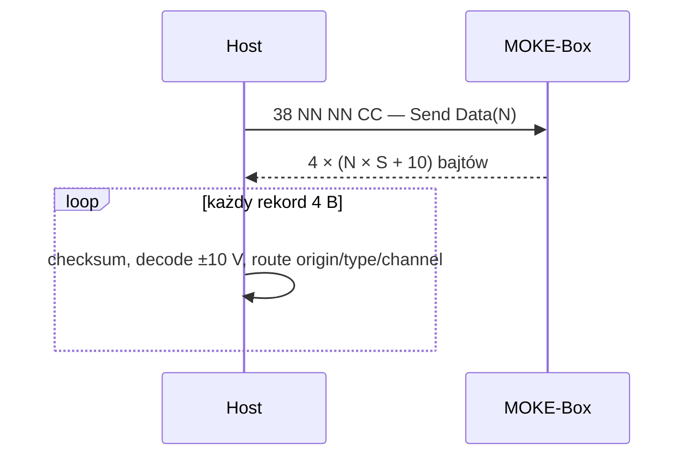

# MOKE-Box / BOKE-Box — rekonstrukcja protokołu komunikacyjnego

Data analizy: 2026-07-18  
Status: specyfikacja odtworzona z kodu LabVIEW; niezweryfikowana jeszcze na fizycznym MOKE-Box  
Zakres źródeł: `docs/External_libraries/MOKE-Box_in_progress/project`

## 1. Wniosek wykonawczy

Sterowanie MOKE-Box bez LabVIEW jest możliwe. Aplikacja używa zwykłego połączenia TCP/IP oraz stałych, czterobajtowych rekordów binarnych. Nie znaleziono szyfrowania, kompresji, autoryzacji ani zależności protokołu od runtime LabVIEW.

Najważniejsze ustalenia:

- transport: surowy TCP, domyślnie port `10001`;
- każda komenda i każdy rekord odpowiedzi ma dokładnie 4 bajty;
- bajt 0 zawiera adres modułu, typ i kanał;
- bajty 1–2 zawierają 16-bitową wartość albo parametr;
- dla komend i odpowiedzi AD5362 (VOUT) bajt 3 jest ważoną sumą kontrolną modulo 256;
- dla odpowiedzi AD7734 (Hall/Kerr) bajty 1–3 są pojedynczym, 24-bitowym wynikiem ADC — bez checksumy;
- wyjścia analogowe są zadawane jako napięcie `VOUT` w zakresie `-10...+10 V`, a nie bezpośrednio w amperach;
- pomiary Halla i Kerra wracają przez przetwornik AD7734;
- odczyt ośmiu wyjść VOUT wraca jako dane AD5362;
- wartość pola powstaje z napięcia Halla przez wielomian trzeciego stopnia i opcjonalną korekcję interpolacyjną;
- aplikacja zawiera otwartą pętlę wstępną oraz domkniętą regulację pola z tolerancją `0,0001 T`.

Nie można jeszcze uznać za potwierdzone na sprzęcie:

- bieżącego adresu IP urządzenia;
- przypisania fizycznych wyjść VOUT do konkretnego zasilacza/cewki;
- zależności `VOUT [V] -> prąd elektromagnesu [A]`;
- znaczenia komend `Reset`, `Set Extension` i typów zarezerwowanych;
- jednostki osi X tabeli korekcji zapisanej w dostarczonym pliku kalibracyjnym.

## 2. Materiał dowodowy i poziomy pewności

Analizę wykonano z następujących artefaktów:

- `MOKE-Box-ThaTec.lvproj` — projekt LabVIEW 2015;
- `Moke-box-ThaTec.vi` — główny moduł urządzenia;
- `moke-box-template.llb` — biblioteka niskopoziomowych VI i kalibracji;
- `New_sub_VIs.zip` — osobne wersje VI protokołu;
- `field_calibration.mcal` — binarny plik danych kalibracyjnych;
- wyeksportowane diagramy blokowe i kontrolowane uruchomienia czystych funkcji VI bez połączenia z urządzeniem.

Oryginalnych VI nie modyfikowano. Kontrolne sumy SHA-256 plików źródłowych przed i po eksporcie diagramów były identyczne.

Oznaczenia używane dalej:

- **POTWIERDZONE** — wynika bezpośrednio z diagramu albo z uruchomienia czystego VI na danych testowych;
- **SILNA INFERENCJA** — jednoznaczne z połączeń pomiędzy VI, ale bez ramki z fizycznego urządzenia;
- **DO WERYFIKACJI** — kod jest niepełny, niespójny pomiędzy wersjami albo wymaga znajomości hardware’u.

## 3. Warstwa transportowa

### 3.1. Połączenie

| Parametr | Wartość | Pewność |
|---|---:|---|
| Transport | TCP/IPv4 | POTWIERDZONE |
| Port | `10001` | POTWIERDZONE |
| Domyślny adres w produkcyjnym VI | `131.246.221.46` | POTWIERDZONE |
| Adres w `readback test.vi` | `192.168.0.2` | POTWIERDZONE |
| Timeout zapisu komendy | `4000 ms` | POTWIERDZONE |
| Timeout odczytu serii danych | `20000 ms` | POTWIERDZONE |
| Timeout odczytu VOUT | `200 ms` | POTWIERDZONE |

Adresy IP są zapisanymi wartościami konfiguracyjnymi, a nie częścią protokołu. Adres `131.246.221.112` z pliku `.aliases` opisuje alias celu projektu LabVIEW i nie powinien być automatycznie traktowany jako adres MOKE-Box.

W kodzie występuje niespójność timeoutu połączenia: etykieta kontrolki mówi `60000 ms`, zapisana wartość kontrolki wynosi `300 ms`, a główny VI ma kontrolkę `timeout=200`. Nowy sterownik powinien udostępniać timeout jako konfigurację, np. domyślnie 2–5 s dla połączenia i zapisu oraz 20–25 s dla akwizycji.

### 3.2. Własności strumienia

TCP nie zachowuje granic wiadomości. Sterownik musi buforować dane i wykonywać `recv_exact(4)` dla pojedynczego rekordu albo `recv_exact(expected_bytes)` dla odpowiedzi blokowej. Pojedyncze `recv()` nie gwarantuje otrzymania całej żądanej długości.

Nie ma znaków początku/końca ramki ani mechanizmu ucieczki. Po utracie wyrównania bajtów najbezpieczniej zamknąć połączenie i zestawić je ponownie. Suma kontrolna jest prostą sumą ważoną, nie CRC, więc nie powinna służyć do agresywnego wyszukiwania synchronizacji w dowolnym miejscu strumienia.

## 4. Format czterobajtowej ramki

### 4.1. Układ

| Offset | Nazwa | Znaczenie |
|---:|---|---|
| 0 | `HEADER` | target/origin, type, channel |
| 1 | `MSB` | starszy bajt wartości lub parametru |
| 2 | `LSB` | młodszy bajt wartości lub parametru |
| 3 | `CHECKSUM` | ważona suma kontrolna modulo 256 |

Nagłówek:

```text
bit:     7 6 | 5 4 3 | 2 1 0
         -----+-------+------
pole:    TGT  | TYPE  | CH
```

```text
HEADER = ((target_or_origin & 0x03) << 6)
       | ((type             & 0x07) << 3)
       |  (channel          & 0x07)
```

Dekodowanie:

```text
origin  = (HEADER & 0xC0) >> 6
type    = (HEADER & 0x38) >> 3
channel =  HEADER & 0x07
```

### 4.2. Suma kontrolna i payload AD7734

```text
CHECKSUM = (HEADER + 2*MSB + 4*LSB) & 0xFF
```

VI wykonuje pośrednie konwersje do `U8`, lecz wynik jest równoważny sumie modulo 256.

Checksum dotyczy ramek poleceń oraz rekordów odpowiedzi AD5362. Test fizycznego
MOKE Box przeprowadzony 2026-07-18 potwierdził odmienny format AD7734:

```text
08 7E BA 1C
│  └──────── 24-bitowy kod ADC = 0x7EBA1C
└─────────── MainBox / AD7734 / kanał 0 (Hall 1)
```

Ostatni bajt `1C` nie jest checksumą. Kod ADC ma reprezentację bipolarną
offsetową: `signed = code_u24 - 0x800000`, a napięcie wejściowe wynosi
`10 * signed / 0x7FFFFF` dla wartości dodatnich albo `/ 0x800000` dla ujemnych.
Powyższa ramka daje około `-0,09945 V`, zgodne ze wskazaniem LabVIEW około
`-0,09933 V`.

Przykład:

```text
HEADER=0x38, MSB=0x00, LSB=0x64
CHECKSUM=(0x38 + 2*0x00 + 4*0x64) mod 256 = 0xC8
ramka: 38 00 64 C8
```

## 5. Przestrzeń adresowa i typy

### 5.1. Target komend host -> MOKE-Box

| Kod | Nazwa w LabVIEW | Rola |
|---:|---|---|
| 0 | `MainBox` | moduł główny |
| 1 | `Kerr0` | pierwszy tor Kerra |
| 2 | `Kerr1` | drugi tor Kerra |
| 3 | `Opt2` | moduł/układ opcjonalny; w odpowiedziach źródło AD5362 |

### 5.2. Typ komendy host -> MOKE-Box

| Kod | Nazwa w LabVIEW | Status rekonstrukcji |
|---:|---|---|
| 0 | `Reset` | format nagłówka znany, semantyka payloadu nieznana |
| 1 | `Set Gain` | odtworzone |
| 2 | `VOUTn` | odtworzone |
| 3 | `Readback VOUT` | odtworzone |
| 4 | `Set Extension` | nieużywane w analizowanej aplikacji |
| 5 | `Reserved1` | zarezerwowane |
| 6 | `Reserved2` | zarezerwowane |
| 7 | `Send Data` | odtworzone; żądanie serii próbek |

`send_command.vi` wykonuje tylko `TCP Write`. Komendy ustawiające gain i VOUT nie mają na tym poziomie osobnego ACK; potwierdzeniem stanu powinien być jawny readback lub kolejny poprawny blok pomiarowy.

### 5.3. Typ odpowiedzi MOKE-Box -> host

Enum odpowiedzi ma inne znaczenie niż enum komend:

| Kod | Nazwa odpowiedzi | Zastosowanie |
|---:|---|---|
| 0 | `Reset` | rekord reset/status; aplikacja nie opisuje payloadu |
| 1 | `AD7734` | próbki Halla i Kerra |
| 2 | `AD5362` | odczyty ośmiu VOUT |
| 3–7 | — | parser `split_command_byte.vi` zgłasza błąd |

Dozwolone kombinacje odpowiedzi typu AD7734:

- `MainBox`: kanały 0–3;
- `Kerr0`: kanały 0–2;
- `Kerr1`: kanały 0–2.

Analiza VI wskazywała odpowiedź AD5362 z origin `Opt2` i kanałami 0–7. Test
rzeczywistego urządzenia `131.246.221.33:10001` wykonany 2026-07-18 zwrócił
jednak origin `MainBox`, nagłówki `10...17`. Sterownik akceptuje oba warianty,
ale zawsze wymaga typu AD5362, ośmiu unikalnych kanałów 0–7 i poprawnej
checksumy każdego rekordu.

## 6. Kodowanie wartości analogowej ±10 V

### 6.1. Napięcie -> kod U16

Wejście jest najpierw ograniczane do `[-10, +10] V`.

```text
jeżeli V >= 0:
    raw = 32768 + 3276.7 * V
jeżeli V < 0:
    raw = 32768 + 3276.8 * V

code = najbliższy kod U16 w zakresie 0...65535
MSB = (code >> 8) & 0xFF
LSB = code & 0xFF
```

LabVIEW rozdziela jeszcze wartość operacją `Quotient & Remainder` przez 256 i konwertuje oba wyniki do `U8`. Przy dokładnych remisach pół-LSB występuje zaokrąglenie LabVIEW do parzystej i saturacja pojedynczego bajtu. Dla nowego sterownika wystarczy wybrać najbliższy 16-bitowy kod; różnica w punkcie dokładnie pół-LSB jest fizycznie pomijalna.

### 6.2. Kod U16 -> napięcie

```text
u = (MSB << 8) | LSB
s = u - 32768

jeżeli s >= 0:
    V = 10 * s / 32767
jeżeli s < 0:
    V = 10 * s / 32768
```

### 6.3. Potwierdzone wektory kodera

| Żądane V | MSB LSB | Kod | Wartość po dekodowaniu |
|---:|---|---:|---:|
| `-12` (saturacja) | `00 00` | 0 | `-10.000000 V` |
| `-10` | `00 00` | 0 | `-10.000000 V` |
| `-5` | `40 00` | 16384 | `-5.000000 V` |
| `-1` | `73 33` | 29491 | `-1.000061 V` |
| `0` | `80 00` | 32768 | `0.000000 V` |
| `+1` | `8C CD` | 36045 | `+1.000092 V` |
| `+5` | `BF FF` | 49151 | `+4.999847 V` |
| `+10` | `FF FF` | 65535 | `+10.000000 V` |
| `+12` (saturacja) | `FF FF` | 65535 | `+10.000000 V` |

Rozdzielczość w pobliżu zera wynosi około `0,305 mV/LSB`.

## 7. Komendy sterujące

### 7.1. Ustawienie wzmocnień Halla

Enum wzmocnienia:

| Kod | Wzmocnienie |
|---:|---:|
| 0 | 1 |
| 1 | 10 |
| 2 | 100 |
| 3 | 1000 |

Komenda:

```text
target  = MainBox (0)
type    = Set Gain (1)
channel = 0
MSB     = 4 * gain_hall2_code + gain_hall1_code
LSB     = 0
HEADER  = 0x08
```

Dwa kody mieszczą się w czterech najmłodszych bitach `MSB`: Hall1 w bitach 1..0, Hall2 w bitach 3..2.

Przykład Hall1=`Gain 10` i Hall2=`Gain 100`:

```text
MSB = 4*2 + 1 = 9
ramka = 08 09 00 1A
```

### 7.2. Ustawienie wzmocnienia Kerr0/Kerr1

```text
target  = Kerr0 (1) albo Kerr1 (2)
type    = Set Gain (1)
channel = 0
MSB     = gain_code  # 0..3
LSB     = 0
```

Przykłady:

```text
Kerr0, Gain 100:  48 02 00 4C
Kerr1, Gain 1000: 88 03 00 8E
```

### 7.3. Bezpośrednie ustawienie VOUT

```text
target  = MainBox (0)
type    = VOUTn (2)
channel = 0..7
MSB,LSB = encode_voltage(requested_voltage)
HEADER  = 0x10 + channel
```

Przykłady dla kanału 2:

```text
-1 V: 12 73 33 C4
 0 V: 12 80 00 12
+1 V: 12 8C CD 5E
```

`set_VOUTn_timed.vi` nie definiuje nowej komendy. Generuje serię tych samych ramek, zmieniając napięcie krokami `0,05 V` co `25 ms`, czyli nominalnie `2 V/s`.

### 7.4. Odczyt wszystkich VOUT

Żądanie jest zawsze wysyłane na kanał 0:

```text
target  = MainBox (0)
type    = Readback VOUT (3)
channel = 0
MSB     = 0
LSB     = 0
ramka   = 18 00 00 18
```

Następnie host odczytuje dokładnie 32 bajty, czyli osiem rekordów po 4 bajty. Oczekiwane rekordy mają:

```text
origin  = MainBox (0) na sprawdzonym urządzeniu; Opt2 (3) w analizowanym VI
type    = AD5362 (2)
channel = 0..7
```

Nagłówki wynikające z analizy VI to `D0...D7`. Przechwyt rzeczywistego
urządzenia `131.246.221.33:10001` zwrócił `10...17`; pełna odpowiedź dla
zerowych VOUT miała postać `10 80 00 10 ... 17 80 00 17`. Payload każdego
rekordu jest dekodowany tym samym algorytmem ±10 V. `readback_VOUT.vi` zwraca
tablicę ośmiu napięć w kolejności rekordów, a `V_read_out_channel.vi` wybiera z
niej żądany indeks.

Przykład syntetycznej odpowiedzi dla VOUT2=`0 V`:

```text
D2 80 00 D2
```

### 7.5. Żądanie serii danych

```text
target  = MainBox (0)
type    = Send Data (7)
channel = 0
MSB,LSB = liczba próbek N jako unsigned big-endian U16
HEADER  = 0x38
```

`request_values.vi` ogranicza `N` do zakresu `1...60000`. Wyższy poziom `get_data.vi` ogranicza typowe wywołanie do `0...1000`.

Przykład dla `N=100`:

```text
38 00 64 C8
```

### 7.6. Reset i typy nieużywane

Nagłówki można wyliczyć, ale analizowana aplikacja nie pokazuje wiarygodnego payloadu ani reakcji dla `Reset`, `Set Extension`, `Reserved1` i `Reserved2`. Nie należy ich wysyłać do fizycznego urządzenia przed pasywnym przechwyceniem ruchu lub uzyskaniem dokumentacji firmware.

## 8. Akwizycja danych AD7734

### 8.1. Tryby akwizycji

Kontrolka `Set-up` ma niestandardowe wartości numeryczne równe liczbie aktywnych strumieni:

| Wartość | Etykieta | Liczba strumieni |
|---:|---|---:|
| 4 | `only MainBox` | 4 |
| 7 | `MainBox and Kerr0` | 7 |
| 10 | `MainBox, Kerr0 and Kerr1` | 10 |

Rekonstrukcja VI wskazywała, że po wysłaniu żądania `N` host oczekuje:

```text
record_count = N * active_stream_count + 10
byte_count   = 4 * record_count
```

Dodatkowe 10 rekordów stanowi zapas/overhead narzucony przez oryginalny VI. Sorter przyjmuje całość, ale dodaje do każdej tablicy najwyżej `N` wartości.

**Weryfikacja fizyczna (2026-07-18):** `Send Data(1)` zwróciło dokładnie jeden
rekord `08 7E BA 1C`, bez dalszych danych w ciągu 25 s. Produkcyjny odczyt
napięcia Halla używa więc wyłącznie potwierdzonego trybu: jedna próbka,
MainBox/AD7734/kanał 0. Wielokanałowy układ `N × streams + 10` pozostaje
niezweryfikowany i nie jest używany do odczytu Halla.

Sekwencja `get_data.vi`:

1. odczekaj `5 ms`;
2. wyślij `Send Data(N)`;
3. wykonaj blokujący odczyt `byte_count` z timeoutem `20000 ms`;
4. podziel ciąg na rekordy 4-bajtowe;
5. sprawdź długość modulo 4 i checksum każdej ramki;
6. rozdziel rekordy według origin/type/channel;
7. odczekaj `5 ms`;
8. porównaj liczniki strumieni z `N` (`all values present?`).



### 8.2. Mapowanie strumieni

| Origin | Type | Channel | Tablica VI | Znaczenie etykiety |
|---|---|---:|---|---|
| MainBox | AD7734 | 0 | `Hall1` | Longitudinal Hall |
| MainBox | AD7734 | 1 | `Hall1 current` | Longitudinal Hall current |
| MainBox | AD7734 | 2 | `Hall2` | Transversal Hall |
| MainBox | AD7734 | 3 | `Hall2 current` | Transversal Hall current |
| Kerr0 | AD7734 | 0 | `Kerr0 I1` | tor Kerr0 I1 |
| Kerr0 | AD7734 | 1 | `Kerr0 I2` | tor Kerr0 I2 |
| Kerr0 | AD7734 | 2 | `Kerr0 I12` | tor Kerr0 I12 |
| Kerr1 | AD7734 | 0 | `Kerr1 I1` | tor Kerr1 I1 |
| Kerr1 | AD7734 | 1 | `Kerr1 I2` | tor Kerr1 I2 |
| Kerr1 | AD7734 | 2 | `Kerr1 I12` | tor Kerr1 I12 |

Nazwy `Hall1 current` i `Hall2 current` sugerują odczyt prądu wzbudzenia czujników Halla. Sam kod nie dowodzi, że którykolwiek z tych kanałów jest pomiarem prądu cewki elektromagnesu.

Przykładowe, syntetyczne rekordy z wartością `0 V`:

```text
MainBox / Hall1: 08 80 00 08
Kerr0 / I2:      49 80 00 49
Kerr1 / I12:     8A 80 00 8A
```

## 9. Odczyt Halla i obliczenie pola

### 9.1. Uśrednianie

`Read_Hall_Voltage.vi` wywołuje `get_data.vi`, a następnie dla Hall1 i Hall2 oblicza:

- średnią napięcia;
- odchylenie standardowe, zwracane jako błąd/niepewność sygnału.

Liczba próbek uśredniania jest parametrem `U16`.

### 9.2. Wielomian Halla

`Calculate_mField_from_calibration.vi` wykonuje:

```text
Hall Voltage -> Hall_Polynomial -> Hall_Interpolation_Correction -> Magnetic Field
```

Wielomian jest trzeciego stopnia:

```text
H_poly(V) = C0 + C1*V + C2*V^2 + C3*V^3
```

Współczynniki odczytane z dostarczonego `field_calibration.mcal`:

```text
C0 = -0.0007387072430926411
C1 =  0.013032760125236825
C2 =  0.0000027310986380390884
C3 = -0.00000868776802374576
```

VI opisuje wejście jako wolty, a wyjście jako tesle. Przykładowe wyniki potwierdzone uruchomieniem VI:

| Hall V | H_poly |
|---:|---:|
| -2 V | -0.02672380095 |
| -1 V | -0.01376004850 |
| 0 V | -0.00073870724 |
| +1 V | +0.01228809621 |
| +2 V | +0.02526823526 |

### 9.3. Korekcja interpolacyjna

Gdy wartość wejściowa znajduje się w zakresie osi X, `Hall_Interpolation_Correction.vi` wykonuje interpolację liniową tablicy Y i dodaje wynik do wartości pola:

```text
H_final = H_poly + linear_interpolate(X, Y, H_poly)
```

Poza zakresem tablicy korekcja jest pomijana.

Kontrolne uruchomienie kompletnego toru potwierdziło, że LabVIEW akceptuje malejącą kolejność X i rzeczywiście dodaje korekcję. Dla dostarczonego pliku otrzymano:

| Hall V | H_poly | H_final |
|---:|---:|---:|
| -2 V | -0.02672380095 | -0.02680333230 |
| -1 V | -0.01376004850 | -0.01384039500 |
| 0 V | -0.00073870724 | -0.00081987252 |
| +1 V | +0.01228809621 | +0.01220611181 |
| +2 V | +0.02526823526 | +0.02518543466 |

Dane załadowane z pliku `.mcal`, w zapisanej kolejności:

```text
X, Y
 5.9080780,  0.0001364378400402072
 5.7791190,  0.0000564675594532937
 5.6372510,  0.0000393376831726994
 5.4805600,  0.0000000053910940018
 5.3078890, -0.0000554888578082335
 5.1170780, -0.0001083980752359659
 4.9041810, -0.0001172671309594003
 4.6625230, -0.0001356234917049976
 4.3780300, -0.0001624265887510343
 4.0223210, -0.0000220467862774784
 3.4608600,  0.0002915679972148935
 2.6576950,  0.0001954037474750994
 1.8108250,  0.0000812905685817593
 0.9486496, -0.0000298562948136787
 0.08249153,-0.0000863987876694662
-0.7938507, -0.0000312944941695346
-1.6624210, -0.0000728209725206312
-2.5091710, -0.0001543096097917501
-3.3030820, -0.0002059025197054670
-3.8782010,  0.0000845373583377093
-4.2414250,  0.0001741570079067528
-4.5292940,  0.0001646477780448130
-4.7732880,  0.0001407524196972987
-4.9878450,  0.0000980785112104088
-5.1800780,  0.0000485537660201846
-5.3539030, -0.0000167191189211352
-5.5113160, -0.0000409568713770764
-5.6539890, -0.0001017825323288840
-5.7841920, -0.0001699454969501801
```

**DO WERYFIKACJI:** oś X ma zakres około `-5,78...+5,91`, podczas gdy wielomian Halla dla typowych napięć daje pole rzędu dziesiątek mili-/setnych tesli. Może to oznaczać, że X jest zapisane w mT, pochodzi z napięcia Halla albo jest pozostałością starszej kalibracji. Nie należy bezwarunkowo stosować tej korekcji w nowym sterowniku, dopóki wynik nie zostanie porównany z polem wzorcowym. Wielomian podstawowy jest spójny wymiarowo z etykietami VI.

## 10. Pole zadane -> napięcie sterujące

`Control_Polynomial.vi` oblicza przewidywane napięcie sterujące z pola zadanego:

```text
U_ctrl(H) = D0 + D1*H + D2*H^2 + D3*H^3

dU/dH = D1 + 2*D2*H + 3*D3*H^2
```

Współczynniki z dostarczonego `.mcal`:

```text
D0 =      0.013376282807252431
D1 =    -19.760781522032598
D2 =      2.2678468359669477
D3 = -12559.73337452914
```

Przykłady potwierdzone uruchomieniem VI:

| H [T] | U_ctrl [V] | dU/dH [V/T] |
|---:|---:|---:|
| -0.02 | +0.509976919 | -34.923175445 |
| -0.01 | +0.223770616 | -23.574058471 |
| 0 | +0.013376283 | -19.760781522 |
| +0.01 | -0.196564481 | -23.483344598 |
| +0.02 | -0.481410076 | -34.741747698 |

Główny VI zapisuje przy starcie do globalnej zmiennej limit napięcia `6,66 V`. Plik `.mcal` nie zawiera tego limitu.

## 11. Sterowanie polem i ograniczenia

### 11.1. Sterowanie wstępne

`rough_field_set.vi`:

- oblicza napięcie z `Control_Polynomial.vi`;
- odczytuje bieżący VOUT;
- ogranicza pojedynczy krok napięcia do około `±1,6 V`;
- ustawia napięcie komendą VOUT;
- czeka `300 ms`.

### 11.2. Regulacja domknięta

`p-control-step.vi`:

- odczytuje i uśrednia napięcie Halla;
- przelicza je na pole;
- wykorzystuje wielomian sterowania oraz jego pochodną;
- stosuje współczynnik korekcyjny `0,9`;
- ogranicza korektę pojedynczego kroku do `±0,8 V`;
- wywołuje ograniczony zapis napięcia;
- używa czasu oczekiwania `90 ms`;
- uznaje pole za osiągnięte, gdy `abs(H_set-H_measured) <= 0,0001 T`.

`set_voltage_mother.vi` porównuje nastawę z globalnym limitem napięcia i dla przekroczenia generuje błąd `665`, zamiast wysłać wartość.

### 11.3. Kanał pola

W głównym `Moke-box-ThaTec.vi` zapisana wartość `Field Control Channel` wynosi `2`. Osobny `Initialize_MOKE_Voltage.vi` zeruje natomiast kanały `4,5,6,7`. Jest to istotna niespójność dwóch fragmentów projektu. Nie wolno zakładać, że konkretny kanał steruje elektromagnesem bez weryfikacji okablowania.

## 12. Napięcie sterujące a prąd elektromagnesu

Protokół MOKE-Box ustawia napięcie DAC, nie prąd w amperach. Najbardziej prawdopodobny tor wygląda następująco:

```text
komenda TCP -> VOUT MOKE-Box [-10..+10 V]
            -> analogowe wejście sterujące zasilacza elektromagnesu
            -> prąd cewki [A]
            -> pole
            -> czujnik Halla -> napięcie -> pole [T]
```

Do sterowania prądem potrzebna jest dodatkowa charakterystyka zasilacza, np.:

```text
I_coil = a * U_ctrl + b
```

albo tabela/nieliniowa funkcja z dokumentacji zasilacza. Tych danych nie ma w analizowanych VI. Jeżeli zasilacz ma wejście ±10 V odpowiadające np. ±Imax, współczynnik `a` wynika z konfiguracji zasilacza, nie z protokołu MOKE-Box.

Można natomiast sterować polem bez jawnego przeliczania na ampery: ograniczona pętla sprzężenia zwrotnego reguluje VOUT do chwili uzyskania żądanego pola z czujnika Halla. Nadal wymagane są niezależne ograniczenia prądu i temperatury po stronie zasilacza.

## 13. Minimalny kodek referencyjny w Pythonie

Poniższy kod tylko buduje i sprawdza ramki. Nie otwiera połączenia i nie steruje hardware’em.

```python
from __future__ import annotations


def checksum(header: int, msb: int, lsb: int) -> int:
    return (header + 2 * msb + 4 * lsb) & 0xFF


def make_header(target: int, command_type: int, channel: int) -> int:
    if not 0 <= target <= 3:
        raise ValueError("target outside 0..3")
    if not 0 <= command_type <= 7:
        raise ValueError("type outside 0..7")
    if not 0 <= channel <= 7:
        raise ValueError("channel outside 0..7")
    return (target << 6) | (command_type << 3) | channel


def make_frame(target: int, command_type: int, channel: int,
               msb: int, lsb: int) -> bytes:
    header = make_header(target, command_type, channel)
    if not 0 <= msb <= 255 or not 0 <= lsb <= 255:
        raise ValueError("payload byte outside 0..255")
    return bytes((header, msb, lsb, checksum(header, msb, lsb)))


def encode_voltage(voltage: float) -> tuple[int, int]:
    voltage = max(-10.0, min(10.0, float(voltage)))
    scale = 3276.7 if voltage >= 0.0 else 3276.8
    code = int(round(32768.0 + scale * voltage))
    code = max(0, min(65535, code))
    return (code >> 8) & 0xFF, code & 0xFF


def decode_voltage(msb: int, lsb: int) -> float:
    signed = ((msb << 8) | lsb) - 32768
    denominator = 32767.0 if signed >= 0 else 32768.0
    return 10.0 * signed / denominator


def validate_frame(frame: bytes) -> bool:
    if len(frame) != 4:
        return False
    return frame[3] == checksum(frame[0], frame[1], frame[2])


def request_samples(count: int) -> bytes:
    if not 1 <= count <= 60000:
        raise ValueError("count outside 1..60000")
    return make_frame(0, 7, 0, count >> 8, count & 0xFF)


def set_vout(channel: int, voltage: float) -> bytes:
    msb, lsb = encode_voltage(voltage)
    return make_frame(0, 2, channel, msb, lsb)
```

Kod produkcyjny powinien dodatkowo mieć:

- `recv_exact()` z limitem czasu;
- blokadę równoległych operacji na jednym sockecie;
- stan połączenia i bezpieczne ponowne połączenie;
- dozwoloną listę kanałów;
- konfigurowalny limit napięcia niższy lub równy limitowi sprzętowemu;
- limit szybkości zmian;
- obowiązkowy odczyt zwrotny po zapisie;
- zatrzymanie po błędzie checksum, niepełnym bloku, braku stabilności pola lub przekroczeniu temperatury/prądu;
- dziennik surowych ramek TX/RX z monotonicznym timestampem.

## 14. Procedura bezpiecznej walidacji na urządzeniu

### Etap A — pasywne potwierdzenie

1. Uruchomić oryginalny LabVIEW z działającym stanowiskiem.
2. Przechwycić ruch filtrem `tcp.port == 10001`.
3. Potwierdzić adres IP, czterobajtowe ramki, checksum i kolejność odpowiedzi.
4. Zapisać osobno operacje: połączenie, ustawienie gain, odczyt Hall, readback VOUT, minimalna zmiana pola, field off.

To jest najbezpieczniejszy sposób potwierdzenia semantyki firmware bez wysyłania nowych komend.

### Etap B — test bez energii w elektromagnesie

1. Wyłączyć wyjście mocy zasilacza albo fizycznie odłączyć cewkę zgodnie z procedurą stanowiska.
2. Ustawić sprzętowy limit prądu na minimalną bezpieczną wartość.
3. Połączyć tylko jednego klienta TCP.
4. Wykonać wyłącznie `Readback VOUT`.
5. Zażądać jednej próbki (`N=1`) i sprawdzić odpowiedź AD7734 jako 24-bitowy kod ADC, bez checksumy.
6. Nie wysyłać `Reset` ani komend zarezerwowanych.

### Etap C — identyfikacja kanału VOUT

1. Zmierzyć wszystkie VOUT multimetrem/DAQ.
2. Na jednym kandydacie wysłać kolejno `0`, `+0,05`, `0`, `-0,05`, `0 V`.
3. Po każdym zapisie wykonać `Readback VOUT`.
4. Zidentyfikować fizyczny kanał i polaryzację.
5. Powtórzyć dopiero po potwierdzeniu, że kanał nie steruje innym elementem stanowiska.

### Etap D — identyfikacja prądowa

1. Zasilacz w trybie ograniczonego prądu, aktywne zabezpieczenie termiczne i awaryjne wyłączenie.
2. Zmieniać VOUT małymi krokami, początkowo najwyżej `0,05...0,1 V`.
3. Rejestrować jednocześnie VOUT, prąd z niezależnego miernika/zasilacza, Hall V i pole wzorcowe.
4. Wyznaczyć `I(U)` osobno dla obu polaryzacji i sprawdzić histerezę.
5. Ustawić software’owy limit VOUT znacznie poniżej `6,66 V`, dopóki mapa nie jest kompletna.

### Etap E — kalibracja pola

1. Wyłączyć korekcję interpolacyjną z dostarczonego `.mcal`.
2. Zebrać pary `Hall Voltage [V]` i `H_ref [T]` dla pełnego bezpiecznego zakresu.
3. Dopasować wielomian, sprawdzić reszty i walidację krzyżową.
4. Dopiero potem utworzyć tabelę korekcji w jednoznacznych jednostkach.
5. Pętlę domkniętą uruchamiać od małego pola, małych korekt i dłuższego czasu stabilizacji.

## 15. Warunki uznania sterownika za zgodny

Sterownik bez LabVIEW można uznać za zgodny, jeżeli:

- wszystkie wektory ramek z sekcji 6–7 przechodzą testy jednostkowe;
- parser poprawnie składa dane z fragmentowanych odczytów TCP;
- zrzut z oryginalnej aplikacji daje identyczne nagłówki i checksum;
- odczyt VOUT zwraca osiem kanałów z origin `MainBox` albo `Opt2`, type `AD5362`;
- akwizycja `N` daje dokładnie `N` wartości dla każdego aktywnego strumienia;
- po błędzie ramki sterownik zamyka sesję i nie kontynuuje sterowania na przesuniętym strumieniu;
- napięcie wyjściowe jest ograniczone niezależnie od danych kalibracyjnych;
- field-off/abort został potwierdzony fizycznie dla właściwego kanału;
- przeliczenie pola zostało porównane z miernikiem wzorcowym;
- zasilacz ma niezależny sprzętowy limit prądu.

## 16. Otwarte punkty do domknięcia przechwytem sprzętowym

1. Jaki jest aktualny IP MOKE-Box i czy dopuszcza tylko jednego klienta?
2. Czy po połączeniu urządzenie wysyła rekord powitalny/reset?
3. Który VOUT jest rzeczywiście wejściem zasilacza elektromagnesu?
4. Czy odpowiedzi AD5362 zawsze przychodzą w kolejności kanałów 0–7?
5. Jak wygląda odpowiedź po błędnej checksum?
6. Czy `Reset` zeruje VOUT, resetuje ADC, czy restartuje cały kontroler?
7. Jakie jest znaczenie `Set Extension`?
8. Czy `Hall1 current`/`Hall2 current` mierzą prąd wzbudzenia czujników, czy inny tor?
9. W jakiej jednostce zapisano oś X korekcji interpolacyjnej?
10. Jaka jest sprzętowa charakterystyka `VOUT -> I_coil` i bezpieczny limit `dI/dt`?

Po zebraniu jednego kompletnego PCAP z sesji LabVIEW punkty 1–8 powinny dać się zamknąć bez dalszej dekompilacji.
