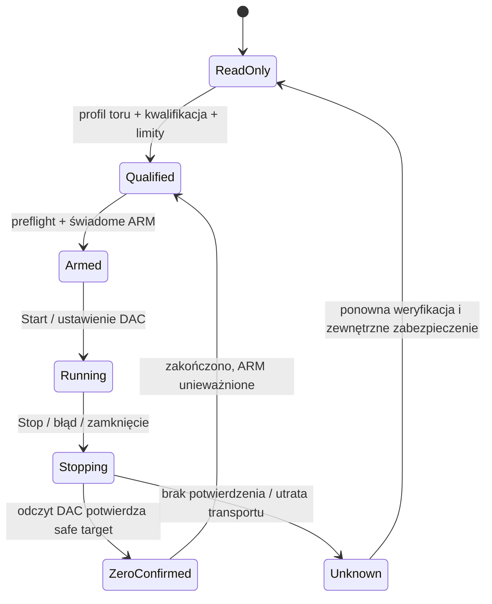
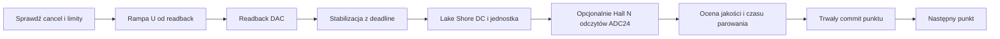

# Plan wdrożenia MOKE-Box: napięcie sterujące Kepco i kalibracja pola Lake Shore

Data: 2026-10-02. Status: **V1 wdrożone programowo; kwalifikacja fizycznego toru pozostaje otwarta**.
Zlecenie rozszerzono na implementację sterowania i kalibracji. Sterowniki,
modele, engine i UI są rozszerzone; aktywne ustawienia stanowiska oraz
uprawnienia do fizycznego sterowania nie zostały zmienione.

Aktualny stan i instrukcja operatora:
[raport wdrożenia](../../raports/MOKE_BOX_IMPLEMENTATION_AND_OPERATOR_GUIDE_2026-10-02.md).
Panel regulacji jest oddzielny od kalibracji. Zgodnie z doprecyzowaniem
operatora skopiowano blok konfiguracji Keithley: `LimitField`, zakres
min/max, popup `Edit`, odstępy formularza i pasek przycisków. Historia U/B
znajduje się po prawej. Checklista poniżej pozostaje specyfikacją pełnej
kwalifikacji, łącznie z niewykonanymi próbami fizycznymi S0/S8 i osobnym V2/S9.

Doprecyzowanie operatora: Live ON automatycznie reguluje napięcie, Live OFF
wymaga Apply. Czas odpowiedzi toru oszacowano na 2 s: dodano minimum oczekiwania
po rampie do profilu stanowiska oraz edytowalny, dłuższy czas w panelu.
Live przechowuje wyłącznie najnowszy draft podczas pojedynczej aktywnej rampy.
400 ms edycji pola pozostaje osobnym czasem od ustalania elektromagnesu.
W ramach S8 należy zmierzyć odpowiedź Lake Shore i zatwierdzić czasy/rampę;
2 s jest wartością startową, nie potwierdzonym wynikiem pomiaru.

Podstawa: [przegląd inżynieryjny](../../raports/MOKE_BOX_ENGINEERING_REVIEW_2026-10-02.md),
[dowody źródłowe](../../raports/evidence/moke_labview_static_audit_2026-10-02.json)
oraz aktualny kod, nie pseudokod starszego raportu.
Plan rozszerza [masterplan aplikacji](../../PLAN_WDROZENIA.md) i
[kwalifikację sprzętu](../../MACIERZ_KWALIFIKACJI_SPRZETOWEJ.md).

## 1. Rezultat dla operatora i zakres wersji

### Wersja pierwsza — kompletna ścieżka napięciowa

1. Operator wybiera kwalifikowany kanał MOKE-Box, wprowadza **min/max napięcia
   sterującego** w V/mV i ustawia U_DAC ręcznie lub w sweepie. To napięcie na
   wyjściu MOKE-Box, nie napięcie na cewce Kepco. W pierwszym wdrożeniu obsługujemy
   jeden przypisany tor elektromagnesu; odczyt pozostałych VOUT pozostaje dostępny.
2. Karta pokazuje U zadane, U potwierdzone odczytem DAC, efektywny zakres,
   stan uzbrojenia i działania „Uzbrój”, „Ustaw”, „Sprowadź sterowanie do zera”.
   Obok U pojawia się przewidywane B z wybranej kalibracji. Bez kalibracji karta
   jest nadal użyteczna napięciowo, a B pokazuje brak modelu zamiast fikcyjnego zera.
3. Nowa zakładka **Kalibracja pola** pozwala określić U_min/U_max, siatkę,
   oczekiwanie/stabilność, próbki i powtórzenia. Program wykonuje sweep tam/z
   powrotem, mierzy Lake Shore i opcjonalnie Hall, trwale zapisuje dane, ocenia
   jakość, pokazuje porównanie gałęzi i zapisuje nową wersję kalibracji.
4. Operator jawnie wybiera kalibrację dla toru. Podgląd sweepu pokazuje obok U
   B przewidywane, a monitor wyników osobno B zmierzone lub wyznaczone z Halla.
5. Stop, błąd pomiaru, błąd zapisu, E-STOP i zamknięcie aplikacji uruchamiają
   zdefiniowaną procedurę kończenia. Każda utrata potwierdzenia pozostawia UNKNOWN.

### Dalsze etapy

V2: sweep po zadanym B z jednoznacznym, monotonicznym odwrotnym modelem gałęzi.
V3: ograniczony regulator pola z Hall feedback, stabilnością i deadline.
Oddzielnie: drugi elektromagnes/pole wektorowe, kompensacja sprzężeń,
sterowanie programowalnym Kepco, automatyczne rozmagnesowanie. Nie implementujemy
ich przez zgadywanie kanału 3 lub komend Reset.

Kalibracja nie jest warunkiem zapisu napięcia; kwalifikacja toru i jego limitów
jest. Brak kalibracji blokuje operacje z zadanym polem oraz liczbowy podgląd B.

## 2. Stan obecny i zależności

| Warstwa | Obecnie | Docelowo |
|---|---|---|
| wire | kodek SET_VOUT/readback, ADC24 | zachowanie zgodności, granice kwantyzacji, wariant sprzętowy |
| settings | read-only; writes zabronione walidatorem | osobno read qualification, write qualification i fizyczne envelope |
| adapter | guarded write/ramp, bez pełnych limitów/ARM/cancel | wspólna polityka napięciowa, bezpieczny worker-owned ramp i shutdown |
| UI | diagnostyka Hall/VOUT | sterowanie, operator min/max, kalibracja i jawne źródła B |
| recipes | configure_moke_box blokowane, brak osi rejestru | napięciowy block/provider, compiler/preflight/finally |
| engine | Hall i Lake Shore reads | rzeczywiste U, kalibracja snapshot, B-est/measured, stany wyjść |
| storage | ogólny HDF5/PyThat, brak modelu kalibracji MOKE | niezmienne profile, surowe przebiegi, wersjonowane metadane |

Istniejące wzorce do wykorzystania: Keithley `sweep_provider.py`, sterowanie
limitami/ARM i rampą, `DeviceController.acquire_run_lease()`, charakterystyka
Keithley z workerem, dziennikiem i częściowym wynikiem. Zachować kontrakt
`DeviceModule` i `DeviceSweepProvider`; nie kopiować założeń SMU o OUTPUT OFF,
compliance, pomiarze prądu ani source V/I do MOKE-Box.

Kolejność zależności: **S0 → S1 → S2 → S3 → S4 → S5 → S6 → S7 → S8**.
Modele kalibracji można przygotować po S1, ale fizyczna akwizycja wymaga S3.
S9 (zadane B/regulator) ma osobną bramkę po ukończeniu V1.

## 3. Kontrakt fizyczny i bezpieczeństwa

### 3.1. Cztery różne wielkości

**Uzupełnienie od operatora, 2026-10-02:** Kepco **72-6M**, tryb prądowy.
To wyjaśnia sterowanie napięciowe w LabVIEW: cyfrowa komenda TCP ustawia DAC
MOKE-Box, a jego analogowe napięcie zadaje prąd Kepco. Napięcie na cewce jest
wynikiem regulacji prądu. Nominalne 0,6 A/V opisano i udokumentowano w
[przeglądzie toru](../../raports/MOKE_BOX_ENGINEERING_REVIEW_2026-10-02.md#8-dokumentacja-producentów-i-brakujące-dane-stanowiska).
Nie wpisywać tego automatycznie jako kwalifikowanego przelicznika stanowiska.
Profil musi zapisać rzeczywiste gain [A/V], offset [A] i polaryzację, sposób ich
ustalenia oraz model/serial/revision. Ewentualny `I_est` z takiego modelu wymaga
etykiety „przewidywany”; nie zastępuje `I_measured` ani compliance.

| Wielkość | Jednostka wewnętrzna | Źródło |
|---|---|---|
| U_DAC | V | nastawa/odczyt MOKE-Box; steruje wejściem analogowym Kepco |
| I_coil, U_coil | A, V | wyłącznie niezależny pomiar lub kwalifikowany odczyt Kepco |
| B_ref / B_measured | T | Lake Shore w DC, znana sonda i orientacja |
| B_est / B_hall | T | odpowiednio model U→B i model Hall V→B z kalibracji |

Nie używać H [A/m] zamiennie z B [T]. Human-authored YAML/UI wymaga jednostek,
`parse_quantity` normalizuje do SI, a adapter konwertuje raz do kodów wire.
Gauss→T = 1e−4. Oe/A/m odrzucać dla tej kalibracji bez odrębnego modelu fizycznego.
Nie utożsamiać kanałów Hall current z pomiarem prądu cewki.

### 3.2. Zakresy i role

```text
effective_min_v = max(codec_min, qualified_station_min,
                      experiment_min, operator_min)
effective_max_v = min(codec_max, qualified_station_max,
                      experiment_max, operator_max)
```

Envelope stacji obejmuje również dU/dt, maksymalny krok, timeout, safe target,
dopuszczalne kanały oraz zabezpieczenia cewki/Kepco. Operator może zmieniać
zakres roboczy wewnątrz envelope. Inżynier/serwis zatwierdza envelope, okablowanie
i profil fizyczny. Zmiana kanału, Kepco mode, limitu stacji lub toru unieważnia
approval/ARM i zgodność kalibracji. Rozszerzenie zakresu operatora jest dozwolone
jedynie wewnątrz zatwierdzonego envelope i po ponownej walidacji planu.

Gdy prąd nie jest mierzony, nie udawać programowego compliance I. Wymagać
niezależnie ustawionego sprzętowego ograniczenia Kepco, interlock/ochrony cieplnej
według kwalifikacji; rejestrować dostępne dowody i ich ograniczenia.

Odrzucać NaN/Inf/bool jako liczby, nieznane kanały, niekwalifikowane kanały,
odwrócony/pusty zakres, brak jednostek, niekompletne limity eksperymentu,
niezatwierdzony profil i code_u16 reprezentujący wartość poza granicą.
Nie obcinać nielegalnej nastawy do limitu i nie rozszerzać zakresu z kalibracji.
Jeśli obecna nastawa jest poza nowym węższym zakresem operatora, zmiana wymaga
kontrolowanego zakończenia pracy; nie zgłaszać zgodnego stanu samą zmianą formularza.

Safe target jest osobną kwalifikowaną wartością, zwykle zero. Musi mieścić się
w fizycznym envelope, ale może leżeć poza roboczym min/max operatora, np. przy
sweepie dodatnim. Shutdown nigdy nie jest blokowany roboczym minimum +1 V.

### 3.3. MOKE nie ma potwierdzonej komendy OUTPUT ENABLE

Nie tworzyć fikcyjnego sprzętowego OUTPUT OFF. W MOKE zapis DAC jest działaniem
mogącym dostarczyć energię. Rozdzielić konfigurację **planu w pamięci** od ARM
i pierwszego zapisu. Konfiguracja nie może zmienić DAC. Configure-while-off
oznacza brak mutacji i, dla testów konfiguracji hardware, potwierdzone zewnętrzne
wyłączenie stopnia mocy Kepco. Jeśli brak takiego dowodu, zakwalifikowany workflow
nie może zakładać, że configure jest energetycznie pasywne.

ARM wiąże jednorazową zgodę z profilem, kanałem, planem/zakresem, generacją sesji
i snapshotem kalibracji. „Ustaw”/„Start” konsumuje zgodę i rozpoczyna rampę.
Zmiana celu poza zatwierdzonym planem, limitów, sesji, toru lub aktywnej kalibracji
unieważnia zgodę. Dla całego sweepu zgoda dotyczy niezmiennej pełnej trajektorii.



To stany specyfikacji; należy odwzorować je na istniejący `DeviceState` i osobne
dowody wyjścia, bez równoległego publicznego enum dublującego architekturę.
`ZeroConfirmed` oznacza wyłącznie potwierdzony safe DAC. `SAFE` całego toru
wymaga dowodów uzgodnionych w kwalifikacji, np. I_coil i/lub wyłączenia Kepco.
Zero DAC nie dowodzi zero pola, braku remanencji ani wyłączenia stopnia mocy.

### 3.4. Normalne zakończenie i awaria

Normalny Stop: anulowanie nowych nastaw → zatwierdzona rampa do safe target →
readback → potwierdzenia fizyczne, jeśli dostępne → trwały status i release lease.
E-STOP: przerwać rampę natychmiast flagą poza kolejką GUI, wykonać zatwierdzoną
procedurę awaryjną, próbować wszystkich dostępnych wyłączeń, zapisać UNKNOWN
tam, gdzie brak dowodu. Bez kwalifikacji nie zgadywać, czy skok do 0 czy rampa
jest bezpieczniejsza dla indukcyjnego obciążenia.

Po błędzie checksum/fragmentacji sesja nie nadaje się do dalszego dekodowania.
Nie wysyłać zwykłych writes na rozsynchronizowany transport. Przy utracie TCP
sprzęt może utrzymać DAC: zamknięcie socketu nie jest shutdownem. Fizyczny
interlock/inhibit/watchdog zasilacza musi obsłużyć ryzyko poza procesem, jeśli
jest wymagany przez kwalifikację. Nowe połączenie nie przywraca ostatniej nastawy.

## 4. Modele i kontrakty danych

Nowe klasy immutable z wartościami SI, bez Qt i bez I/O w konstruktorach:

| Proponowany model | Minimalne dane |
|---|---|
| `MokeVoltageRequest` | channel, target_v, approved effective range, ramp policy, deadline/context |
| `MokeVoltageReadback` | requested_v, applied code/voltage, actual_v, timestamp, session generation, verification |
| `MokeControlEnvelope` | station/experiment/operator bounds, slew/step, safe target, qualifications |
| `FieldEstimate` | value_t lub brak, source, branch/history validity, calibration_id/hash, domain, quality/uncertainty |
| `MokeCalibrationRequest` | channel/tor, U_min/max, grid, branches, repeats, settling, N samples, output location |
| `MokeCalibrationPoint` | index/branch/repeat, U_requested/readback, Hall raw/V, B_ref/raw unit/mode, timestamps, quality |
| `MokeFieldCalibration` | schema_version, identity/provenance, domains, branch models, Hall model, raw-run hash, quality |

Umieścić neutralne ilości/rezultaty w `app/domain`, wire i specyficzne profile
w `app/devices/moke_box`. Nie utrzymywać drugiej tabeli jednostek w UI ani
drugiego rejestru parametrów obok `parameter_registry.py`.

Zapisane nazwy pomiarowe i wyświetlane etykiety nie są tym samym. Istniejące
`moke_box.hall1_field_t` musi zachować znaczenie wraz z jawnym opisem metody legacy;
nie przepisywać dawnych plików i nie reinterpretować bez śladu. Nowe wyniki
odróżniają pole estymowane od pomiaru. Prywatne metadane mogą zawierać tekst/status,
a brak liczbowej wartości oznacza pominięcie opcjonalnego klucza lub jawne null
w właściwym modelu; nie wstawiać NaN do `MeasurementPoint`.

## 5. Moduł kalibracji — dokładny workflow

### 5.1. Formularz i preflight

Operator wybiera tor i Lake Shore, podaje U_min/U_max, krok albo liczbę punktów
(jedna metoda tworzenia siatki), liczbę powtórzeń, N próbek na punkt i tryb
stabilizacji. Pole B, Hall i polaryzacja mają jawne źródła. Przed ARM pokazać
całą sekwencję, przejście od bieżącego U do początku, liczbę punktów i ETA.

Sprawdzić: zgodność profilu i kalibracji toru, limity całej trajektorii i każdego
pośredniego kroku, aktualny DAC, generację połączenia, dostępność trwałego zapisu,
tożsamość Lake Shore oraz DC + T/gauss. Zachować sonda/pozycja/orientacja/szczelina,
Kepco mode, gain Hall, temperaturę/warunki jeśli są mierzone i datę wzorcowania.
Gain pozostaje stały; nie ustawiać go automatycznie z importowanego MCAL.

Rezerwować **oba** istniejące controllery, w ustalonej kolejności, z rollbackiem
częściowej rezerwacji. Zatrzymać ich timery live, odczekać/drain in-flight I/O,
odrzucić zaległe UI calls według tokena generacji, dopiero potem rozpocząć run.
Ręczne sterowanie i sweep na zajętym urządzeniu są zablokowane backendowo.
GUI nie otwiera drugiego socketu ani sesji VISA na potrzeby kalibracji.

Gdy wystarcza B(U), Hall jest opcjonalny: pozwala wykonać kalibrację z Lake Shore
bez kwalifikowanego ADC Halla. Gdy wybrano budowę B(Hall), brak/błąd Halla
kończy tę procedurę jako niekompletną, bez automatycznej aktywacji profilu.

### 5.2. Trajektoria i histereza

Siatka powstaje metodą całkowitej liczby kroków, bez niestabilnego float arange.
Jawna reguła końca zakresu: endpoint jest osiągnięty albo operator widzi błąd
niepodzielnego zakresu. Maksymalna liczba punktów jest ograniczona.

Start od aktualnego readback, ograniczona rampa do U_min, opcjonalny osobno
oznaczony przebieg kondycjonujący, potem U_min→U_max→U_min dla każdego powtórzenia.
Kondycjonowanie zwiększa czas/podawanie energii, więc jest częścią zaakceptowanego
planu i nie uruchamia się „w tle”. Zachować znaki, kolejność, zero, powtórzenia
i oba rekordy punktu zwrotnego. To nie jest automatyczne rozmagnesowanie.

Oznaczenie increasing/decreasing dotyczy U_DAC, nie znaku dB/dU. Zapisujemy
branch_id, repeat_id, kierunek i prehistorię. Główna pętla kalibracji nie
gwarantuje zgodności małych pętli/rewersji w późniejszym eksperymencie.

### 5.3. Jeden punkt



1. Zwalidować cel/kod/kanał oraz ograniczenia przed mutacją i każdym krokiem.
2. Rampować z readback, weryfikując każdy krok. Częstotliwość zapisów nie może
   przekroczyć dU/dt, również gdy odczyty są szybkie; wątki nie wykonują skoku
   do catch-up celu po opóźnieniu. Brak retry writes przy niepewnym stanie.
3. Stabilizacja czasowa ma kwalifikowany minimalny czas. Adaptacyjna używa
   B_ref(t), ograniczonego okna, |dB/dt| i rozrzutu, minimalnego czasu i
   twardego deadline. Bez gotowego B(Hall) nie oceniać dryfu w teslach z raw Hall.
4. Czytać N próbek Lake Shore, opcjonalnie N pojedynczych Hall ADC24, z czasami
   UTC i monotonicznymi. Nie deklarować synchroniczności; rejestrować opóźnienie
   parowania i jego dopuszczalny próg. Sprawdzać konfigurację/jednostkę przed/po
   grupie odczytów; zmiana UNIT/mode oznacza punkt nieważny i kontrolowany Stop.
5. N=1 nie daje oceny powtarzalności: stddev/SEM jako niedostępne, nie zerowa
   niepewność. Dla N>1 zachować raw, średnią, rozrzut i metodę liczenia SEM;
   uwzględniać zależność czasową próbek, nie obiecywać N niezależnych obserwacji.
6. Sprawdzić finite, nasycenie/overrange rozpoznawalne według instrukcji, brak
   stabilności, tolerancję DAC, timestamp i zakres. Nie odrzucać cicho outlierów.
7. Zatwierdzić kompletny punkt na dysku i flush; UI aktualizuje postęp dopiero
   z potwierdzonego wyniku. Błąd storage zatrzymuje energizujący workflow.

Przy zakończeniu: shutdown przed fittingiem, terminal status, zwolnienie lease,
a następnie analiza offline. Nie trzymać elektromagnesu na ostatnim napięciu
podczas dopasowania lub oczekiwania na decyzję operatora.

### 5.4. Model kalibracji i kryteria akceptacji

Model podstawowy **B_ref(U_readback)**: osobne interpolacje liniowe mierzonej
siatki dla gałęzi U↑/U↓. To wystarcza do podglądu pola obok napięcia i unika
dużych reszt globalnej kubiki widocznych w archiwach. Powtórzenia tego samego U
agregować tylko w obrębie tej samej gałęzi/historii, z zachowaniem danych i reguły.
Nie sortować całej historii i nie uśredniać gałęzi „dla wygody”.

Opcjonalny model **B_ref(Hall V)**: dopasowanie liniowe lub wielomianowe o stopniu
uzasadnionym jakością, z uwarunkowaniem/scaling, jawnie C0…Cn. Kubika jest trybem
zgodności z LabVIEW, nie obligatoryjnym najlepszym modelem. Przez numpy można
zrobić liniowe least squares współczynników; nie potrzeba LM ani nowej zależności
SciPy tylko dlatego, że oryginalny VI używa nieliniowego narzędzia fittingu.

Korekcja reszt opcjonalna: r=B_ref−B_model, X jawnie w tej samej dziedzinie co
zapytanie (np. B_model [T]), B_corr=B_model+interp(r). Sprawdzić monotoniczność X,
duplikaty i wielowartościowość. Jeżeli nie ma jednoznacznego modelu, zachować
profil bez korekcji albo branch-specific; nie produkować niejawnie zgadywanej osi.

Każdy model wymaga: liczby punktów i zakresu, rozrzutu powtórzeń, RMSE/max residual,
walidacji na oddzielnym przebiegu/punktach, wpływu histerezy, residual plot,
kompletnego opisu toru i statusu accepted/rejected. Fit na wszystkich punktach
i zerowe reszty interpolacji tych samych punktów nie dowodzą dokładności.
Progi jakości/niepewności wybiera się z wymagania eksperymentu i wzorcowania
sondy; plan nie zgaduje uniwersalnego „50 µT”.

Budżet niepewności rozdziela referencję/sondę, orientację i pozycję, temperaturę,
powtarzalność/dryf, resztę walidacyjną i histerezę. Bez danych UI pokazuje
„niepewność nieokreślona”, nie ±0 i nie sam RMSE jako niepewność rozszerzoną.

Brak ekstrapolacji. Dla U poza dziedziną, nieznanej historii/mniejszej pętli,
zmienionej szczeliny, gain, polaryzacji, Kepco mode lub innego kanału zwracamy
status nieważności. Można pokazać jawny zakres między gałęziami jako orientacyjny
przedział, ale nie precyzyjne B bez wybranej/uzasadnionej historii.

### 5.5. Aktywacja i import legacy

Nowy wynik zapisujemy jako immutable artifact `calibration_id` + content hash,
ze statusem draft/accepted/rejected. Aktywacja jest osobnym działaniem operatora,
po przeglądzie jakości, w dozwolonym zakresie roli; nie zmienia napięcia.
Lista aktywnych profili zawiera tor, zakres, datę i historię. Snapshot używany
przez trwający run jest niezmienny. Zmiana wyboru unieważnia podgląd/ARM planu,
nie podmienia kalibracji w połowie sweepu.

MCAL import początkowo **inspection-only**: ograniczone długości, endian,
finite, C0…C3, no trailing bytes, matching X/Y. Jawna deklaracja domeny/jednostki,
znaku korekcji i toru w sidecar; zachować hash oryginału. Brak metadanych oznacza
unqualified. Eksport MCAL jest opcjonalny, dopiero gdy model da się reprezentować
bez utraty branch semantics i przeszedł referencyjne wykonanie LabVIEW.
Nie nadpisywać `field_calibration.mcal` stanowiska podczas kalibracji PyLab.

## 6. UI Fluent i podgląd pola w sweepach

Rozszerzyć istniejącą stronę MOKE-Box o zakładki w projekcie `FluentTabView`:
„Sterowanie napięciem”, „Kalibracja pola”, „Diagnostyka/Hall”. Zachować istniejący
live dialog, historię i VOUT diagnostics, z aktualnym źródłem pochodnego B.
Nie dodawać QMainWindow/QTabWidget, legacy wrappera lub UI shell facade.

Karta sterowania: kwalifikowany kanał i rola toru, zakres stacji, edytowalne
min/max operatora, input U z jednostką, readback/time, obok **B przewidywane**
z nazwą/gałęzią kalibracji. Oddzielne kafle „B z Halla” i „B Lake Shore” mają
timestamp i stan stale/invalid. Stare wartości nie pozostają wizualnie „live”.
Brak modelu, disabled, busy, arming, ramping, error, UNKNOWN i safe DAC mają
czytelny tekst/ikonę; kolor nie jest jedynym nośnikiem informacji.

Kalibracja: formularz z podglądem trajektorii/ETA, wyraźne ARM/Start/Stop,
postęp trwałych punktów, wykres B(U) z oddzielnymi gałęziami, Hall/reference
residual i lista wersji. UI reaguje w trakcie ramp/odczytu; Stop jest dostępny
podczas busy. Wszystkie I/O/fit/zapis pracują poza GUI. Węzły errors wracają
do właściwego pola formularza. Wykresy używają project tokens i legendy jednostek.

Sweep pozostaje osią napięciową w V. Podgląd punktów ma dodatkową kolumnę B_est
[mT] + branch/validity; nie zamienia osi U na pole bez zmiany typu sweepu.
Monitor wykonania pokazuje requested U, actual DAC i pole wraz ze źródłem.
Wyniki/reference metadata używają tego samego snapshotu kalibracji co preview.
Opcjonalne quick controls powstają dopiero po zdefiniowaniu deskryptora/rejestru,
tej samej polityki limitów i backendowych bramek, bez omijania strony MOKE.

Render acceptance: `show()` + event processing, normalny desktop 1360×880,
wąskie okno 980×720, light/dark, scaled text/keyboard, visible child geometry
każdej zakładki, brak obcięcia actions/etykiet, widoczny Stop. Zapisać screenshoty
do artefaktów kwalifikacji. QFluent Pro tylko przy dostępnej paczce i licencji;
brak Pro nie blokuje użycia standardowych Fluent controls.

## 7. Sweep, compiler, runner i blokady

Proponowane stabilne targets: `moke_box.vout.{channel}.voltage` (dimension voltage,
unit V) dla kwalifikowanych kanałów. Rejestr jest jedyną mapą tożsamości.
Zaktualizować także kolejność/filter w `legacy_ui_parameter_definitions`, żeby
nowe parametry nie wywołały KeyError przy sortowaniu pickera.

Nowy `moke_box/sweep_provider.py` mapuje napięciowe ROI na typowany plan rampy.
Recipe block: channel, control_voltage z jednostką, ramp/settling, envelope
eksperymentu, opcjonalny calibration_id/hash. Zachować odczyt starych receptur;
nie zmieniać znaczenia istniejącego niekwalifikowanego `configure_moke_box`
z field semantics na voltage semantics bez jawnej wersji/migracji.

Preflight wymaganych urządzeń: voltage sweep potrzebuje MOKE; pole z Lake Shore
w punktach dodatkowo Lake Shore. Sam podgląd B_est nie wymaga fizycznego miernika.
Compiler waliduje całą trajektorię, intermediate ramps, safe target, wymagane
capabilities, uprawnienia, approval i limity; bounds kontroluje ponownie adapter.
Brak kalibracji nigdy nie wymusza automatycznej kalibracji ani zmiany limitów.

Runner rozróżnia mutating MOKE actions od reads. Dodać akcje do klasyfikacji
ryzyka/retry, required devices, watchdog, dry-run/outputs_forced_off,
snapshotu output_status i hashowanego shutdown manifest. Dry-run może czytać
tylko dopuszczone pasywne dane i nie zapisuje DAC, również przez `finally`.
Symulacja modeluje DAC/Kepco/coil/reference wspólnym kontekstem; oznaczyć ją
w wynikach. Resume tylko po zewnętrznym potwierdzeniu bezpiecznego stanu,
zgodnym torze i hashach; kalibracji histerezowej V1 nie wznawiać jako ciągłej
historii po przerwaniu energii — rozpocząć nowy przebieg, zachowując częściowy.

W `_RunAccess.safe()` dodać właściwie zwalidowaną operację safe-target/zero;
nie uznawać dowolnego `set_vout(0)` za ogólny safe bypass. Flaga przerwania
musi dotrzeć do bieżącej rampy przed wykonaniem kolejnego write, niezależnie od
kolejki QObject. Po aktywacji urządzenia zakładki live i odczyty runu korzystają
z jednego właściciela adaptera; zapis/odczyt transakcji jest serializowany.

## 8. Trwałość danych i zgodność naukowa

Raw run kalibracji ma status running/completed/aborted/faulted, UTC, operatora,
profile/settings/request snapshots i hashe, tożsamość instrumentów, cewek,
sond/orientacji/geometrii, metodę stabilizacji, firmware evidence, simulation
flag oraz wszystkie surowe próbki i metadane parowania.

Wykorzystać istniejące granice commit/flush i czytelność częściowego HDF5.
Przed rozpoczęciem energii utworzyć plik exclusively i sprawdzić writer.
Wersjonowana prywatna sekcja `/run/moke_calibration` przechowuje provenance/model
oraz raw point metadata; dokładne rozmieszczenie uzgodnić z aktualnym writerem,
bez mieszania publicznej i prywatnej transakcji. Publiczne skalarne U/Hall/B
mapować przez registry i thaTEC mapper. Nowe publiczne pola mają nową tożsamość;
nie zmieniać jednostki/znaczenia istniejących w miejscu.

Wynik zwykłego sweepu utrwala snapshot modelu i calibration_id/hash, requested U,
kod/applied U, actual DAC, B_est, measured B/Hall jeśli dostępne, branch/quality
oraz dane źródłowe. B_est ma oznaczenie calculated; UI nie etykietuje go measured.
CSV jest odtwarzalnym eksportem z jednostkami, HDF5 źródłem surowego przebiegu.
Profil kalibracji JSON zapisujemy atomowo, wersjonujemy i nie nadpisujemy
przy aktywacji; settings przechowuje referencję, wynik runu pełny snapshot.

Błąd write/flush zatrzymuje procedurę, uruchamia shutdown i zwraca faulted.
Fitting nie aktywuje profilu z niekompletnego lub faulted runu. Nawet jeśli fit
wykonano diagnostycznie, jest oznaczony jako draft/unqualified. Stare wyniki
pozostają czytelne ze swoją historyczną metodą B; nie przeliczać ich przy load.
Zmiana publicznego HDF5 wymaga mapper+writer+reader+validator i realnego PyThat
round-trip; manifest/golden zmieniać tylko dla rzeczywistej zmiany kontraktu.

## 9. Zadania wdrożeniowe, pliki i bramki

Poniższe ścieżki nowych plików są propozycją podziału odpowiedzialności,
a nie twierdzeniem, że komponenty już istnieją.

### S0 — kwalifikowalna specyfikacja toru (P0)

- [ ] Zatwierdzić slot urządzenia, VOUT i fizyczne okablowanie; dla zgłoszonego
  Kepco 72-6M/current potwierdzić tabliczkę, serial/revision i rzeczywistą konfigurację,
  zewnętrzne zabezpieczenia, envelope i procedurę shutdown.
- [ ] Zmierzyć/udokumentować U_DAC→I_coil (gain, offset, znak), indukcyjność
  i rezystancję cewki oraz istniejącą kompensację pętli. Kwalifikować stabilność
  z tym obciążeniem i odprowadzenie energii przy stop/zaniku zasilania.
  Nie utożsamiać zgłoszonego M z wariantem zoptymalizowanym dla indukcyjności L.
- [ ] Zdefiniować dowody kwalifikacji protokołu oraz osobno mutacji i safe target;
  bez obsługi IDN nie wpisywać expected_model jako zmierzonej tożsamości.
- [ ] Zebrać passive trace i DMM vectors przy wyłączonym stopniu mocy, dopiero
  potem mały dopuszczony test z elektromagnesem. Nie potrzebujemy starego MCAL
  do sprawdzenia samego zapisu DAC.
- [ ] Zamknąć specyfikację ADC24/readback origin i kolejności rekordów.

Pliki: `docs/MACIERZ_KWALIFIKACJI_SPRZETOWEJ.md`, `docs/HIL_QUALIFICATION.md`,
nowe referencyjne wektory/trace evidence. Bramka: specyfikacja nie zgaduje
fizycznych limitów; niekwalifikowany profil pozostaje write-disabled.

### S1 — ilości, modele, polityka zakresów i settings (P0)

- [ ] Dodać typowane request/result/envelope i finite/dimension validation.
- [ ] Rozbudować `app/settings/models.py` oraz `app/resources/settings.template.yml`:
  oddzielne write qualification, channel binding, limits, ramp/shutdown policy.
- [ ] Nowe pola mają bezpieczne disabled/unqualified defaults. Starszy read-only
  YAML ładuje się bez przyznania nowych uprawnień. Nie edytować aktywnej
  `.config/settings.yml` jako skutku samego wdrożenia kodu.
- [ ] Dodać `app/safety/moke_box.py`; użyć istniejącego `RangeSettings`/quantity
  vocabulary, kontekstu limitów receptury i manual policy. Wszystkie ścieżki
  porównują ten sam zakres i sprawdzają code-represented voltage.
- [ ] Operator min/max przechowywać jako jawny kontekst eksperymentu/profil
  roboczy; przetrwanie restartu nie oznacza automatycznego ARM.

Bramka/testy: zakresy signed/asymmetric/zero; unit mV/V/scientific notation;
granice ±1 LSB, błędny wymiar, NaN/Inf, duplicates/invalid channels, niepełny
eksperyment; safe zero poza operator range; revocation approval i restart.
Nowe testy: `test_moke_safety.py`, `test_moke_settings.py`.

### S2 — adapter, rampa i potwierdzenie zakończenia (P0)

- [ ] `app/devices/moke_box/{models,adapter,transport,protocol,module}.py`:
  typowane dispatch, dynamiczne capabilities i policy przy każdej mutacji.
- [ ] Rampa startuje od rzeczywistego readback; skończona liczba kroków,
  kwalifikowany slew/step, monotonic deadline, event cancellation i readback
  po każdym kroku. Całą zmianę serializować na właścicielu transportu.
- [ ] Nie utrzymywać GUI-thread sleep, nie powielać socketu i nie ponawiać
  niepewnej mutacji po timeout. Przy błędzie stan energii UNKNOWN.
- [ ] Zdefiniować `ramp_to_safe_target`, `confirm_safe_target`, `emergency_off`
  w granicach rzeczywistych capabilities; konfiguracja read-only nie wysyła OFF.
- [ ] Uzupełnić `app/domain/readiness.py`, `app/ui/workers.py`, backend access
  i `app/ui/shell/main_window.py` o bramki tych operacji i dostępny Stop.

Bramka/testy: fake TX order, brak write przed ARM, snapshot/epoch, fragmented
32B, origin/order/duplicate channel, checksum, mismatch, timeout na każdym kroku,
cancel w wait i read, shutdown failure, ZERO evidence vs SAFE. Spy dowodzi,
że inne kanały się nie zmieniają. Testy: `test_moke_protocol.py`,
`test_moke_voltage_control.py`, `test_device_run_lease.py`.

### S3 — ręczna karta napięcia i min/max operatora (P1)

- [ ] `app/devices/moke_box/ui/page.py` i nowe kontrolki strony używają S1/S2,
  aktualnego `DeviceController`, Fluent tokens i typowanych rezultatów.
- [ ] Wprowadzić min/max, cel, effective envelope, ARM/Start/Zero, requested/
  readback/timestamp i status niepewnego output; brak B-model nie blokuje U.
- [ ] Zablokować writes dla busy/read-only/unqualified, pozostawić właściwe
  safety actions; cofnięcie/lost focus nie wysyła wartości automatycznie.
- [ ] Settings/readiness/safety strip przedstawiają rzeczywiste dowody.

Bramka: funkcjonalny run w symulacji + rendering 1360×880/980×720 light/dark,
keyboard, disabled/loading/error, jawny Stop, screenshots. Testy:
`test_fluent_moke_voltage_page.py` oraz istniejąca regresja device pages/shell.

### S4 — napięciowe sweepy i engine (P1)

- [ ] `app/recipes/{parameter_registry,models,semantic_tree}.py`,
  `app/devices/moke_box/sweep_provider.py` i `module.py`: voltage block/provider,
  axis identity, unit parser, ROI/order i optional calibration reference.
- [ ] `app/engine/{compiler,runner,policy,estimation,recovery}.py`: required
  device, complete envelope, mutation classification, ARM context, deadlines,
  retry prohibition, telemetry, safe manifest i ograniczenia resume.
- [ ] Read-only stare `measure_moke_hall`/Lake Shore pozostają dostępne; field
  actions pozostają niekwalifikowane do S9. Outputs-forced-off nie omija blokad.
- [ ] Zapisać requested/applied/readback U, snapshot i unit metadata.

Bramka: compile bez hardware; dodatni/ujemny/zero sweep, zagnieżdżone ROI,
non-divisible endpoints, dry-run żadnego SET_VOUT, Stop/watchdog/storage-fault
i final state; provider rejestru trafia do UI/compiler/storage. Testy:
`test_moke_sweep_provider.py`, `test_recipe_compiler.py`,
`test_adapters_and_runner.py`, `test_run_recovery.py`, `test_execution_policy.py`.

### S5 — model kalibracji i trwały repozytorium profili (P1)

- [ ] Nowe `app/devices/moke_box/calibration/{models,analysis,repository,legacy}.py`:
  immutable profiles, forward branch table, Hall model, residual convention,
  domain/validity, uncertainty metadata i inspection-only MCAL import.
- [ ] Snapshot chosen profile i content hash; atomic version writes, bez silent
  overwrites. Wybór aktywnego profilu nie wykonuje instrument I/O.
- [ ] Przy braku profilu usunąć domyślne prezentowanie 1 T/V jako bieżącego
  zmierzonego B w nowych wynikach; zachować kompatybilność dawnych plików.

Bramka: znane syntetyczne dodatnie/ujemne slopes, hysteresis, duplicates,
monotonic branches, nieznana historia, no extrapolation, malformed/truncated
MCAL, endian, trailing bytes, zmieniony gain/geometry, inny tor/hash i mismatch.
Testy: `test_moke_calibration_models.py`, `test_moke_calibration_repository.py`.

### S6 — worker kalibracji, wspólne leases i raw storage (P1)

- [ ] Nowe `calibration/{runner,storage}.py` na istniejących controller leases,
  nie na bezpośrednich adapterach GUI. Zrealizować workflow sekcji 5.
- [ ] Lake Shore korzysta z existing query-only adapter i DC/unit verification;
  dodać punktowe metadane freshness oraz obsługę overrange zgodną z instrukcją.
- [ ] Commit/flush punktów, faulted/aborted close, częściowy wynik i shutdown
  przed fittingiem. Aktywacja nie jest częścią automatycznego runu.
- [ ] `app/devices/moke_box/simulator.py` oraz wspólny `SimulationContext`:
  napięcie→coil/B, hysteresis/drift/noise, Hall gain/polarity, Lake Shore unit
  changes, timeout i disconnect. Symulowane reference i Hall mają wspólną fizykę.

Bramka: known profile recovered z niezależnych syntetycznych danych, sekwencje
branches/repeats, rollback leases, pending live call, UNIT/mode zmiana,
niestabilność, Stop/storage fault na każdym etapie, wszystkie approved shutdown
actions attempted, brak accepted profile po niekompletnym runie. Testy:
`test_moke_calibration_runner.py`, `test_moke_calibration_storage.py`,
`test_device_modules.py`, `test_device_run_lease.py`.

### S7 — zakładka kalibracji i B obok U we wszystkich widokach (P1)

- [ ] Nowe `app/devices/moke_box/ui/calibration_page.py` z formularzem,
  wykresami gałęzi, quality review, wersjami i jawnie „Użyj kalibracji”.
- [ ] Wspólny `FieldEstimate` w MOKE card/live, recipe preview, Run Monitor,
  manual spectrum metadata i wynikach; dokładnie ten sam snapshot/units.
- [ ] Nieznana historia/out-of-domain/stale/reference missing mają czytelne
  stany; no zero-fill/no hidden extrapolation. B_est nigdy nie nazywa się measured.
- [ ] Preservować timer/live window, route parenting i keyboard focus; przy
  lease live jest zawieszone i wraca dopiero po kontrolowanym release.

Bramka: rendering wszystkich tabów po show/processEvents, normal/narrow,
light/dark, scaled text, actions i error states; screenshoty. Testy:
`test_fluent_moke_calibration_page.py`, `test_moke_field_estimate_ui.py`,
`test_fluent_shell.py`, `test_fluent_recipe_execution_pages.py`.

### S8 — zgodność storage i kwalifikacja V1 (P0 przed release)

- [ ] `app/storage/{hdf5_writer,hdf5_reader,thatec_schema_mapper,thatec_writer,
  thatec_reader,thatec_validator}.py`: nowe scalars/provenance bez reinterpretacji
  dawnych pól; manifest tylko przy realnej zmianie publicznego kontraktu.
- [ ] Public/private status i checkpoints spójne, CSV odtwarzalne, jednostki
  i timestampy jednoznaczne. Zweryfikować `require_pythat=True`.
- [ ] Kwalifikacja hardware według sekcji 10: read-only → DAC bez mocy →
  ograniczony test toru → kalibracja → regresja fault/Stop/end-to-end.
- [ ] Uzupełnić instrukcję operatora, acceptance evidence i approval profilu.

Bramka: ukończony, pusty, aborted i faulted plik; reopen + PyThat round-trip;
naprawdę zmierzone DAC i B, kwalifikowany shutdown/utrata transportu;
niequalifikowane pozostaje disabled. Regresja storage, compiler/runner,
device modules/readiness/access i UI. Zaliczenie symulacji nie oznacza HIL.

### S9 — opcjonalne zadane B i regulator (P2)

- [ ] Udowodnić monotoniczność i domenę odwrotnego U(B) osobno dla każdej gałęzi,
  uwzględnić saturation i plateau; nie odwracać wielowartościowego modelu.
- [ ] Pole target ma własny descriptor/schema i limits w T; pełna trajektoria
  U wyliczona przed ARM i sprawdzana również przy każdej korekcie regulatora.
- [ ] Kwalifikować Hall model/sign feedback, limit ΔU/dUdt, damping,
  settling, timeout, invalid sensor, rozbieżność Hall/reference i shutdown.
- [ ] Porównać z konkretną wersją VI/trace, jeśli wymagana zgodność LabVIEW.

Bramka: brak oscylacji/windup/writes poza zakresem, osiągalność/tolerancja
z niezależnych pomiarów, nieudane settling/cancel powoduje shutdown.
Regulator nie jest potrzebny do dostarczenia żądanego podglądu B(U) w V1.

## 10. Kwalifikacja stanowiskowa i kryteria odbioru

| Etap | Wykonanie | Dowód zaliczenia |
|---|---|---|
| A, pasywny | aktualne urządzenia/sondy, okablowanie, IDN475, VOUT read, passive trace LabVIEW | tożsamość i wariant wire; żadnej mutacji wyjścia |
| B, bez mocy cewki | kwalifikowane małe DAC vectors z multimetrem i readback, stopień mocy Kepco off | potwierdzony fizyczny kanał/polaryzacja i brak zmian innych VOUT |
| C, ograniczony tor | najmniejszy dopuszczony zakres, sprzętowe I/V/thermal limits, rampa/zero | zmierzone I/B, czas odpowiedzi, działający inhibit/E-STOP i shutdown |
| D, kalibracja | dwie gałęzie + powtórzenia, świadomy zakres, ustalona sonda/geometria | trwałe surowe dane, quality/uncertainty review, niezależny przebieg walidacyjny |
| E, end-to-end | ręcznie i sweep, Stop, aplikacja close, disconnect i storage fault według bezpiecznej procedury | brak nieautoryzowanej nastawy; partial data czytelne; DAC zero lub jawne UNKNOWN |

Dokumentować datę/operatora, profil/approval hash, fizyczny VOUT, Kepco model/mode,
sondę/orientację/pozycję, zakres, trace TX/RX i DMM/current/reference. Próby utraty
transportu/awarii wykonywać wyłącznie przy niezależnym zabezpieczeniu stanowiska.
Nie ponawiać czynności energetycznej po niepewnym wyniku bez potwierdzenia stanu.

V1 można odebrać, gdy: operator limits działają w UI/compiler/adapter; kanał
jest kwalifikowany; wszystkie writes są po świadomym ARM; Stop jest responsywny;
kalibracja tworzy dwie udokumentowane gałęzie i nie aktywuje się automatycznie;
podgląd B ma zakres/historię/źródło; wyniki zawierają immutable calibration;
HDF5/PyThat i testy rendering przechodzą; fizyczny shutdown ma dowody.
Jeśli S8 hardware nie wykonano, oznaczyć release **simulator-qualified only**,
a uprawnienia fizycznych writes pozostawić wyłączone.

## 11. Walidacja wykonana przy przygotowaniu planu

- Inwentarz 26 plików i odczyt trzech MCAL, 38 VI LLB, 23 plików ZIP,
  sześciu tabel i dwóch THA: zakończone; hash evidence w raporcie.
- Kodek MOKE oraz trzy wybrane istniejące testy rendering MOKE/Lake Shore:
  **13 passed, 4 subtests passed**. Render tests korzystały z kopii settings,
  z catalogue/output skierowanymi do `scratch/moke-planning-ui-20261002`.
- Istniejące testy modułu Lake Shore: **7 passed, 10 deselected**
  (`tests/test_device_modules.py -k lakeshore`). Łącznie wybrane końcowe kontrole:
  **20 passed i 4 subtests passed**. `ruff check tools/audit_moke_labview.py` zaliczony.
- Początkowy pełny plik testów UI: 10 passed (kodek), 23 failed na zapisie
  readonly katalogu SQLite wskazanego w aktywnej konfiguracji. Nie były to
  awarie nowej funkcjonalności; potem ograniczony rendering powtórzono na
  izolowanych danych. Całego pliku UI nie deklarujemy ponownie zaliczonym.
- Nie wykonano kwalifikacji hardware ani renderowania nowej zakładki — jest
  zaplanowana, a nie zaimplementowana. Pełna suite aplikacji nie była wymagana
  do zmiany dokumentacji; pozostaje bramką przyszłego wdrożenia cross-subsystem.

Komendy przyszłej weryfikacji: `ruff check app tests`, focused nowe pytest,
następnie regresja compiler/runner/settings/safety/storage/PyThat/UI. Przy
rendering zapewnić izolowany katalog danych; nie testować na aktywnym catalogue.

## 12. Decyzje do zamknięcia podczas S0

| Decyzja | Przyjęcie planistyczne | Warunek zamknięcia |
|---|---|---|
| Field VOUT | logiczny 2 jako historyczny kandydat, writes disabled | fizyczne przewody + DMM i approval |
| Kepco | 72-6M, tryb prądowy — informacja operatora; nominalne 0,6 A/V | tabliczka/serial/revision + rzeczywiste gain/offset/znak i konfiguracja toru |
| Obciążenie indukcyjne | zgłoszony wariant M; optymalizacji L nie potwierdzono | indukcyjność cewki, istniejąca kompensacja, stabilność i odprowadzenie energii przy stop/zaniku zasilania |
| U envelope | nie przyjmujemy ±6/±6,66/±10 V jako safe default | zatwierdzone I/V/thermal i pomiar toru |
| Lake Shore | istniejący adapter 475; 455 wymaga osobnego wsparcia | actual IDN/model/sonda |
| Pole podglądu | B(U) branch table, opcjonalnie B(Hall) | raw calibration + quality/validity review |
| Procedura stop | normal ramp i kwalifikowana emergency path | skuteczność/latency i potwierdzenie fizyczne |
| Legacy MCAL | inspection-only | units/sign/domain/wersja + referencyjne VI tests |
| Tolerancja/uncertainty | jawnie zależna od eksperymentu | wymaganie naukowe + wzorcowanie sondy |

Brak odpowiedzi na te pozycje nie wstrzymuje S1 i symulacji. Blokuje jedynie
zależne operacje fizyczne i zaakceptowanie profilu jako gotowego do pracy.
